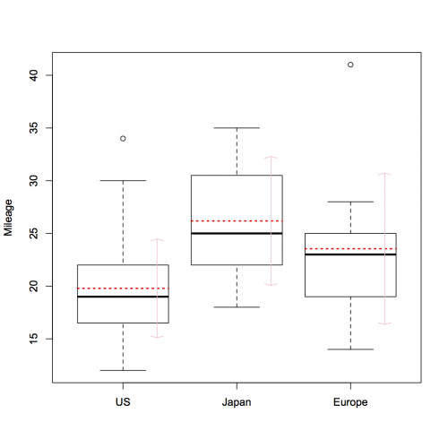

[](http://quantlet.de/)

## [](http://quantlet.de/) **SMSboxcar** [](http://quantlet.de/)

```yaml


Name of Quantlet: SMSboxcar

Published in: Multivariate Statistics: Exercises and Solutions

Description: 'Computes boxplots for the mileage of US, Japanese and European company headquarters from car data, respectively. Evidently, for the US the core of observations have lowest values of mileage compared with Japan and the EU. However, the US shows larger variation in the data. All boxplots show rather unsymmetric boxes, the medians (red solid lines) and means (black dashed lines) are not overlapping.'

Keywords: boxplot, data visualization, five number summary, graphical representation, mean, median, plot, robust estimation, visualization

See also: 'SMSandcurpopu, SMSboxbank6, SMSboxunemp, SMSboxunemp, SMSdenbank, SMSdenbank, SMSdrafcar, SMSdrafcar, SMSfacenorm, SMSfacenorm, SMShiscar, SMShiscar, SMShisheights, SMShisheights, SMSpcpcar, SMSpcpcar, SMSscanorm2, SMSscanorm3, SMSscanorm3, SMSscapopu, SMSscapopu'

Author[r]: Monika Jakubcova
Author[m]: Awdesch Melzer

Submitted:  Fri, August 07 2015 by Awdesch Melzer

Datafile[r]: carc.rda
Datafile[m]: carc.txt

Example[r]: 'Shows boxplots for the mileage of US, Japanese and European cars. In addition to the mean and the median, a comparison of the interquatile distance (robust) and the standard deviation (unrobust) is presented.'
Example[m]: Shows boxplots for the mileage of US, Japanese and European cars.
```




### R Code
```r

rm(list=ls(all=TRUE)) # remove variables
graphics.off()        # close all windows
# setwd("C/...")      # set working direktory

load("carc.rda")      # load car data
rb   = boxplot(M~C,data=carc,ylab="Mileage") # boxplot of mileage by company headquarters

mn.t = tapply(carc$M, carc$C, mean)
sd.t = tapply(carc$M, carc$C, sd)
xi   = seq(rb$n)
# add mean and standard deviation (+/-)
for(i in 1:3) lines(c(xi[i]-0.4,xi[i]+0.4), rep(mn.t[i],2), col = "red", lwd=2, lty= "dotted")
arrows(xi+0.3, mn.t - sd.t, xi+0.3, mn.t + sd.t, code = 3, col = "pink", angle = 75, length = .1)
```

automatically created on 2018-05-28

### MATLAB Code
```matlab

clear all     % clear variables
close all     % close windows
clc           % blank page

load carc.txt % load data

% extract mileage and company headquarters
M    = carc(:,2);     % mileage
C    = carc(:,13);    % headquarters


j    = 1;     % extract mileage by different headquarters from USA=1, Japan=2, EU=3 for
l    = 1; 
m    = 1;
for i=1:length(C)
    
    if (C(i)==1)
        us(j) = M(i); % Mileage US
        j     = j+1;
    elseif (C(i)==2)
        ja(l) = M(i); % Mileage Japan
        l     = l+1;
    elseif (C(i)==3)
        eu(m) = M(i); % Mileage Europe
        m     = m+1;
    end
end

% calculation of means for each headquarter
muus = mean(us);  % mean USA
muja = mean(ja);  % mean Japan
mueu = mean(eu);  % mean EU

% plot
hold on
line([0.775 1.225],[muus muus],'Color','k','LineStyle',':','LineWidth',1.2)
line([1.775 2.225],[muja muja],'Color','k','LineStyle',':','LineWidth',1.2)
line([2.775 3.225],[mueu mueu],'Color','k','LineStyle',':','LineWidth',1.2)
boxplot(M,C,'Symbol','o','labels',{'US','JAPAN','EU'})  
title('Car Data','FontSize',16,'FontWeight','Bold')
set(findobj(gca,'Type','text'),'FontSize',16,'FontWeight','Bold');
box on
set(gca,'LineWidth',1.6,'FontSize',16,'FontWeight','Bold')   % set frame
hold off

% quantile
five = quantile(M,[.025 .25 .50 .75 .975]); 
five

% to save plot please uncomment following lines 
% print -painters -dpng -r600 SMSboxcar.png
% print -painters -dpdf -r600 SMSboxcar.pdf
```

automatically created on 2018-05-28