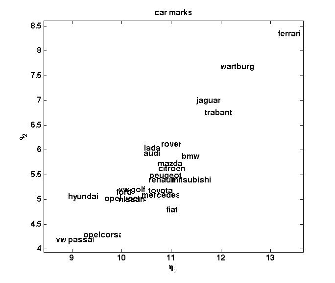
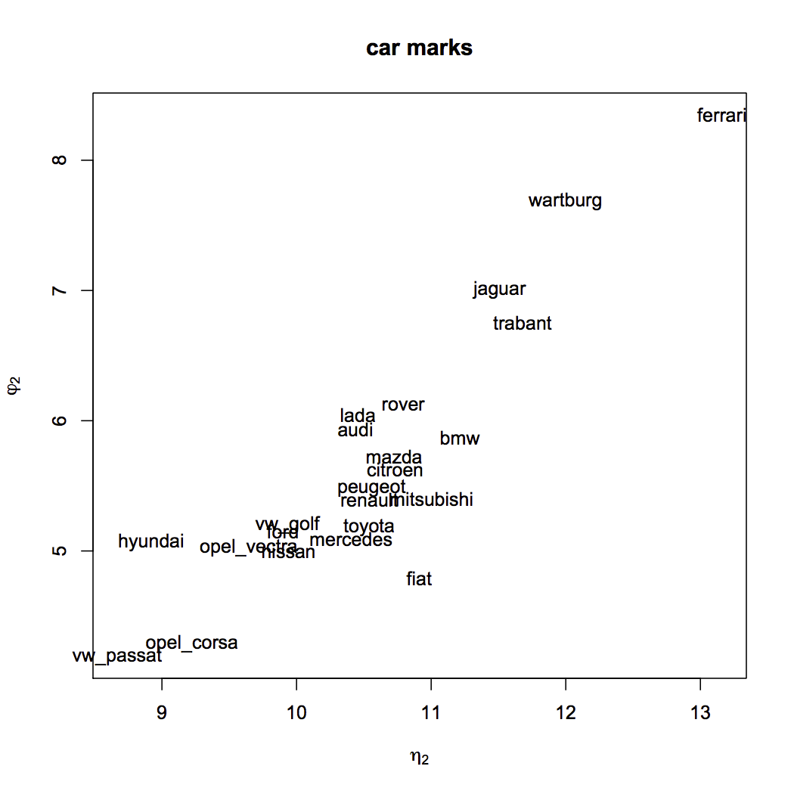

[](http://quantlet.de/)

## [](http://quantlet.de/) **SMScancarm2** [](http://quantlet.de/)

```yaml

Name of Quantlet: SMScancarm2

Published in: 'Multivariate Statistics: Exercises and Solutions'

Description: 'Estimates the canonical variables for a subset of variables of the car marks data set: X - (price, value), Y - (economy, service, design, sportiness, safety, easy handling). A scatterplot of the second 2 canonical variables are presented. The relationship between the two canonical variables is moderate.'

Keywords: 'canonical correlation, covariance, eigenvalue, eigenvector, singular value decomposition, canonical vector, canonical variable'

See also: 'SMScancarm, SMScancarm1, SMScancarm2'

Author[r]: Tomas Marada
Author[m]: Awdesch Melzer

Datafile[r]: carmean2.rda
Datafile[m]: carmean2.dat

Example: 'Canonical correlation for car data'

```





### R Code
```r

graphics.off()
rm(list=ls(all=TRUE))

# setwd("C:/...") # please change working directory
load("carmean2.rda")

x     = as.matrix(carmean2[,c(4,3,1:2,5:8)]);  # reorder: price value econ serv design sport safe easy
xrows = c("audi","bmw","citroen","ferrari",
            "fiat","ford","hyundai","jaguar",
            "lada","mazda","mercedes","mitsubishi",
            "nissan","opel_corsa","opel_vectra",
            "peugeot","renault","rover","toyota",
            "trabant","vw_golf","vw_passat","wartburg"
            );
s     = cov(x);                      # covariance
sa    = s[1:2,1:2];                  # covariance of price & value
sb    = s[3:8,3:8];                  # covariance of rest
temp  = eigen(sa);                   # spectral decomposition 
ea    = temp$values;
va    = temp$vectors;
temp  = eigen(sb);                   # spectral decomposition 
eb    = temp$values;
vb    = temp$vectors;
sa2   = va %*% diag(1/sqrt(ea)) %*% t(va);  # sa^(-1/2)
sb2   = vb %*% diag(1/sqrt(eb)) %*% t(vb);  # sb^(-1/2)
k     = sa2 %*% s[1:2,3:8] %*% sb2;           # matrix k
temp  = svd(t(k));                   # singular value decomposition
l     = temp$d;
d     = -temp$u;
g     = -temp$v;
a     = sa2 %*% g;                   # canonical vectors a
b     = sb2 %*% d;                   # canonical vectors b
a[,2] = a[,2]*(-1)
b[,2] = b[,2]*(-1)
print("second pair of canonical vectors")
print(a[,2])
print(b[,2])
eta   = x[,1:2] %*% a[,2];           # second canonical variable eta 
phi   = x[,3:8] %*% b[,2];           # second canonical variable phi 
etaphi= cbind(eta,phi);
plot(etaphi,type = "n", main = "car marks", xlab = expression(eta[2]), ylab = expression(varphi[2]));
text(etaphi,xrows,xpd=NA);           # adding labels to points

```

automatically created on 2018-09-04

### MATLAB Code
```matlab

% clear cache and close windows
clear all
close all
clc

% load data set
[type, economy, service, value, price, design, sporty, safety, handling] = textread('carmean2.dat','%s %f %f %f %f %f %f %f %f');
cars       = horzcat(economy, service, value, price, design, sporty, safety, handling); % Horizontal concatenation, creates data matrix
names      = strvcat('economy', 'service', 'value', 'price', 'design', 'sporty', 'safety', 'handling');
names      = cellstr(names);

names      = names([4,3,1:2,5:8]);  % reorder: price value econ serv design sport safe handling
x          = cars(:,[4,3,1:2,5:8]);
labels     = strvcat('audi','bmw','citroen','ferrari',...
            'fiat','ford','hyundai','jaguar',...
            'lada','mazda','mercedes','mitsubishi',...
            'nissan','opelcorsa','opel vectra',...
            'peugeot','renault','rover','toyota',...
            'trabant','vw golf','vw passat','wartburg');
labels     = cellstr(labels);

s          = cov(x);             % covariance
sa         = s(1:2,1:2);         % covariance of price & value
sb         = s(3:8,3:8);         % covariance of rest
[va ea]    = eig(sa);            % spectral decomposition
ea         = diag(ea);
[ea, ind]  = sort(ea,'descend');
va         = va(:,ind);
[vb eb]    = eig(sb);% spectral decomposition
eb         = diag(eb);
[eb, ind]  = sort(eb,'descend');
vb         = vb(:,ind);
sa2        = va * diag(1./sqrt((ea))) * va';  % sa^(-1/2)
sb2        = vb * diag(1./sqrt((eb))) * vb';  % sb^(-1/2)
k          = sa2 * s(1:2,3:8) * sb2;           % matrix k
[g l d]    = svd(k,'econ');      % singular value decomposition
a          = sa2 * g;            % canonical vectors a
b          = sb2 * d;            % canonical vectors b
eta        = x(:,1:2) * a(:,2);  % second canonical variable eta 
phi        = x(:,3:8) * b(:,2);  % second canonical variable phi 

plot(eta,phi, 'w')
title('car marks','FontSize',16,'FontWeight','Bold')
xlabel('\eta_2','FontSize',16,'FontWeight','Bold')
ylabel('\phi_2','FontSize',16,'FontWeight','Bold')
text(eta,phi,labels,'FontSize',16,'FontWeight','Bold')
box on
set(gca,'LineWidth',1.6,'FontSize',16,'FontWeight','Bold')
xlim([min(eta)-0.25,max(eta)+0.5])
ylim([min(phi-0.25),max(phi)+0.25])


```

automatically created on 2018-09-04