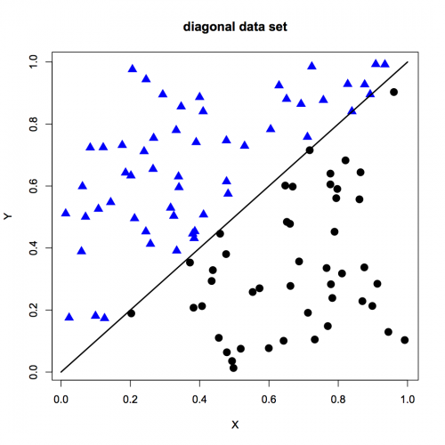

[](http://quantlet.de/)

## [](http://quantlet.de/) **SMScartdiag** [](http://quantlet.de/)

```yaml

Name of Quantlet: SMScartdiag

Published in: Multivariate Statistics: Exercises and Solutions

Description: 'Performs CART on a diagonal data set using Gini index.'

Keywords: 'cart, classification tree, gini index'

See also: 'SMScartdiag, SMScartsq, SMSdisfbank2, SMSeppbank, SMSsimpdbank, SMSsimpdsimu, SMSsir2cars, SMSsir2simu, SMSsircars, SMSsirsimu, SMSsircars, SMSsirsimu, SMSsiruscomp, SMSsvmbankrupt, SMSsvmorange, SMSsvmspiral'

Author: Awdesch Melzer

Example: 'Plot of a classification tree produced with Gini index.'
```



### R Code
```r

# clear variables and close windows
rm(list=ls(all=TRUE))
graphics.off()

# install and load packages
libraries = c("mvpart")
lapply(libraries, function(x) if (!(x %in% installed.packages())) {
    install.packages(x)})
lapply(libraries, library, quietly = TRUE, character.only = TRUE)

 # generate perfect sample
 tuto = function(seed,n){
   set.seed(seed)
   xdat   = cbind(runif(n),runif(n))
   index  = (xdat[,1]>xdat[,2])+1
   layout = 17*(index==1) + 19*(index==2)
   color  = 1*(index==1) + 0*(index==2)
   ydat   = index
   y      = list(xdat=xdat,ydat=ydat,layout=layout,color=color)
 }

data      = tuto(1,100)
x         = data$xdat
y         = data$ydat

contr     = rpart.control(minsplit=1, usesurrogate=1, minbucket=1, maxdepth=30)

# create classification tree
tr        = rpart(y~x[,1]+x[,2],parms="gini",x=TRUE,y=TRUE,control=contr)

splits    = tr$splits[,4]
variables = rownames(tr$splits)
variable  = numeric(length(variables))
variable[which(variables=="x[, 2]")]=2
variable[which(variables=="x[, 1]")]=1

color     = character(length=nrow(x))
color[which(data$color==0)]="black"
color[which(data$color==1)]="blue"

opar      =par(mfrow=c(1,2))
  
plot(x,type="n",ylab=expression(x[2]),xlab=expression(x[1]),main="diagonal data set")
points(x,col=color,pch=data$layout,cex=1.1)
dlin      = cbind(c(0,1),c(0,1))
lines(dlin,lwd=2)

  
plot(x,type="n",ylab=expression(x[2]),xlab=expression(x[1]),main="CART thresholds")
points(x,col=color,pch=data$layout,cex=1.1)
abline(h=splits[variable==2])
abline(v=splits[variable==1])
 
#point(splits,variable,x,y,data)

par(opar)
par(mar=c(2,1,4,2)+0.1)

plot(tr)
text(tr,cex=0.8,xpd=NA)

par(opar)

```

automatically created on 2018-05-28