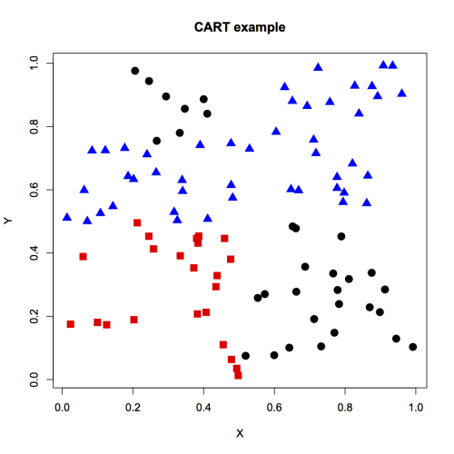

[](http://quantlet.de/)

## [](http://quantlet.de/) **SMScartsq** [](http://quantlet.de/)

```yaml

Name of Quantlet: SMScartsq

Published in: Multivariate Statistics: Exercises and Solutions

Description: 'Performs CART on an ideal data set using Gini index.'

Keywords: 'cart, classification tree, gini index'

See also: 'SMScartdiag, SMScartsq, SMSdisfbank2, SMSeppbank, SMSsimpdbank, SMSsimpdsimu, SMSsir2cars, SMSsir2simu, SMSsircars, SMSsirsimu, SMSsircars, SMSsirsimu, SMSsiruscomp, SMSsvmbankrupt, SMSsvmorange, SMSsvmspiral'

Author: Awdesch Melzer

Example: 'Plot of a classification tree produced with Gini index.'
```



### R Code
```r

# clear variables and close windows
rm(list=ls(all=TRUE))
graphics.off()

# install and load packages
libraries = c("mvpart")
lapply(libraries, function(x) if (!(x %in% installed.packages())) {
    install.packages(x)})
lapply(libraries, library, quietly = TRUE, character.only = TRUE)

# Subroutine for perfect sample generation
 tuto = function(seed,n){
  set.seed(seed)
  xdat   = cbind(runif(n),runif(n))
  index  = 1+(xdat[,2]<=0.5)+(xdat[,2]<=0.5)*(xdat[,1]<=0.5)+(xdat[,2]>0.5)*(xdat[,1]<=0.5)*(xdat[,2]>0.75)
  layout = 1*(index==1)+0*(index==2)+4*(index==3)
  color  = 1*(index==1)+0*(index==2)+4*(index==3)
  ydat   = index
  y      = list(xdat=xdat,ydat=ydat,layout=layout,color=color)
  return(y)
 }

# main calculation
 data  = tuto(1,100)
 x     = data$xdat
 color = character(length=nrow(x))
 color[which(data$color==0)]="black"
 color[which(data$color==1)]="blue"
 color[which(data$color==4)]="red"
 point = numeric(length=nrow(x))
 point[which(data$layout==0)]=19
 point[which(data$layout==1)]=17
 point[which(data$layout==4)]=15

opar=par(mfrow=c(1,2))

plot(x, col=color,pch=point,cex=1.1,ylab=expression(x[2]),xlab=expression(x[1]))
title("CART example")

y     = data$ydat
contr = rpart.control(minsplit=1, usesurrogate=1, minbucket=1, maxdepth=30)

# create classification tree
t2 = rpart(y~x[,1]+x[,2],parms="gini",x=TRUE,y=TRUE,control=contr)

par(mar=c(2,1,4,2)+0.1)

# plot classification tree
# dev.new()
plot(t2)
text(t2,cex=0.75,xpd=NA)

par(opar)
```

automatically created on 2018-05-28