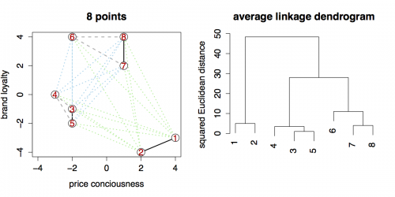

[](http://quantlet.de/)

## [](http://quantlet.de/) **SMSclus8pa** [](http://quantlet.de/)

```yaml

Name of Quantlet : SMSclus8pa
Published in : 'Multivariate Statistics: Exercises and Solutions'

Description : 'Employs the average linkage using squared Euclidean distance matrices 
to perform a cluster analysis on an 8 points example'

Keywords : cluster-analysis, dendrogram, linkage, euclidean, distance, plot 

See also : 'MVAclususcrime, MVAdrugsim, SMSclus8p, SMSclus8pd, SMSclus8pd, SMSclus8pmst2,
SMSclusbank, SMSclusbank2, SMSclusbank3, SMScluscomp, SMScluscrime, SMScluscrimechi2, SMSclushealth'

Author : Awdesch Melzer

Submitted : Fri, August 22 2014 by Awdesch Melzer

Example : 8 points example for average linkage algorithm
```



### R Code
```r

# clear cache and close windows
graphics.off()
rm(list=ls(all=TRUE))

# define eight points
eight = cbind(c(-3,-2,-2,-2,1,1,2,4),c(0,4,-1,-2,4,2,-4,-3))
eight = eight[c(8,7,3,1,4,2,6,5),]
dev.new()
# plot eight points using average linkage
par(mfrow = c(1, 2))
plot(eight,type="n", xlab="price conciousness",ylab="brand loyalty",main="8 points", xlim=c(-4,4))

# agglomarate first two nearest points
segments(eight[5,1],eight[5,2 ],eight[3,1 ],eight[3,2],lwd=2,"black")
# add third point via average
segments(eight[3,1],eight[3,2 ],eight[4,1 ],eight[4,2],lwd=2,lty=2,col="darkgrey")
segments(eight[5,1],eight[5,2 ],eight[4,1 ],eight[4,2],lwd=2,lty=2,col="darkgrey")
# agglomerate second two nearest points
segments(eight[7,1],eight[7,2 ],eight[8,1 ],eight[8,2],lwd=2,"black")
# agglomarate third two nearest points
segments(eight[1,1],eight[1,2 ],eight[2,1 ],eight[2,2],lwd=2,"black")
# add point six to second subcluster via average
segments(eight[8,1],eight[8,2 ],eight[6,1 ],eight[6,2],lwd=2,lty=2,col="darkgrey")
segments(eight[7,1],eight[7,2 ],eight[6,1 ],eight[6,2],lwd=2,lty=2,col="darkgrey")

# compute subcluster between 345 and 678 via average
segments(eight[4,1],eight[4,2],eight[6,1],eight[6,2],lwd=2,lty=3,col="skyblue")
segments(eight[4,1],eight[4,2],eight[8,1],eight[8,2],lwd=2,lty=3,col="skyblue")
segments(eight[4,1],eight[4,2],eight[7,1],eight[7,2],lwd=2,lty=3,col="skyblue")
segments(eight[3,1],eight[3,2],eight[6,1],eight[6,2],lwd=2,lty=3,col="skyblue")
segments(eight[3,1],eight[3,2],eight[7,1],eight[7,2],lwd=2,lty=3,col="skyblue")
segments(eight[3,1],eight[3,2],eight[8,1],eight[8,2],lwd=2,lty=3,col="skyblue")
segments(eight[5,1],eight[5,2],eight[6,1],eight[6,2],lwd=2,lty=3,col="skyblue")
segments(eight[5,1],eight[5,2],eight[7,1],eight[7,2],lwd=2,lty=3,col="skyblue")
segments(eight[5,1],eight[5,2],eight[8,1],eight[8,2],lwd=2,lty=3,col="skyblue")

# compute in case of merging of two last clusters:
segments(eight[2,1],eight[2,2 ],eight[6,1 ],eight[6,2],lwd=2,lty=3,col="lightgreen")
segments(eight[2,1],eight[2,2 ],eight[4,1 ],eight[4,2],lwd=2,lty=3,col="lightgreen")
segments(eight[2,1],eight[2,2 ],eight[5,1 ],eight[5,2],lwd=2,lty=3,col="lightgreen")
segments(eight[2,1],eight[2,2 ],eight[7,1 ],eight[7,2],lwd=2,lty=3,col="lightgreen")
segments(eight[2,1],eight[2,2 ],eight[8,1 ],eight[8,2],lwd=2,lty=3,col="lightgreen")
segments(eight[2,1],eight[2,2 ],eight[3,1 ],eight[3,2],lwd=2,lty=3,col="lightgreen")
segments(eight[1,1],eight[1,2 ],eight[6,1 ],eight[6,2],lwd=2,lty=3,col="lightgreen")
segments(eight[1,1],eight[1,2 ],eight[4,1 ],eight[4,2],lwd=2,lty=3,col="lightgreen")
segments(eight[1,1],eight[1,2 ],eight[5,1 ],eight[5,2],lwd=2,lty=3,col="lightgreen")
segments(eight[1,1],eight[1,2 ],eight[7,1 ],eight[7,2],lwd=2,lty=3,col="lightgreen")
segments(eight[1,1],eight[1,2 ],eight[8,1 ],eight[8,2],lwd=2,lty=3,col="lightgreen")
segments(eight[1,1],eight[1,2 ],eight[3,1 ],eight[3,2],lwd=2,lty=3,col="lightgreen")

points(eight, pch=21, cex=2.6, bg="white")
text(eight,as.character(1:8),col="red3", cex=1)

plot(hclust(dist(eight,method="euclidean")^2,method="average"),ylab="squared Euclidean distance",sub="",xlab="",main="average linkage dendrogram") 


```

automatically created on 2018-05-28