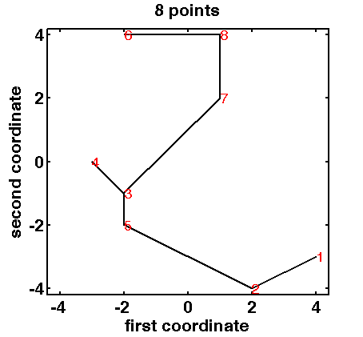
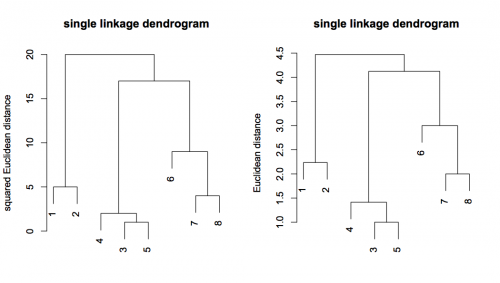
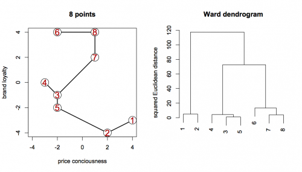

[](http://quantlet.de/)

## [](http://quantlet.de/) **SMSclus8pd** [](http://quantlet.de/)

```yaml

Name of Quantlet: SMSclus8pd

Published in: Multivariate Statistics: Exercises and Solutions

Description: 'employs the single linkage method using simple Euclidean distance and squared Euclidean distance matrices to perform a cluster analysis on an 8 points example. Three plots are generated. First plot shows the 8 points, second plot the dendrogram for squared Euclidean distance and single linkage while the third plot presents the dendrogram for Euclidean distance using single linkage algorithm'

Keywords: 'cluster-analysis, dendrogram, distance, euclidean, euclidean distance matrix, euclidean-norm, linkage, single linkage, squared'

See also: 'MVAQnetClusKmeans, MVAQnetClusKmeansB, MVAQnetClusKmeansT, MVAcarsim, MVAclus8p, MVAclusfood, MVAclususcrime, MVAdrugsim, MVAspecclust, SMScarsim, SMSclus8km, SMSclus8pa, SMSclus8pc, SMSclus8pd, SMSclus8pmst, SMSclus8pmst2, SMSclus8psc, SMSclusbank, SMSclusbank2, SMSclusbank3, SMScluscereal, SMScluscomp, SMScluscrime, SMScluscrimechi2, SMSclushealth, SMSclushealth05, SMScluskmcereal, SMScluskmhealth'

Author[r]: Tomas Hovorka, Awdesch Melzer
Author[m]: Awdesch Melzer

Example[r]: 'Figure 1: Single linkage using squared Euclidean and Euclidean distance for 8 points example. Figure 2: Eight points and ward dendrogram'
Example[m]: 'Single linkage using squared Euclidean and Euclidean distance for 8 points example'
```








### R Code
```r

# clear cache and close windows
graphics.off()
rm(list=ls(all=TRUE))

# define eight points
eight=cbind(c(-3,-2,-2,-2,1,1,2,4),c(0,4,-1,-2,4,2,-4,-3))
eight=eight[c(8,7,3,1,4,2,6,5),]

# plot eight points according to single linkage algorithm
par(mfrow = c(1, 2))
plot(eight,type="n",xlab="price conciousness",ylab="brand loyalty",xlim=c(-4,4), main="8 points")
segments(eight[1,1],eight[1,2 ],eight[2,1 ],eight[2,2],lwd=2)
segments(eight[2,1],eight[2,2 ],eight[5,1 ],eight[5,2],lwd=2)
segments(eight[5,1],eight[5,2 ],eight[3,1 ],eight[3,2],lwd=2)
segments(eight[3,1],eight[3,2 ],eight[4,1 ],eight[4,2],lwd=2)
segments(eight[3,1],eight[3,2 ],eight[7,1 ],eight[7,2],lwd=2)
segments(eight[7,1],eight[7,2 ],eight[8,1 ],eight[8,2],lwd=2)
segments(eight[8,1],eight[8,2 ],eight[6,1 ],eight[6,2],lwd=2)
points(eight, pch=21, cex=3, bg="white")
text(eight,as.character(1:8),col="red3",xlab="first coordinate", ylab="second coordinate", main="8 points",cex=1.5)
plot(hclust(dist(eight,method="euclidean")^2,method="ward.D"),ylab="squared Euclidean distance", xlab="",sub="",main="Ward dendrogram") 


dev.new()

par(mfrow = c(1, 2),mar=c(2, 4, 4, 2) +  0.1)
plot(hclust(dist(eight,method="euclidean")^2,method="single"),ylab="squared Euclidean distance",main="single linkage dendrogram",xlab="",sub="") 
plot(hclust(dist(eight,method="euclidean"),method="single"),ylab="Euclidean distance",main="single linkage dendrogram",xlab="",sub="")


```

automatically created on 2018-05-28

### MATLAB Code
```matlab

% clear cache and close windows
clear all
close all
clc

%% example data set containing 8 points
eight  = [-3,-2,-2,-2,1,1,2,4;
          0,4,-1,-2,4,2,-4,-3]';
eight  = eight([8,7,3,1,4,2,6,5]',:);

%% cluster analysis employing ward algorithm
figure(1)
plot(eight,'w')
hold on
plot(eight(1:2,1),eight(1:2,2),'k','LineWidth',2)
plot(eight([2 5],1),eight([2 5],2),'k','LineWidth',2)
plot(eight([5 3],1),eight([5 3],2),'k','LineWidth',2)
plot(eight([3 4],1),eight([3 4],2),'k','LineWidth',2)
plot(eight([3 7],1),eight([3 7],2),'k','LineWidth',2)
plot(eight([7 8],1),eight([7 8],2),'k','LineWidth',2)
plot(eight([8 6],1),eight([8 6],2),'k','LineWidth',2)
lab = strvcat(num2str((1:8)'));
ylim([-4.2,4.2])
xlim([-4.4,4.4])
text(eight(:,1),eight(:,2),lab,'Color','r','FontSize',14)
xlabel('first coordinate','FontSize',16,'FontWeight','Bold')
ylabel('second coordinate','FontSize',16,'FontWeight','Bold')
title('8 points','FontSize',16,'FontWeight','Bold')
set(gca,'LineWidth',1.6,'FontSize',16,'FontWeight','Bold')

%% single linkage for squared Euclidean distance matrix
% Draw line segments between pairs of points 
% euclidean distance matrix
d      = pdist(eight,'euclidean');

% squared euclidean distance matrix
dd     = d.^2;

% cluster analysis with ward algorithm                                                  
ss     = linkage(dd,'single');

% Dendrogram for the 8 data points after single linkage
figure(2)
subplot(1,2,1)
[H,T]  = dendrogram(ss,'colorthreshold','default');
set(H,'LineWidth',2)
title('Single Linkage Dendrogram - 8 points','FontSize',16,'FontWeight','Bold')
ylabel('Squared Euclidean Distance','FontSize',16,'FontWeight','Bold')
box on
set(gca,'LineWidth',1.6,'FontSize',16,'FontWeight','Bold')

%% single linkage for Euclidean distance matrix
% Draw line segments between pairs of points 
% euclidean distance matrix
d      = pdist(eight,'euclidean');

% cluster analysis with ward algorithm                                                  
ss     = linkage(d,'single');

% Dendrogram for the 8 data points after single linkage
subplot(1,2,2)
[H,T]  = dendrogram(ss,'colorthreshold','default');
set(H,'LineWidth',2)
title('Single Linkage Dendrogram - 8 points','FontSize',16,'FontWeight','Bold')
ylabel('Squared Euclidean Distance','FontSize',16,'FontWeight','Bold')
box on
set(gca,'LineWidth',1.6,'FontSize',16,'FontWeight','Bold')
```

automatically created on 2018-05-28