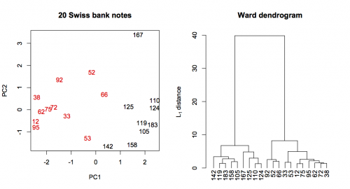

[](http://quantlet.de/)

## [](http://quantlet.de/) **SMSclusbank3** [](http://quantlet.de/)

```yaml

Name of Quantlet: SMSclusbank3

Published in: Multivariate Statistics: Exercises and Solutions

Description: 'performs a PCA and a cluster analysis for 20 randomly chosen bank notes from the swiss bank notes dataset. Centered principal components as well as cluster analysis employing ward algorithm to L1 distance matrix perform similarly on seperating real from forged bank notes. However, the banknote 116 is misspecified by cluster analysis with L1 (Manhattan, City Block) distance. Even ward algorithm with perfoming best on balancing distances and cluster sizes is not able to pass in this example.'

Keywords: 'cluster-analysis, distance, manhattan metric, city block metric, mannheim metric, L1-norm, linkage, ward, ward algorithm, dendrogram, principal components, PCA, centering, pseudo random numbers, sampling'

See also: 'MVAQnetClusKmeans, MVAQnetClusKmeansB, MVAQnetClusKmeansT, MVAcarsim, MVAclus8p, MVAclusfood, MVAclususcrime, MVAdrugsim, MVAspecclust, SMScarsim, SMSclus8km, SMSclus8pa, SMSclus8pc, SMSclus8pd, SMSclus8pmst, SMSclus8pmst2, SMSclus8psc, SMSclusbank, SMSclusbank2, SMSclusbank3, SMScluscereal, SMScluscomp, SMScluscrime, SMScluscrimechi2, SMSclushealth, SMSclushealth05, SMScluskmcereal, SMScluskmhealth'

Author[r]: Kristyna Sionova
Author[m]: Awdesch Melzer

Datafile[r]: bank2.rda
Datafile[m]: bank2.dat

Example: 'PCA for the 20 randomly chosen bank notes and the Dendrogram of them after applying the Ward algorithm.'
```




### R Code
```r

# clear cache and close windows
graphics.off()
rm(list=ls(all=TRUE))

# setwd("C:/...")      # please change your working directory for loading your data

# install and load packages
libraries = c("MASS")
lapply(libraries, function(x) if (!(x %in% installed.packages())) {
  install.packages(x)
})
lapply(libraries, library, quietly = TRUE, character.only = TRUE) 

load("bank2.rda")      # load bank data

set.seed(100)          # set pseudo random numbers

nahvyber  = sample(1:200, 20, replace = FALSE) # select random sample
dvacet    = bank2[nahvyber,] # retrieve random sample

vysledek  = prcomp(dvacet,scale.=TRUE)$x[,1:2]	# perform principal component analysis

par(mfrow=c(1,2))	
plot(vysledek,type="n",main="20 Swiss bank notes") 
text(vysledek, labels = as.character(rownames(dvacet)),col=as.numeric(as.numeric(rownames(dvacet))<=100)+1)
hc    = hclust(dist(dvacet,method="manhattan"),method="ward.D") # L1 distance and Ward algorithm
dend1 =  as.dendrogram(hc)
par(mar=c(2, 4, 4, 2) +  0.1)
plot(dend1,ylab=bquote(L[1]~distance),xlab="",sub="",main="Ward dendrogram")

```

automatically created on 2018-05-28

### MATLAB Code
```matlab

% clear variables and close graphics
clear all
close all
clc

%% load data and take sample
load('bank2.dat')

% set pseudo random numbers
RandStream.setGlobalStream(RandStream('mt19937ar','seed',100));

% sample n=20 out of the data set
bank2 = [(1:200)',bank2];    % set index variable
n     = 20;                  % sample size
bank  = datasample(bank2,n); % 20 randomly selected Swiss bank notes
lab   = strvcat(num2str(bank(:,1)));
color = ones(3,200);         % setting color
i     = 0;
while (i<=200)
    i = i + 1;
    if(i<101)
        color(:,i) = [1, 0, 0]';            % red
    end
    if(i>100)
        color(:,i) = [0, 0, 0]';            % black
    end
end
color = color(:,bank(:,1));  % sample colors

%% principal component analysis
[coeff,score,latent]  = pca(bank(:,2:7));

% plot of scores
subplot(1,2,1)
plot(score(:,1),score(:,2),'w')
title('20 Swiss bank notes','FontSize',16,'FontWeight','Bold')
hold on
for(i = 1:n)
text(score(i,1),score(i,2),lab(i,:),'Color',color(:,i),'FontSize',14)
end
xlabel('PC1','FontSize',12,'FontWeight','Bold')
ylabel('PC2','FontSize',12,'FontWeight','Bold')
box on
set(gca,'LineWidth',1.6,'FontSize',12,'FontWeight','Bold')

%% ward method for L1 distance matrix
% Draw line segments between pairs of points 
d     = pdist(bank(:,2:7),'cityblock'); % L1 distance
ss    = linkage(d,'ward');     % cluster analysis with ward algorithm 

% Dendrogram for the data points after ward linkage
subplot(1,2,2)
[H,T] = dendrogram(ss,'colorthreshold','default','Labels',lab);
set(H,'LineWidth',2)
title('Ward Dendrogram','FontSize',16,'FontWeight','Bold')
ylabel('L_1 Distance','FontSize',12,'FontWeight','Bold')
box on
set(gca,'LineWidth',1.6,'FontSize',12,'FontWeight','Bold')

```

automatically created on 2018-05-28