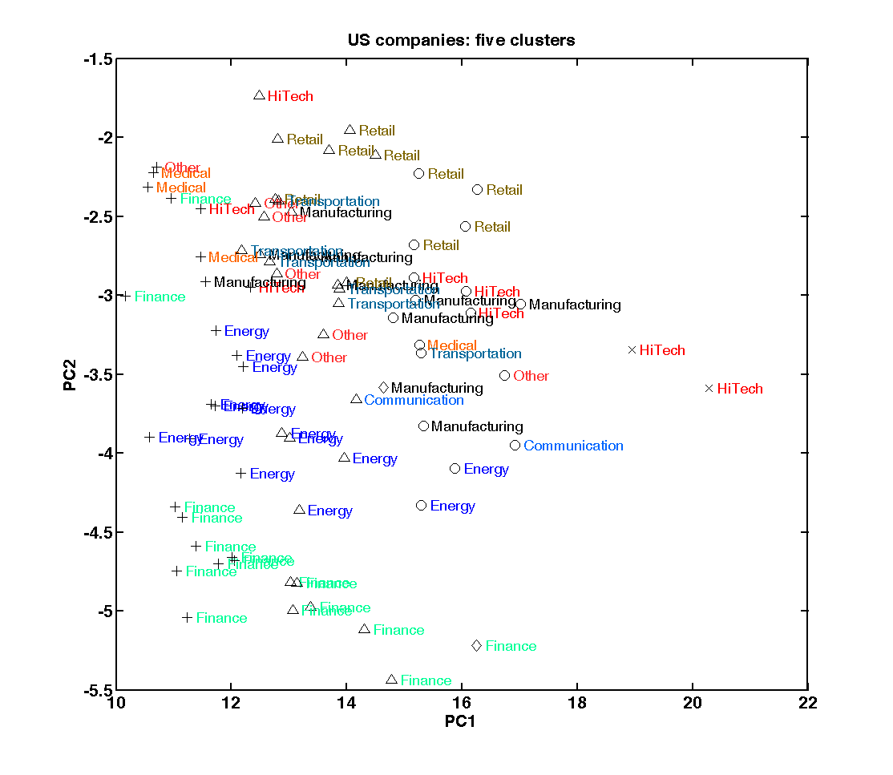

[](http://quantlet.de/)

## [](http://quantlet.de/) **SMScluscomp** [](http://quantlet.de/)

```yaml

Name of Quantlet: SMScluscomp

Published in: Multivariate Statistics: Exercises and Solutions

Description: 'performs cluster analysis for US companies. The
               six dimentional data set contrains information on the
               assets, sales, market value, profits, cash flow and number
               of employees of 79 US companies. The companies are
               classified according to their type: Communication, Energy,
               Finance, Hi-Tech, Manufacturing, Medical, Other, Retail,
               and Transportation.
               The rescaling is in this case necessary since otherwise we
               observe most of the points concentrated in the lower left 
               corner with the two largest companies (IBM and General 
               Electric) dominating the plot.
               On the transformed data we perform a principal component
               analysis and a cluster analysis employing L1-norm
               (City-Block) and Ward linkage algorithm. Plots of principal
               components and the dendrogram are presented. After extraction
               of 5 clusters, the principal components with the five
               clusters (denoted by different symbols) and nine sectors
               (denoted by different colours) are shown.
               The plot slightly differs from R due to variation in algorithms.'

Keywords: 'cluster-analysis, Ward algorithm, distance, manhattan metric, city block metric, mannheim metric, L1-norm, linkage, ward, ward algorithm, dendrogram, principal components, PCA, centering, pseudo random numbers, sampling'

See also: 'MVAQnetClusKmeans, MVAQnetClusKmeansB, MVAQnetClusKmeansT, MVAcarsim, MVAclus8p, MVAclusfood, MVAclususcrime, MVAdrugsim, MVAspecclust, SMScarsim, SMSclus8km, SMSclus8pa, SMSclus8pc, SMSclus8pd, SMSclus8pmst, SMSclus8pmst2, SMSclus8psc, SMSclusbank, SMSclusbank2, SMSclusbank3, SMScluscereal, SMScluscomp, SMScluscrime, SMScluscrimechi2, SMSclushealth, SMSclushealth05, SMScluskmcereal, SMScluskmhealth'

Author[r]: Jakub Pecanka, Awdesch Melzer
Author[m]: Awdesch Melzer

Datafile[r]: uscomp.rda
Datafile[m]: uscomp.dat

Example: 'Plots of principal components and the dendrogram.'
```





### R Code
```r

# clear cache and close windows
graphics.off()
rm(list=ls(all=TRUE))

# setwd("C:/...")         # please set your working directory to load company data

  opar = par(c(1,1),cex=1)

 load('uscomp.rda')       # load data
 uscomp$Sales    = as.numeric(as.character(uscomp$Sales)) # eliminate data error
 uscomp$Sales[65]= 1601

 xx    = as.matrix(uscomp[,c(-7)]) # data without sectors
 xxi   = substr(as.character(uscomp$Sector),1,3) # take first 2 letters of sector names
 xxxi  = row.names(uscomp)         # set company names
 n     = nrow(xx)                            # sample size
 # scaling (arbitrary)
 meanxx=apply(xx,2,mean)
 x     = t(t(xx)-meanxx)
 minxx = apply(xx,2,min)
 maxxx = apply(xx,2,max)
 varxx = apply(xx,2,var)
 xxp   = log(t(t(xx)-minxx+(maxxx-minxx)/200))
 xxp   = round(xxp,4)
 sxx   = matrix(sqrt(varxx),nrow=78,ncol=6,byrow=TRUE)
 # eigenvalue decomposition
 e=eigen(cov(xxp),sym=TRUE)               # eigensystem analysis
 tmp=cbind(e$va,t(e$ve))               # sort by eigenvalues
 
 jsort = function(mat){  # sorting function
    s  = sort(mat[,1],decr=TRUE,ind=TRUE)
    return(mat[s$ix,])
 }

 tmp   = jsort(tmp)
 e     = tmp[,1]
 v     = -tmp[,2:7]     # set eigenvector signs according to book
 v[c(4,6),]= -v[c(4,6),]
 y     = xxp%*%t(v)                          # PCA transformation
 y     = y[,1:2]
 y2    = y
 tc    = matrix(1,nrow=n)
 plabels= xxxi                               # set labels for each company
 plot(y,type="n",xlab="PC1",ylab="PC2",main="US companies") # principal component plot
 text(y,label=plabels,xpd=NA)

 label = uscomp$Sector
 label1= sapply(label,substr,1,2)
 rownames(xx)=label1
# second part
 d     = dist(xx,method="manhattan")
 tree  = hclust(d,method="ward.D")
 # show the dendrogram 
 dev.new()
 opar  = par(c(1,1),cex.axis=1.2,cex.lab=1.4,cex.main=1.4,cex=0.5)
 plot(as.dendrogram(tree),horiz=T,main="Ward dendrogram for US companies")
 par(opar)
 g.points = cutree(tree,5)

# show the clusters 
 dev.new()
 opar = par(c(1,1),cex=1.0)
 plot(y2, main="US companies: five clusters",xlab="PC1",ylab="PC2",type="n")
 points(y2,pch=g.points)
 text(matrix(y2[label1=="Co"],ncol=2),labels="Co",xpd=NA,col="navy",pos=4)
 text(matrix(y2[label1=="En"],ncol=2),labels="En",xpd=NA,col="blue",pos=4)
 text(matrix(y2[label1=="Fi"],ncol=2),labels="Fi",xpd=NA,col="darkgreen",pos=4)
 text(matrix(y2[label1=="Hi"],ncol=2),labels="Hi",xpd=NA,col="red",pos=4)
 text(matrix(y2[label1=="Ma"],ncol=2),labels="Ma",xpd=NA,col="black",pos=4)
 text(matrix(y2[label1=="Me"],ncol=2),labels="Me",xpd=NA,col="darkgrey",pos=4)
 text(matrix(y2[label1=="Ot"],ncol=2),labels="Ot",xpd=NA,col="brown",pos=4)
 text(matrix(y2[label1=="Re"],ncol=2),labels="Re",xpd=NA,col="orange",pos=4)
 text(matrix(y2[label1=="Tr"],ncol=2),labels="Tr",xpd=NA,col="purple",pos=4)
 par(opar)

```

automatically created on 2018-05-28

### MATLAB Code
```matlab

clear all
close all
clc

%% load data and transformation

[Names,Assets,Sales,MarketValue,Profits,CashFlow,Employees,Sector] = textread('uscomp2.dat','%s %f %f %f %f %f %f %s');
data       = [Assets,Sales,MarketValue,Profits,CashFlow,Employees];
colnames   = cellstr(strvcat('Assets','Sales','Market Value','Profits','Cash Flow','Employees','Sector'));
Names      = cellstr(strvcat(Names));
n          = size(data,1);           % sample size
meanx      = mean(data);             % column means
x          = data-repmat(meanx,n,1); % centering
minx       = min(data);              % column minimum
maxx       = max(data);              % column maximum
varx       = var(data);              % column variance
xp         = zeros(size(data));      % empty matrix
for (i = 1:n)                       % transformation procedure
xp(i,:)    = log(data(i,:)-minx+(maxx-minx)./200); 
end
sxx        = repmat(sqrt(varx),n,1);% matrix of std deviation

%% pca
[ve, va]   = eig(cov(xp));           % eigensystem analysis
va         = diag(va);               % retrieve from diagonal
[va, ind]  = sort(va,'descend');     % sort in decresing order, index
ve         = ve(:,ind);              % sorting vectors according to index
ve(:,[3,4])= -ve(:,[3,4]);
y          = xp*ve;                  % PCA transformation
y          = y(:,1:2);
y2         = y;
tc         = ones(n,1);

%% Plot 1
figure(1)
plot(y(:,1),y(:,2),'w')
xlabel('PC1','FontSize',16,'FontWeight','Bold')
ylabel('PC2','FontSize',16,'FontWeight','Bold')
title('US companies','FontSize',16,'FontWeight','Bold')
text(y(:,1),y(:,2),Names,'FontSize',14)
box on
set(gca,'LineWidth',1.6,'FontSize',16,'FontWeight','Bold')

%% ward method L1 distance matrix
% Draw line segments between pairs of points 
d          = pdist(xp,'cityblock'); % L1 distance
ss         = linkage(d,'ward');     % cluster analysis with ward algorithm 

% Dendrogram for the data points after ward linkage
sect       = cellstr(strvcat(Sector));
figure(2)
[H,T] = dendrogram(ss,n,'colorthreshold',15,'Orientation','left','Labels',Names);
set(H,'LineWidth',2)
title('Ward dendrogram for US companies','FontSize',16,'FontWeight','Bold')
ylabel('L_1 Distance','FontSize',12,'FontWeight','Bold')
box on
set(gca,'LineWidth',1.6,'FontSize',8,'FontWeight','Bold')

%% clusters and principal components
gpoints    = cluster(ss,'maxclust',5);


% markers for components plot
Marker  = strvcat(Sector);
Marker  = Marker(:,1);

i1      = find(gpoints==1);
i2      = find(gpoints==2);
i3      = find(gpoints==3);
i4      = find(gpoints==4);
i5      = find(gpoints==5);

Marker(i1,:) = 'd';
Marker(i2,:) = 'o';
Marker(i3,:) = '+';
Marker(i4,:) = '^';
Marker(i5,:) = 'x';

% Colors for Sectors
Sectors  =  [1 1 2 2 2 2 2 2 2 2 2 2 2 2 2 2 2 3 3 3 3 3 3 3 3 3 3 3 3 3 ...
    3 3 3 3 4 4 4 4 4 4 4 4 5 5 5 5 5 5 5 5 5 5 6 6 6 6 7 7 7 7 7 7 7 ...
    8 8 8 8 8 8 8 8 8 8 9 9 9 9 9 9]';

colour = ones(3,n);
for i=1:n
    
    if(Sectors(i)==1)
    colour(:,i) = [0, 0.4, 1]';
    end
    if(Sectors(i)==2)
    colour(:,i) = [0, 0, 1]';
    end
    if(Sectors(i)==3)
    colour(:,i) = [0, 1, 0.6]';
    end
    if(Sectors(i)==4)
    colour(:,i) = [1, 0, 0]';
    end
    if(Sectors(i)==5)
    colour(:,i) = [0, 0, 0]';
    end
    if(Sectors(i)==6)
    colour(:,i) = [1, 0.4, 0]';
    end
    if(Sectors(i)==7)
    colour(:,i) = [1, 0.2, 0.2]';
    end
    if(Sectors(i)==8)
    colour(:,i) = [0.5, 0.4, 0]';
    end
    if(Sectors(i)==9)
    colour(:,i) = [0, 0.4, 0.6]';
    end
    end

% show the clusters 
figure(3)
 plot(y2(:,1),y2(:,2),'w')
 title('US companies: five clusters','FontSize',16,'FontWeight','Bold')
 xlabel('PC1','FontSize',16,'FontWeight','Bold')
 ylabel('PC2','FontSize',16,'FontWeight','Bold')
 hold on
 for i=1:n
 plot(y2(i,1),y2(i,2),Marker(i),'Color','k','MarkerSize',10)
 text(y2(i,1)+0.15,y2(i,2),Sector(i),'Color',colour(:,i),'FontSize',14)
 end
 box on
 set(gca,'LineWidth',1.6,'FontSize',16,'FontWeight','Bold')


```

automatically created on 2018-05-28