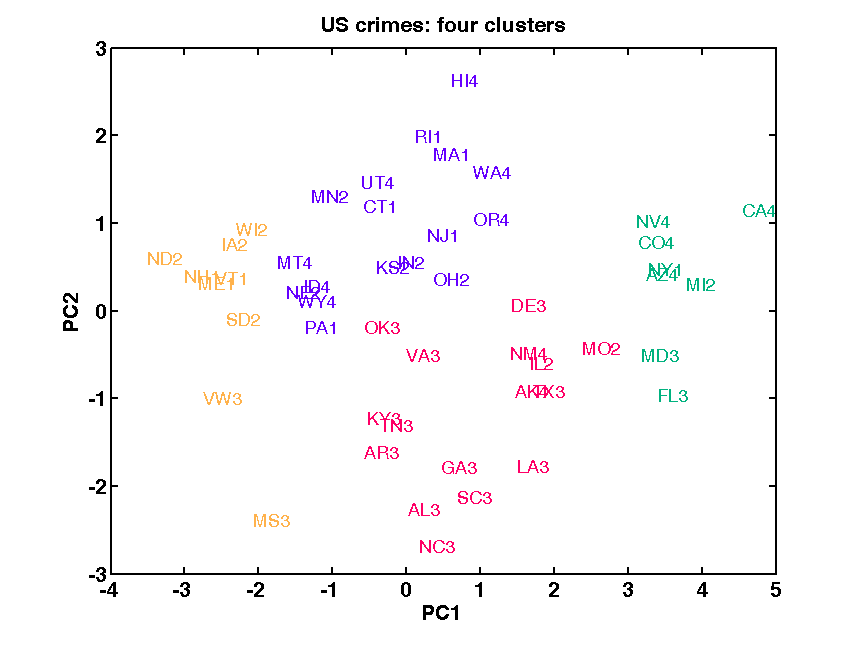
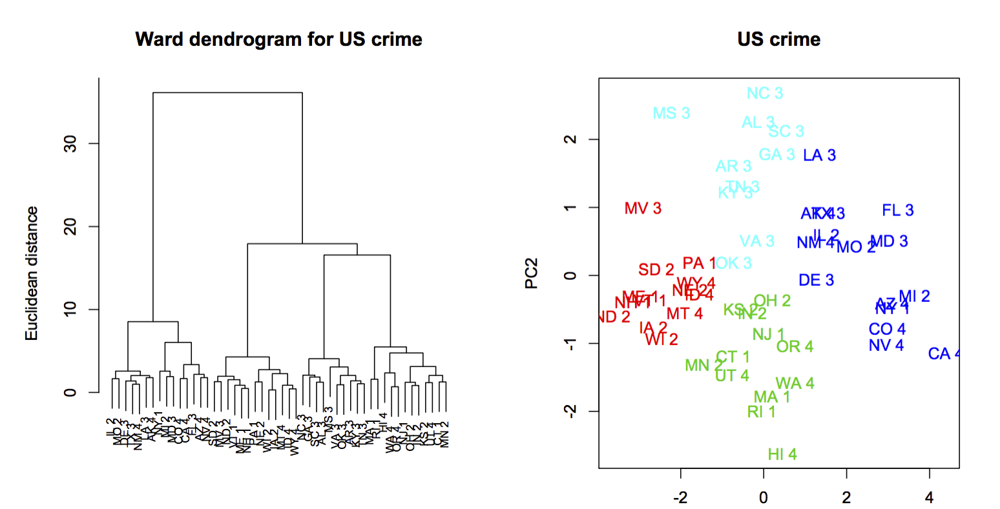

[](http://quantlet.de/)

## [](http://quantlet.de/) **SMScluscrime** [](http://quantlet.de/)

```yaml

Name of Quantlet: SMScluscrime

Published in: Multivariate Statistics: Exercises and Solutions

Description: 'performs cluster analysis for US crime data.
               On the transformed data we perform a principal component
               analysis and a cluster analysis employing Eulcidean
               distance and Ward linkage algorithm. Plots of principal
               components and the dendrogram are presented. After extraction
               of 4 clusters, the principal components with the four
               clusters (denoted by different colours) are shown.'

Keywords: 'cluster analysis, distance, euclidean, euclidean norm, linkage, ward linkage, dendrogram, principal components, PCA, centering'

See also: 'MVAQnetClusKmeans, MVAQnetClusKmeansB, MVAQnetClusKmeansT, MVAcarsim, MVAclus8p, MVAclusfood, MVAclususcrime, MVAdrugsim, MVAspecclust, SMScarsim, SMSclus8km, SMSclus8pa, SMSclus8pc, SMSclus8pd, SMSclus8pmst, SMSclus8pmst2, SMSclus8psc, SMSclusbank, SMSclusbank2, SMSclusbank3, SMScluscereal, SMScluscomp, SMScluscrime, SMScluscrimechi2, SMSclushealth, SMSclushealth05, SMScluskmcereal, SMScluskmhealth'

Author[r]: Zdenek Hlavka
Author[m]: Awdesch Melzer

Datafile[r]: uscrime.rda
Datafile[m]: uscrime.dat

Example: 'Plots of principal components and the dendrogram.'
```






### R Code
```r

# clear history and close windows
graphics.off()
rm(list=ls(all=TRUE))

# setwd("C:/...") #set your working directory, create there a subdirectory 'data' for the datasets
 
load("uscrime.rda")

op   = par(mfrow=c(1,2))
lab  = paste(row.names(uscrime),as.numeric(uscrime$reg))
row.names(uscrime)=lab
x    = uscrime[,3:9]
x    = t(t(x)-apply(x,2,mean))
x    = as.matrix(x)%*%diag(1/(apply(x,2,sd)))
hc   = hclust(dist(x),"ward.D")
cl   = cutree(hc,4)
names(cl)
opar = par(mar=c(2, 5, 4, 2) +  0.1)
plot(hc,labels=lab,main="Ward dendrogram for US crime",xlab="",sub="",cex=0.7,ylab="Euclidean distance")
pr   = prcomp(x)
plot(pr$x[,1:2],type="n",main="US crime")
text(pr$x[,1:2],lab,col=as.numeric(cl)+1)
#par(op)

## Cluster 1
substr(lab[cl==1],1,5)
# Cluster 2
substr(lab[cl==2],1,5)
# cluster 3
substr(lab[cl==3],1,5)
# cluster 4
substr(lab[cl==4],1,5)

## x is dataframe

x     = data.frame(x)
colnames(x)=colnames(uscrime)[3:9]

# clusters and regions
table(uscrime$reg,cl)

## table of means in four clusters
sapply(x,tapply,cl,mean)
cl.eucl= cl
```

automatically created on 2018-05-28

### MATLAB Code
```matlab

% clear memory and close windows
clear all
close all
clc

data      = load('uscrime.dat'); % load data
n         = size(data,1);        % number of observations
% labels for crimes
crime     = strvcat('murder', 'rape', 'robbery', 'assault', 'burglary', 'larceny', 'autotheft');
crime     = cellstr(crime);
% labels for regions
state     = strvcat('ME','NH','VT','MA','RI','CT','NY','NJ','PA','OH','IN','IL','MI','WI','MN','IA','MO','ND','SD','NE','KS','DE','MD','VA','VW','NC','SC','GA','FL','KY','TN','AL','MS','AR','LA','OK','TX','MT','ID','WY','CO','NM','AZ','UT','NV','WA','OR','CA','AK','HI');
state     = strcat(state,num2str(data(:,10)));
state     = cellstr(state);

x         = data(:,3:9);
x         = x-repmat(mean(x),size(x,1),1); % centering
x         = x*diag(1./(std(x)));

%% ward method for squared Euclidean distance matrix
% Draw line segments between pairs of points 
d         = pdist(x,'euclidean'); % L1 distance
ss        = linkage(d,'ward');     % cluster analysis with ward algorithm 

% Dendrogram for the data points after ward linkage
figure(1)
[H,T] = dendrogram(ss,n,'colorthreshold',15,'Orientation','left','Labels',state);
set(H,'LineWidth',2)
title('Ward dendrogram for US crime','FontSize',16,'FontWeight','Bold')
ylabel('Eulidean Distance','FontSize',12,'FontWeight','Bold')
box on
set(gca,'LineWidth',1.6,'FontSize',8,'FontWeight','Bold')

%% pca
[ve, va]   = eig(cov(x));           % eigensystem analysis
va         = diag(va);               % retrieve from diagonal
[va, ind]  = sort(va,'descend');     % sort in decresing order, index
ve         = ve(:,ind);              % sorting vectors according to index
ve(:,[3,4])= -ve(:,[3,4]);
y          = x*ve;                  % PCA transformation
y          = y(:,1:2);
y2         = y;
tc         = ones(n,1);
clus       = 4;
gpoints    = cluster(ss,'maxclust',clus);
gmean      = zeros(clus,size(x,2));
for i=1:clus
   g          = find(gpoints==i);
   gmean(i,:) = mean(x(g,:));
end
% Colors for Sectors
colour = ones(3,n);
for i=1:n
    if(gpoints(i)==1)
    colour(:,i) = [1, 0.7, 0.3]';
    end
    if(gpoints(i)==2)
    colour(:,i) = [0.4, 0, 1]';
    end
    if(gpoints(i)==3)
    colour(:,i) = [0, 0.7, 0.5]';
    end
    if(gpoints(i)==4)
    colour(:,i) = [1, 0, 0.4]';
    end
end
figure(2)
 plot(y2(:,1),y2(:,2),'w')
 title('US crimes: four clusters','FontSize',16,'FontWeight','Bold')
 xlabel('PC1','FontSize',16,'FontWeight','Bold')
 ylabel('PC2','FontSize',16,'FontWeight','Bold')
 hold on
 for i=1:n
     text(y2(i,1)+0.15,y2(i,2),state(i),'Color',colour(:,i),'FontSize',14)
 end
 box on
 set(gca,'LineWidth',1.6,'FontSize',16,'FontWeight','Bold')

%% table of means in four clusters
disp('Cluster means for each variable (columns) and each cluster (rows)')
disp(crime')
disp(gmean)

```

automatically created on 2018-05-28