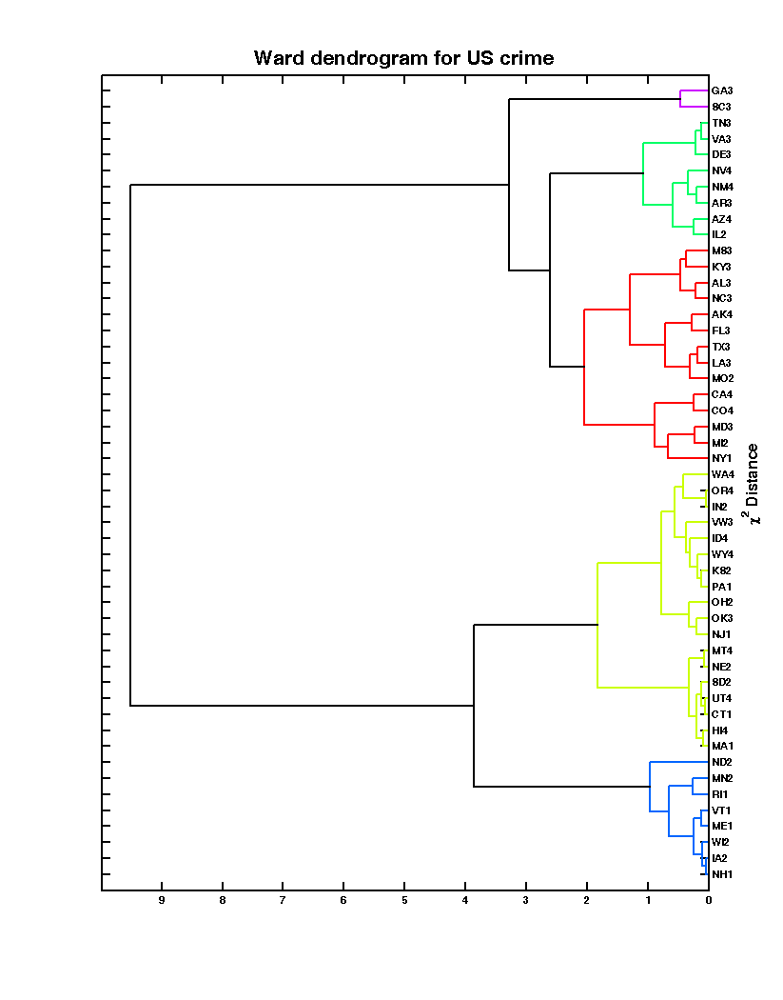
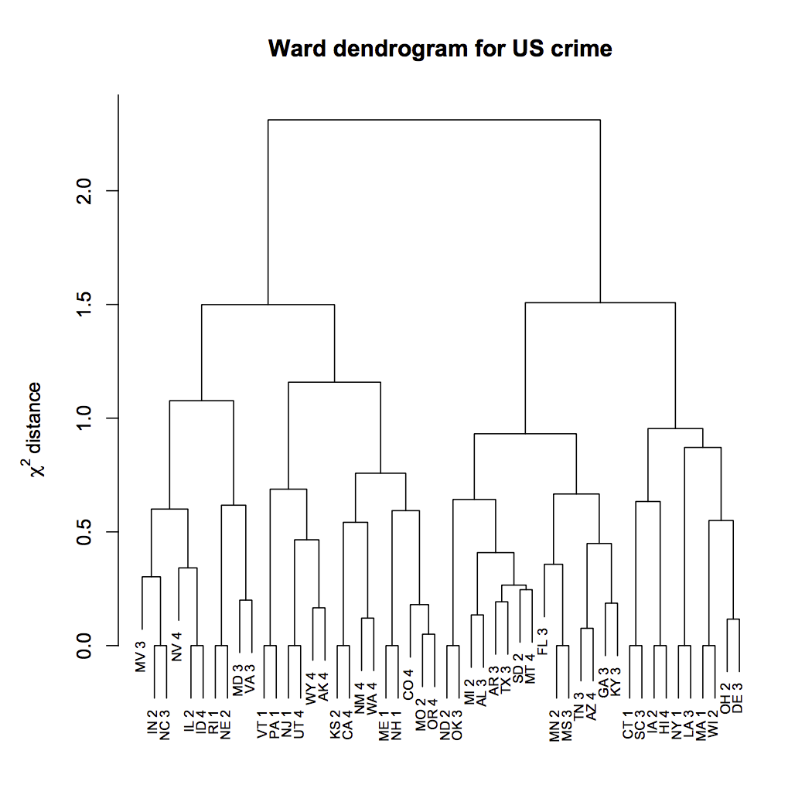
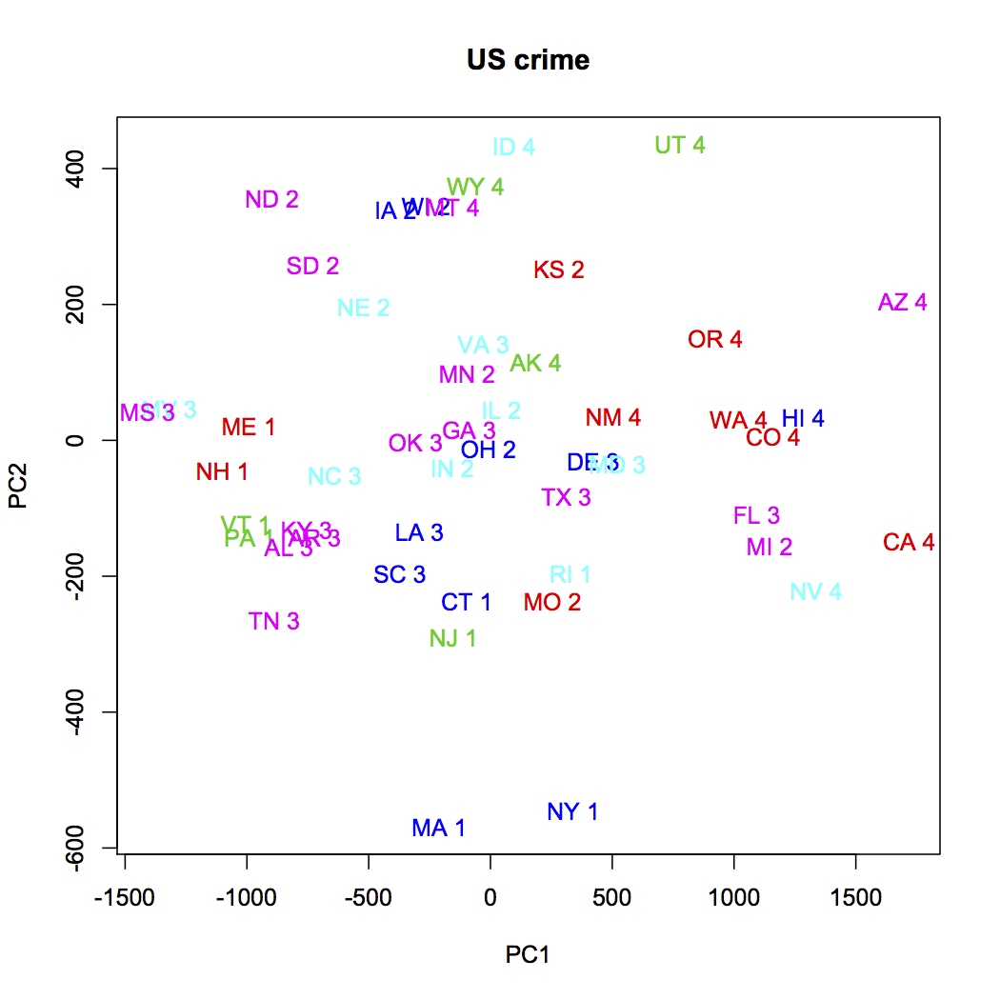

[](http://quantlet.de/)

## [](http://quantlet.de/) **SMScluscrimechi2** [](http://quantlet.de/)

```yaml

Name of Quantlet: SMScluscrimechi2

Published in: Multivariate Statistics: Exercises and Solutions

Description: 'Performs cluster analysis for US crime data.
               On the transformed data we perform a principal component
               analysis and a cluster analysis employing chi-squared
               distance between rows and Ward linkage algorithm. Plots of principal
               components and the dendrogram are presented. After extraction
               of 5 clusters, the principal components with the five
               clusters (denoted by different colours) are shown.'

Keywords: 'cluster analysis, distance, chi-squared distance, linkage, ward linkage, dendrogram, principal components, PCA, centering, chi-squared'

See also: 'MVAQnetClusKmeans, MVAQnetClusKmeansB, MVAQnetClusKmeansT, MVAcarsim, MVAclus8p, MVAclusfood, MVAclususcrime, MVAdrugsim, MVAspecclust, SMScarsim, SMSclus8km, SMSclus8pa, SMSclus8pc, SMSclus8pd, SMSclus8pmst, SMSclus8pmst2, SMSclus8psc, SMSclusbank, SMSclusbank2, SMSclusbank3, SMScluscereal, SMScluscomp, SMScluscrime, SMScluscrimechi2, SMSclushealth, SMSclushealth05, SMScluskmcereal, SMScluskmhealth'

Author[r]: Zdenek Hlavka
Author[m]: Awdesch Melzer

Datafile[r]: uscrime.rda
Datafile[m]: uscrime.dat

Example: 'Plots of principal components and the dendrogram.'
```








### R Code
```r


# Clear workspace
graphics.off()
rm(list=ls(all=TRUE))


# install and load packages
libraries = c("analogue")
lapply(libraries, function(x) if (!(x %in% installed.packages())) {
    install.packages(x)})
lapply(libraries, library, quietly = TRUE, character.only = TRUE)

load("uscrime.rda")
lab    = paste(row.names(uscrime),as.numeric(uscrime$reg))
row.names(uscrime)=lab
x      = uscrime[,3:9]
mcol   = apply(x,2,sum)/sum(x)
x      = as.matrix(x/apply(x,1,sum))%*%diag(1/sqrt(mcol))
d      = matrix(distance(x,method="chi.square")[1:2500],nrow(x),nrow(x))

attr(d,"Size")   = nrow(x)
attr(d,"Labels") = lab
attr(d,"Diag")   = TRUE
attr(d,"Upper")  = TRUE
attr(d,"method") = "chi.square"

hc     = hclust(d,"ward.D")
cl     = cutree(hc,5)
names(cl)
opar   = par(mar=c(2, 5, 4, 2) +  0.1)
plot(hc,labels=lab,main="Ward dendrogram for US crime",xlab="",sub="",cex=0.7,ylab=bquote(chi^2~distance))
pr     = prcomp(uscrime[,3:9])
dev.new()
par(opar)
plot(pr$x[,1:2],type="n",main="US crime")
text(pr$x[,1:2],lab,col=as.numeric(cl)+1)
x      = uscrime[,3:9]
x      = x/apply(x,1,sum)
## x is dataframe of relative frequencies
x      = data.frame(x)
colnames(x)=colnames(uscrime)[3:9]

## table of means in five clusters
sapply(x,tapply,cl,mean)
```

automatically created on 2018-05-28