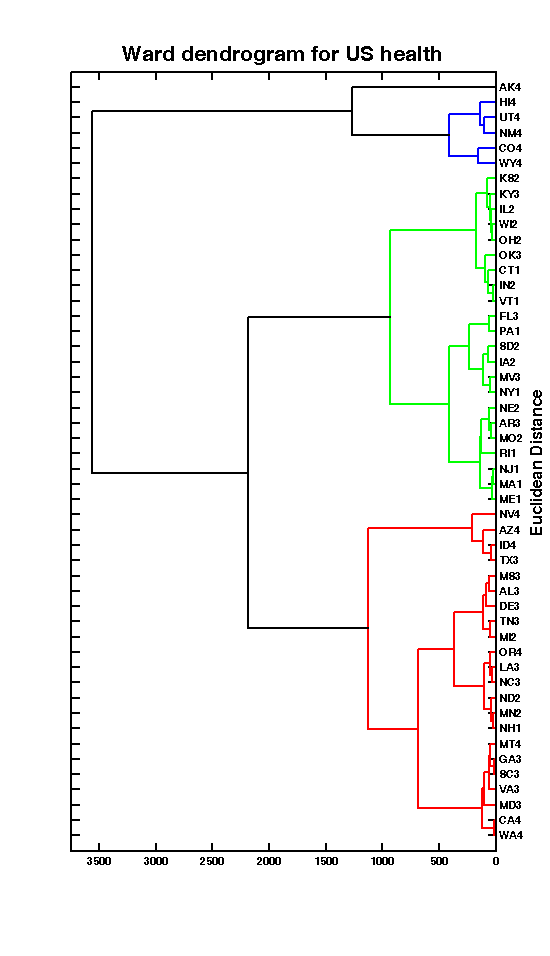
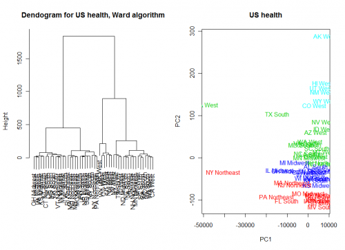

[](http://quantlet.de/)

## [](http://quantlet.de/) **SMSclushealth** [](http://quantlet.de/)

```yaml

Name of Quantlet: SMSclushealth

Published in: Multivariate Statistics: Exercises and Solutions

Description: 'Performs cluster analysis for US health data.
On the transformed data we perform a principal component
analysis and a cluster analysis employing Eulcidean
distance and Ward linkage algorithm. Plots of principal
components and the dendrogram are presented. After extraction
of 4 clusters, the principal components with the four
clusters (denoted by different colours) are shown.
The graphs and clustering differs from R due to different
algorithms.'

Keywords: 'cluster analysis, distance, euclidean, euclidean norm, linkage, ward linkage, dendrogram, principal components, PCA, centering'

See also: 'MVAQnetClusKmeans, MVAQnetClusKmeansB, MVAQnetClusKmeansT, MVAcarsim, MVAclus8p, MVAclusfood, MVAclususcrime, MVAdrugsim, MVAspecclust, SMScarsim, SMSclus8km, SMSclus8pa, SMSclus8pc, SMSclus8pd, SMSclus8pmst, SMSclus8pmst2, SMSclus8psc, SMSclusbank, SMSclusbank2, SMSclusbank3, SMScluscereal, SMScluscomp, SMScluscrime, SMScluscrimechi2, SMSclushealth, SMSclushealth05, SMScluskmcereal, SMScluskmhealth'

Author[r]: Barbora Lebduskova
Author[m]: Awdesch Melzer

Datafile[r]: ushealth.rda
Datafile[m]: ushealth.dat

Example: 'Plots of principal components and the dendrogram.'
```






### R Code
```r

# clear history, close windows
graphics.off()
rm(list=ls(all=TRUE))
setwd("C:/...") # set your working directory
load("ushealth.rda")
op   = par(mfrow=c(1,2))
lab  = paste(row.names(ushealth),ushealth[,12])
row.names(ushealth)=lab
hc   = hclust(dist(ushealth[,3:9]),"ward.D")
cl   = cutree(hc,4)
names(cl)
plot(hc,labels=lab,main="Dendogram for US health, Ward algorithm",xlab="",sub="")
pr   = prcomp(ushealth[,4:10])
plot(pr$x[,1:2],type="n",main="US health")
text(pr$x[,1:2],lab,col=as.numeric(cl)+1)
par(op)
```

automatically created on 2018-05-28

### MATLAB Code
```matlab

clear all
close all
clc

[rows,land_area,popu_1985,acc,card,canc,pul, pneu,diab,liv,doc,shop, reg, div] = ...
    textread('ushealth.dat','%s %f %f %f %f %f %f %f %f %f %f %f %f %f');
health  = horzcat(land_area,popu_1985,acc,card,canc,pul, pneu,diab,liv,doc,shop, reg, div); % Horizontal concatenation, creates data matrix
x       = health(:,3:9);
n       = size(x,1);        % number of observations
% labels for deseases
lab     = strvcat('acc', 'card', 'canc', 'pul', 'pneu', 'diab', 'liv');
lab     = cellstr(lab);
% labels for regions
state   = strcat(rows,num2str(health(:,12)));
state   = cellstr(state);

%% ward method for chi squared distance matrix
% Draw line segments between pairs of points 
d         = dist(x');  % Euclidean distance
ss        = linkage(d,'ward');     % cluster analysis with ward algorithm 

% Dendrogram for the data points after ward linkage
figure(1)
[H,T] = dendrogram(ss,n,'colorthreshold',1200,'Orientation','left','Labels',state);
set(H,'LineWidth',2)
title('Ward dendrogram for US health','FontSize',16,'FontWeight','Bold')
ylabel('Euclidean Distance','FontSize',12,'FontWeight','Bold')
box on
set(gca,'LineWidth',1.6,'FontSize',8,'FontWeight','Bold')
clus      = 4;
gpoints   = cluster(ss,'maxclust',clus);
gmean     = zeros(clus,size(x,2));
for i=1:clus
   g          = find(gpoints==i);
   gmean(i,:) = mean(x(g,:));
end

% Colors for Sectors
colour = ones(3,n);
for i=1:n
    if(gpoints(i)==1)
    colour(:,i) = [1, 0.7, 0.3]';
    end
    if(gpoints(i)==2)
    colour(:,i) = [0.4, 0, 1]';
    end
    if(gpoints(i)==3)
    colour(:,i) = [0, 0.7, 0.5]';
    end
    if(gpoints(i)==4)
    colour(:,i) = [1, 0, 0.4]';
    end
end
%% pca
[COEFF,score,latent,tsquare] = princomp(x);

figure(2)
 plot(score(:,1),score(:,2),'w')
 title('US crimes: four clusters','FontSize',16,'FontWeight','Bold')
 xlabel('PC1','FontSize',16,'FontWeight','Bold')
 ylabel('PC2','FontSize',16,'FontWeight','Bold')
 hold on
 for i=1:n
     text(score(i,1),score(i,2),state(i),'Color',colour(:,i),'FontSize',14)
 end
 box on
 set(gca,'LineWidth',1.6,'FontSize',16,'FontWeight','Bold')

%% table of means in five clusters
disp('Cluster means for each variable (columns) and each cluster (rows)')
disp(lab')
disp(gmean)

```

automatically created on 2018-05-28