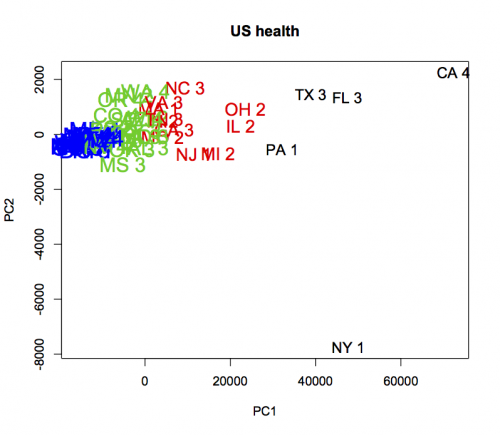
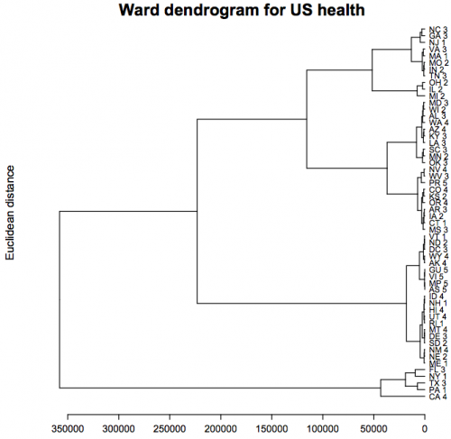

[](http://quantlet.de/)

## [](http://quantlet.de/) **SMSclushealth05** [](http://quantlet.de/)

```yaml

Name of Quantlet : SMSclushealth05

Published in : 'Multivariate Statistics: Exercises and Solutions'

Description : 'Performs cluster analysis for US health 2005 data. On the 
transformed data we perform a principal component analysis and a cluster analysis 
employing Eulcidean distance and Ward linkage algorithm. Plots of principal 
components and the dendrogram are presented. After extraction of 4 clusters, 
the principal components with the four clusters (denoted by different colours) are 
shown. The graphs and clustering differs from R due to different algorithms.'

Keywords : cluster-analysis, dendrogram, pca, principal-components, plot, graphical representation, Ward algorithm, euclidean, distance

See also : 'MVAclus8p, MVAclusbank, MVAclusbh, MVAclusfood, MVAclususcrime, MVAdrugsim, 
SMSclus8p, SMSclus8p, SMSclus8pd, SMSclus8pd, SMSclus8pmst2, SMSclusbank, SMSclusbank2, 
SMSclusbank3, SMScluscomp, SMScluscrime, SMScluscrimechi2, SMSclushealth'

Author : Awdesch Melzer

Submitted : Fri, August 22 2014 by Awdesch Melzer

Datafiles : ushealth05.csv

Example : 

- 'ward dendrogram of 56 US states and associated regions for 9 health related causes of death'

- 'principal components of 4 clusters for 56 US states and associated regions using 9 health related causes of death'
```





### R Code
```r

# clear cache and close windows
rm(list=ls(all=TRUE))
graphics.off()

#setwd("C:/...")        # please change your working directory

ushealth05 = read.csv("ushealth05.csv",sep=",",header=T) # load ushealth data

ush        = ushealth05[order(ushealth05[,20]),] # order data
ushreg     = as.numeric(ush[,20])                # def. region
ushreg[ushreg==1] = 0;ushreg[ushreg==2] = 1;ushreg[ushreg==0] = 2;ushreg[ushreg==3] = 6
ushreg[ushreg==4] = 3;ushreg[ushreg==5] = 4;ushreg[ushreg==6] = 5

lab            = paste(ush[,22],ushreg)
row.names(ush) = lab
D              = dist(ush[,3:12],method="euclidean", p=2) # pairwise "euclidean" distance matrix
# using only the relevant health related causes of death
hc             = hclust(D,"ward") # perform cluster analysis using "ward" agglomeration algorithm
cl             = cutree(hc,4)     # select only 4 clusters

# plot dendrogram
opar       = par(mar=c(2, 5, 4, 2) +  5.5,cex=0.6,cex.axis=1.2,cex.main=2,cex.lab=1.4)
plot(as.dendrogram(hc),horiz=T#,main="Ward dendrogram for US health"
,xlab="",sub="",cex=1.1,ylab="Euclidean distance")
title("Ward dendrogram for US health",line=-0.5)

# perform principal component analysis to show clusters on a 2D set
pr         = prcomp(ush[,3:12])
prx        = t(t(pr$x[,1:2])*(sign(pr$x[1,1:2])))
cl2        = as.numeric(cl) # resetting colours
cl2[cl==1] = 2
cl2[cl==4] = 1
cl2[cl==2] = 3
cl2[cl==3] = 4
# plot principal components and the clusters by colour and size
par(opar)
plot(prx[,1],prx[,2],type="n",main="US health",ylab="PC2",xlab="PC1")
text(prx[,1],prx[,2],lab,xpd=NA,col=as.numeric(cl2),cex=1+0.2*as.numeric(cl2))#+1)

mu.table = rbind(apply(ush[which(cl==1),3:12],2,mean),apply(ush[which(cl==2),3:12],2,mean),apply(ush[which(cl==3),3:12],2,mean),apply(ush[which(cl==4),3:12],2,mean))

```

automatically created on 2018-05-28