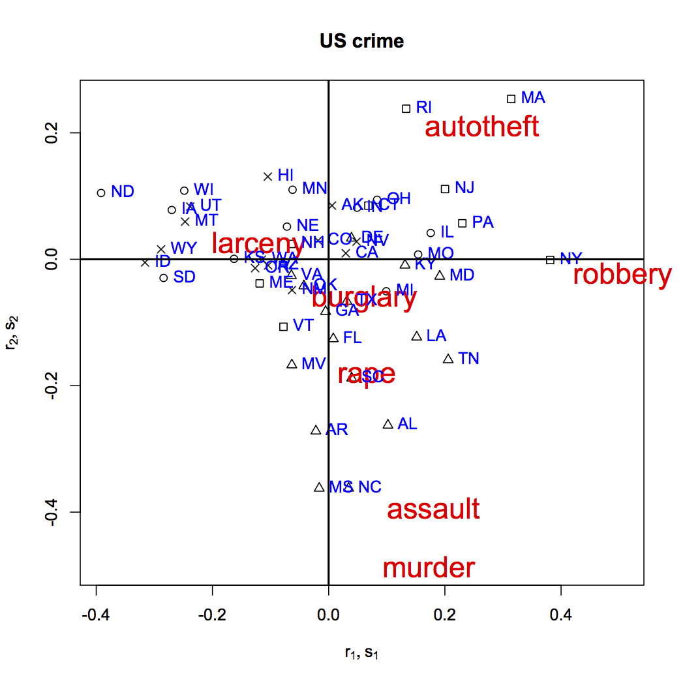

[](http://quantlet.de/)

## [](http://quantlet.de/) **SMScorrcrime** [](http://quantlet.de/)

```yaml

Name of Quantlet: SMScorrcrime

Published in: Multivariate Statistics: Exercises and Solutions

Description: 'performs a correspondence analysis for the US crime data, shows the eigenvalues of the singular value decomposition of the chi-matrix,projections on the first 3 axes and absolute contributions. It also displays graphical the factorial decomposition, the regions are selected in 4 groups (Northeast(blue), Midwest(green), South(cyan) and West(red)).'

Keywords: 'correspondence analysis, eigenvalues, singular value decomposition, chi-matrix, projections, factorial decomposition'

See also: 'SMScorrcarm, SMSchi2bac, SMScorrcrime, SMScorrhealth, SMScorrfood'

Author[r]: Zdenek Hlavka Awdesch Melzer
Author[m]: Awdesch Melzer

Datafile[r]: uscrime.rda
Datafile[m]: uscrime.dat

Example: 'Factorial decomposition for us crime data'
```




### R Code
```r

# clear variables and close windows
rm(list=ls(all=TRUE))
graphics.off()

# setwd("C:/...") # set your working directory
load("uscrime.rda")
x     = uscrime
  
col   = x[,ncol(x)-1]    # region numbers (blue-Northeast, green-Midwest, cyan-South, red- West)
x     = x[,3:(ncol(x)-2)]
xrows = row.names(x)
xcols = names(x)

a     = apply(x,1,sum)   # row sums
b     = apply(x,2,sum)   # column sums
e     = a%*%t(b)/sum(a)

C     = (x-e)/sqrt(e)    # chi-matrix
Y     = svd(C)		     # singular value decomposition
g     = Y$u 
l     = Y$d
v     = Y$v               

## eigenvalues
ll    = l^2

## percentage
per   = cumsum(l^2)/sum(l^2)

# xtable(data.frame(ll,(l^2)/sum(l^2),per))
# multiplies each column of g with each corresponding element of l and devides with each corresponding element of sqrt(a)
r     = (matrix(l,nrow(g),ncol(g),byrow=T)*g)/matrix(sqrt(a),nrow(g),ncol(g),byrow=F)
#rz = diag(a^(-1/2))%*%as.matrix(C)%*%v

# multiplies each column of v with each corresponding element of l and devides with each corresponding element of sqrt(b)
s     = (matrix(l,nrow(v),ncol(v),byrow=T)*v)/matrix(sqrt(b),nrow(v),ncol(v),byrow=F)

car   = t(t((r[,1:3]^2)*apply(x,1,sum))/(l[1:3]^2))   # contribution in r
cas   = t(t((s[,1:3]^2)*apply(x,2,sum))/(l[1:3]^2))    # contribution in s
c1    = car[,1:3]
c2    = cas[,1:3]

rr    = r[,1:2]
ss    = s[,1:2]
rr[,2]= rr[,2]*sign(rr[2,2])
ss[,2]= ss[,2]*sign(ss[6,2])

plot(rr[,1],rr[,2],pch=(as.numeric(col)+c(rep(-1,37),rep(0,13))),xlab=expression(list(r[1],s[1])),ylab=expression(list(r[2],s[2])),main="US crime",ylim=range(rr[,2],ss[,2]),xlim=range(rr[,1],ss[,1]))
points(ss[,1],ss[,2],type="n")
text(ss[,1],ss[,2],xcols,cex=1.8,col="red",xpd=NA)
text(rr[,1],rr[,2],xrows,cex=1,col="blue",pos=4,xpd=NA)
abline(h=0,v=0,lwd=2)


```

automatically created on 2018-05-28

### MATLAB Code
```matlab

% clear variables and close windows
clear all
close all
clc

load('uscrime.dat')
x = uscrime;

% labels for crimes
crime     = strvcat('murder', 'rape', 'robbery', 'assault', 'burglary', 'larceny', 'autotheft');
crime     = cellstr(crime);
% labels for regions
state     = strvcat('ME','NH','VT','MA','RI','CT','NY','NJ','PA','OH','IN','IL','MI','WI','MN','IA','MO','ND','SD','NE','KS','DE','MD','VA','VW','NC','SC','GA','FL','KY','TN','AL','MS','AR','LA','OK','TX','MT','ID','WY','CO','NM','AZ','UT','NV','WA','OR','CA','AK','HI');
state     = cellstr(state);

col       = x(:,10)-1; % region numbers
x         = x(:,3:9);
xrows     = state;
xcols     = crime;

a     = sum(x,2); % row sum
  b     = sum(x,1); % col sum

  e     = a*b./sum(a);

%chi-matrix
  cc    = (x-e)./sqrt(e);

%singular value decomposition
[g l d] = svd(cc,0);
  
%eigenvalues
  ll    = diag(l).*diag(l);
%cumulated percentage of the variance
  aux   = cumsum(ll)./sum(ll);
  perc  = [ll,aux];

  r1    = repmat(diag(l)',size(g,1),1).*g; %multiplies each column of g with each corresponding element of l
  r     = (r1./repmat(sqrt(a),1,size(g,2))); %divides each row of r1 with each corresponding element of sqrt(a)

  s1    = repmat(diag(l)',size(d,1),1).*d; %multiplies each column of d with each corresponding element of l
  s     = (s1./repmat(sqrt(b)',1,size(d,2))); %divides each row of s1 with each corresponding element of sqrt(b)

  car   = repmat(a,1,size(r,2)).*r.^2./repmat(ll',size(r,1),1); %contribution in r

  cas   = repmat(b',1,size(s,2)).*s.^2./repmat(ll',size(s,1),1); %contribution in s

rr      = r(:,1:2);
rr(:,2) = rr(:,2)*(-1);
ss = s(:,1:2);
ss(:,2) = ss(:,2)*(-1);

Markers= ['s','s','s','s','s','s','s','s','s',...
 'o','o','o','o','o','o','o','o','o','o','o','o',...
 '^','^','^','^','^','^','^','^','^','^','^','^','^','^','^','^',...
 'x','x','x','x','x','x','x','x','x','x','x','x','x'];
figure(1)
hold on
for i=1:size(rr,1)
plot(rr(i,1),rr(i,2),Markers(i),'Color','k','MarkerSize',10)
end
xlabel('r_1,s_1','FontSize',16,'FontWeight','Bold')
ylabel('r_2,s_2','FontSize',16,'FontWeight','Bold')
title('US crime','FontSize',16,'FontWeight','Bold')
xlim([min(rr(:,1))-0.01,max(rr(:,1))+0.01])
ylim([min(rr(:,2)-0.01),max(rr(:,2))+0.01])
text(ss(:,1),ss(:,2),xcols,'Color','r','FontSize',16,'FontWeight','Bold')
text(rr(:,1)+0.005,rr(:,2)-0.005,xrows,'Color','b','FontSize',16,'FontWeight','Bold')
box on
line([0,0]',[-2,3]','LineWidth',1.6)
line([-4,4]',[0,0]','LineWidth',1.6)
set(gca,'LineWidth',1.6,'FontSize',16,'FontWeight','Bold')
hold off


```

automatically created on 2018-05-28