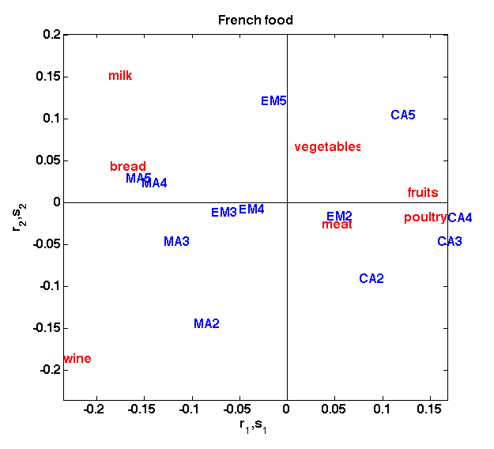
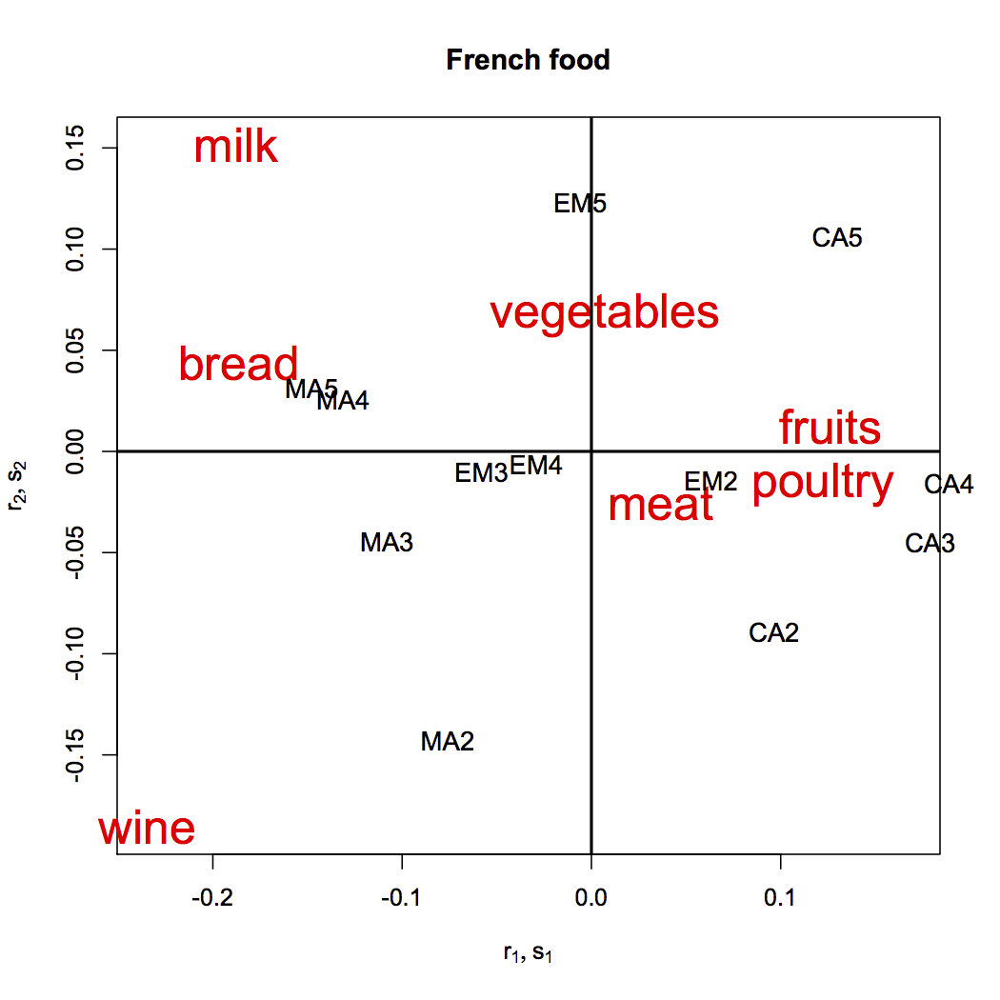

[](http://quantlet.de/)

## [](http://quantlet.de/) **SMScorrfood** [](http://quantlet.de/)

```yaml

Name of Quantlet: SMScorrfood

Published in: Multivariate Statistics: Exercises and Solutions

Description: 'performs a correspondence analysis for the French food data, shows the eigenvalues of the singular value decomposition of the chi-matrix and displays graphical its factorial decomposition.'

Keywords: 'correspondence analysis, eigenvalues, singular value decomposition, chi-matrix, projections, factorial decomposition'

See also: 'SMScorrcarm, SMSchi2bac, SMScorrcrime, SMScorrhealth, SMScorrfood'

Author[r]: Lucia Jaresova, Zdenek Hlavka
Author[m]: Awdesch Melzer

Datafile[r]: food.rda
Datafile[m]: food.dat

Example: 'Factorial decomposition for French food data'
```





### R Code
```r

# Clear memory and close windows
graphics.off()
rm(list=ls(all=TRUE))

# install and load packages
libraries = c("MASS")
lapply(libraries, function(x) if (!(x %in% installed.packages())) {
    install.packages(x)})
lapply(libraries, library, quietly = TRUE, character.only = TRUE)

# setwd("C:/...") # please change the working directory
load("food.rda")

x = food
x                       # data
a = apply(x,1,sum);a    # row frequencies		
b = apply(x,2,sum);b    # column frequencies

# estimated expected value in (i,j)-th category
# under the assumption of independence
e = a%*%t(b)/sum(a)           
round(e,0)

# chi-matrix (contributors to the chi-statistics), 
# which may be viewed as a measure of the departure 
# of the observed x_{ij} from independence
C = (x-e)/sqrt(e) 

decomp = svd(C)         # singular value decomposition
d = decomp$d;d
u = decomp$u;u
v = decomp$v;v
C = u%*%diag(d)%*%t(v)  # this should be matrix C
# eigenvalues & percentages
cbind(d^2, cumsum(d^2/sum((d^2))))


  r1    = matrix(as.matrix(d),nrow=nrow(u),ncol=ncol(u),byrow=T)*u #multiplies each column of g with each corresponding element of l
  r     = (r1/matrix(sqrt(as.matrix(a)),nrow=nrow(u),ncol=ncol(u),byrow=F)) #divides each row of r1 with each corresponding element of sqrt(a)

  s1    = matrix(d,nrow=nrow(v),ncol=ncol(v),byrow=T)*v #multiplies each column of d with each corresponding element of l
  s     = (s1/matrix(sqrt(b),nrow=nrow(v),ncol=ncol(v),byrow=F))#divides each row of s1 with each corresponding element of sqrt(b)

  car   = matrix(matrix(a),nrow=nrow(r),ncol=ncol(r),byrow=F)*r^2/matrix(l^2,nrow=nrow(r),ncol=ncol(r),byrow=T) #contribution in r

  cas   = matrix(matrix(b),nrow=nrow(s),ncol=ncol(s),byrow=F)*s^2/matrix(l^2,nrow=nrow(s),ncol=ncol(s),byrow=T) #contribution in s

rr = t(t(r[,1:2])*sign(r[12,1:2]))
ss = t(t(s[,1:2])*sign(s[3,1:2]))
xrows = rownames(x)
xcols = colnames(x)
# way how to compute correspondece analysis in R

# corresp ... find the principal canonical correlation and corresponding
# 	row- and column-scores from a correspondence analysis of a two-way 
# 	contingency table 
# x ... various forms of the principal argument for specifying a two-way frequency table
# nf ... the number of factors to be computed (we need two for biplot)
#	the first two singular vectors for a sort of biplot.

co = corresp(x, nf = 7)    
names(co)
co$cor		
co$rscore       # row-scores
co$cscore	# column-scores
co$Freq		# two-way frequency table (we have it already as input)


#biplot(cbind(co$rscore[,1],-co$rscore[,2]),cbind(co$cscore[,1],-co$cscore[,2]),main="french food")
plot(rr[,1],rr[,2],xlab=expression(list(r[1],s[1])),ylab=expression(list(r[2],s[2])),main="French food",type="n",ylim=c(min(rr[,2],ss[,2]),max(rr[,2],ss[,2])),xlim=c(min(rr[,1],ss[,1]),max(rr[,1],ss[,1])))
text(ss[,1],ss[,2],xcols,cex=2,col="red",xpd=NA)
points(ss[,1],ss[,2],type="n")
text(rr[,1],rr[,2],xrows,cex=1.1,pos=4,xpd=NA)
abline(h=0,v=0,lwd=2)


```

automatically created on 2018-05-28

### MATLAB Code
```matlab

% clear memory and close windows
clear all
close all
clc

%% load data
[type, A, B, C, D, E, F, G] = textread('food.dat','%s %f %f %f %f %f %f %f');
x       = [A, B, C, D, E, F, G];

a       = sum(x,2);a	% row frequencies		
b       = sum(x,1);b	% column frequencies

% estimated expected value in (i,j)-th category
% under the assumption of independence
e       = a*b/sum(a);
round(e)

% chi-matrix (contributors to the chi-statistics), 
% which may be viewed as a measure of the departure 
% of the observed x_{ij} from independence
C       = (x-e)./sqrt(e);

[u d v] = svd(C,'econ')			% singular value decomposition

C       = u*d*v'		% this should be matrix C
% eigenvalues & percentages
[power(diag(d),2), cumsum(power(diag(d),2)/sum(power(diag(d),2)))]


  r1    = repmat(diag(d)',size(u,1),1).*u; %multiplies each column of g with each corresponding element of l
  r     = (r1./repmat(sqrt(a),1,size(u,2))) %divides each row of r1 with each corresponding element of sqrt(a)

  s1    = repmat(diag(d)',size(v,1),1).*v; %multiplies each column of d with each corresponding element of l
  s     = (s1./repmat(sqrt(b)',1,size(v,2)))%divides each row of s1 with each corresponding element of sqrt(b)

  car   = repmat(a,1,size(r,2)).*r.^2./repmat(diag(d)'.^2,size(r,1),1) %contribution in r

  cas   = repmat(b',1,size(s,2)).*s.^2./repmat(diag(d)'.^2,size(s,1),1) %contribution in s

rr      = r(:,1:2);
rr(:,2) = rr(:,2)*(-1)
ss      = s(:,1:2);
ss(:,2) = ss(:,2)*(-1)

xrows = type;
xcols = strvcat('bread', 'vegetables', 'fruits', 'meat', 'poultry', 'milk', 'wine');
xcols = cellstr(xcols);

%% plot
plot(r(:,1),rr(:,2),'wo')
xlabel('r_1,s_1','FontSize',16,'FontWeight','Bold')
ylabel('r_2,s_2','FontSize',16,'FontWeight','Bold')
title('French food','FontSize',16,'FontWeight','Bold')
ylim([min([min(rr(:,2)),min(ss(:,2))])-0.05,max([max(rr(:,2)),max(ss(:,2))])+0.05])
xlim([min([min(rr(:,1)),min(ss(:,1))]),max([max(rr(:,1)),max(ss(:,1))])])
text(ss(:,1),ss(:,2),xcols,'color','r','FontSize',16,'FontWeight','Bold')
set(gca,'LineWidth',1.6,'FontSize',16,'FontWeight','Bold')
text(rr(:,1),rr(:,2),xrows,'color','b','FontSize',16,'FontWeight','Bold')
line([0,0]',[-1.5,1.5]','color','k','LineWidth',1.6)
line([-1.5,1.5]',[0,0]','color','k','LineWidth',1.6)


```

automatically created on 2018-05-28