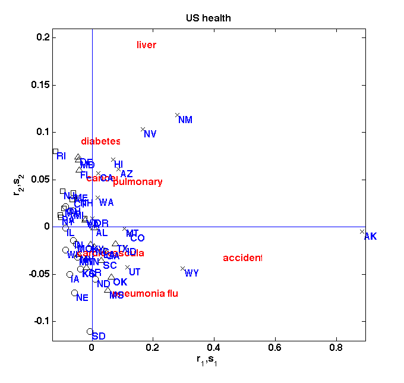
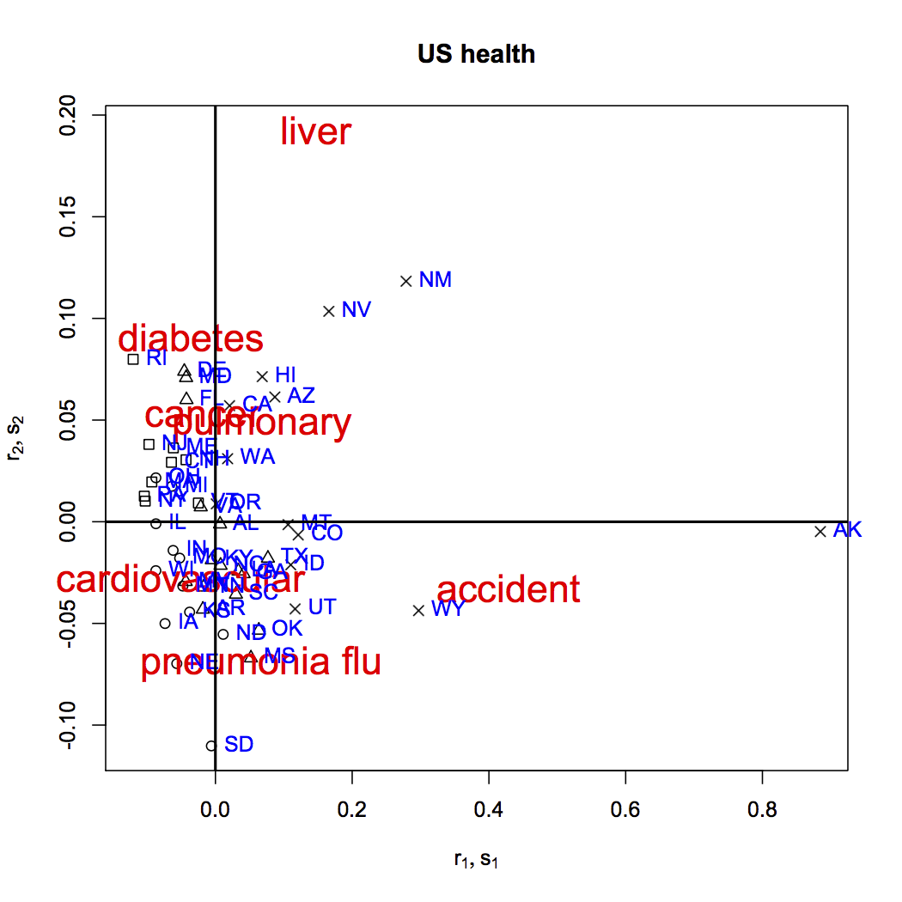
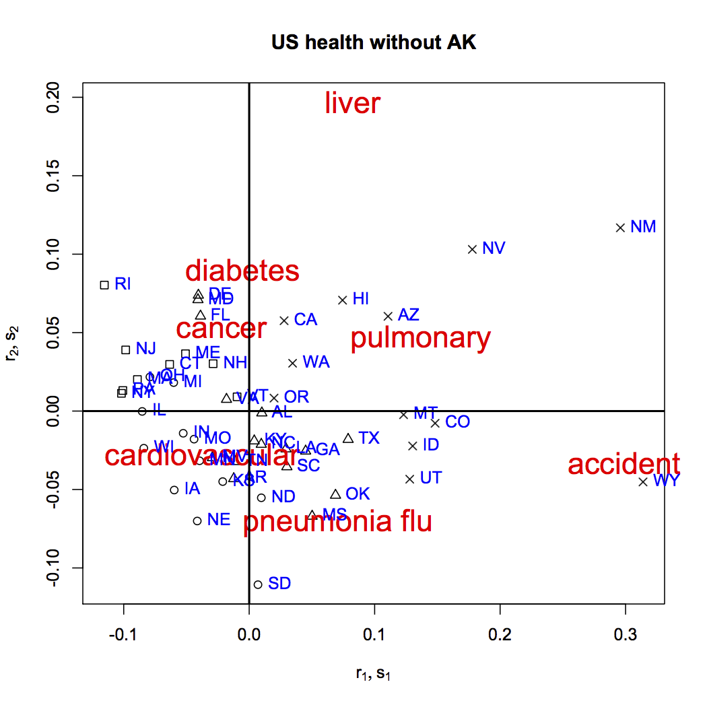

[](http://quantlet.de/)

## [](http://quantlet.de/) **SMScorrhealth** [](http://quantlet.de/)

```yaml

Name of Quantlet: SMScorrhealth

Published in: Multivariate Statistics: Exercises and Solutions

Description: 'performs a correspondence analysis for the US health, shows the eigenvalues of the singular value decomposition of the chi-matrix,projections on the first 3 axes and absolute contributions. It also displays graphical the factorial decomposition, the regions are selected in 4 groups (Northeast(blue), Midwest(green), South(cyan) and West(red)).'

Keywords: 'correspondence analysis, eigenvalues, singular value decomposition, chi-matrix, projections, factorial decomposition'

See also: 'SMScorrcarm, SMSchi2bac, SMScorrcrime, SMScorrhealth, SMScorrfood'

Author[r]: Zdenek Hlavka
Author[m]: Awdesch Melzer

Datafile[r]: ushealth.rda
Datafile[m]: ushealth.dat

Example: 'Factorial decomposition for US health data'
```








### R Code
```r

# clear variables and close windows
rm(list = ls(all=TRUE))
graphics.off()

# wak == 1

# load data

load("ushealth.rda")
x     = ushealth
for (i in 1:ncol(x)){
     x[,i] = as.numeric(x[,i]) 
}
  col   = x[,ncol(x)-1]        # region numbers (Northeast, Midwest, South, West)
  col   = as.numeric(col)+c(rep(-1,37),rep(0,13))
  x     = x[,3:9]
# labels for regions
  xrows = row.names(x)
  #c("ME","NH","VT","MA","RI","CT","NY","NJ","PA","OH","IN","IL","MI","WI","MN","IA","MO","ND","SD","NE","KS","DE","MD","VA","WV","NC","SC","GA","FL","KY","TN","AL","MS","AR","LA","OK","TX","MT","ID","WY","CO","NM","AZ","UT","NV","WA","OR","CA","AK","HI")
# labels for crimes
  xcols = c("accident","cardiovascular","cancer","pulmonary","pneumonia flu","diabetes","liver")
  
  colnames(x) = xcols
  rownames(x) = xrows
  wak   = 1                      # set to 0/1 to ex/include Alaska!!
  wak   = c(rep(1,nrow(x)-2),wak,1)
  x     = subset(x,wak==1)  
  xrows = subset(xrows,wak==1)
  col   = subset(col,wak==1)   
  a     = rowSums(x)
  b     = colSums(x)

  e     = as.matrix(a)%*%b/sum(a)

#chi-matrix
  cc    = (x-e)/sqrt(e)

#singular value decomposition
  sv    = svd(cc)
  g     = sv$u
  l     = sv$d
  d     = sv$v

#eigenvalues
  ll    = l*l
#cumulated percentage of the variance
  aux   = cumsum(ll)/sum(ll)
  perc  = cbind(ll,aux)

  r1    = matrix(as.matrix(l),nrow=nrow(g),ncol=ncol(g),byrow=T)*g #multiplies each column of g with each corresponding element of l
  r     = (r1/matrix(sqrt(as.matrix(a)),nrow=nrow(g),ncol=ncol(g),byrow=F))*(-1) #divides each row of r1 with each corresponding element of sqrt(a)

  s1    = matrix(l,nrow=nrow(d),ncol=ncol(d),byrow=T)*d #multiplies each column of d with each corresponding element of l
  s     = (s1/matrix(sqrt(b),nrow=nrow(d),ncol=ncol(d),byrow=F))*(-1) #divides each row of s1 with each corresponding element of sqrt(b)

  car   = matrix(matrix(a),nrow=nrow(r),ncol=ncol(r),byrow=F)*r^2/matrix(l^2,nrow=nrow(r),ncol=ncol(r),byrow=T) #contribution in r

  cas   = matrix(matrix(b),nrow=nrow(s),ncol=ncol(s),byrow=F)*s^2/matrix(l^2,nrow=nrow(s),ncol=ncol(s),byrow=T) #contribution in s

  rr    = t(t(r[,1:2])*sign(r[50,1:2]))
  ss    = t(t(s[,1:2])*sign(s[7,1:2]))
  
plot(rr[,1],rr[,2],xlab=expression(list(r[1],s[1])),ylab=expression(list(r[2],s[2])),main="US health",pch=c(col),ylim=c(min(rr[,2],ss[,2]),max(rr[,2],ss[,2])),xlim=c(min(rr[,1],ss[,1]),max(rr[,1],ss[,1])))
text(ss[,1],ss[,2],xcols,cex=1.8,col="red",xpd=NA)
points(ss[,1],ss[,2],type="n")
text(rr[,1],rr[,2],xrows,col="blue",pos=4,xpd=NA)
abline(h=0,v=0,lwd=2)

# the same analysis without Alaska:
# wak == 0

  x     = ushealth
  for (i in 1:ncol(x)){
        x[,i] = as.numeric(x[,i]) 
  }
  col   = x[,ncol(x)-1]       # region numbers (Northeast, Midwest, South, West)
  col   = as.numeric(col)+c(rep(-1,37),rep(0,13))
  x     = x[,3:9]
# labels for regions
  xrows = row.names(x)
  #c("ME","NH","VT","MA","RI","CT","NY","NJ","PA","OH","IN","IL","MI","WI","MN","IA","MO","ND","SD","NE","KS","DE","MD","VA","WV","NC","SC","GA","FL","KY","TN","AL","MS","AR","LA","OK","TX","MT","ID","WY","CO","NM","AZ","UT","NV","WA","OR","CA","AK","HI")
# labels for crimes
  xcols = c("accident","cardiovascular","cancer","pulmonary","pneumonia flu","diabetes","liver")
  
  colnames(x) = xcols
  rownames(x) = xrows
  wak   = 0                      # set to 0/1 to ex/include Alaska!!
  wak   = c(rep(1,nrow(x)-2),wak,1)
  x     = subset(x,wak==1)  
  xrows = subset(xrows,wak==1)
  col   = subset(as.numeric(col),wak==1)   
  a     = rowSums(x)
  b     = colSums(x)

  e     = matrix(a)%*%b/sum(a) 
  
  #chi-matrix
  cc    = (x-e)/sqrt(e)
  #singular value decomposition
  sv    = svd(cc)
  g     = sv$u
  l     = sv$d
  d     = sv$v

#eigenvalues
  ll    = l*l
#cumulated percentage of the variance
  aux   = cumsum(ll)/sum(ll)
  perc  = cbind(ll,aux)
  r1    = matrix(l,nrow=nrow(g),ncol=ncol(g),byrow=T)*g # multiplies each column of g with each corresponding element of l
  r     = (r1/matrix(sqrt(a),nrow=nrow(g),ncol=ncol(g),byrow=F))*(-1) # divides each row of r1 with each corresponding element of sqrt(a)
  s1    = matrix(l,nrow=nrow(d),ncol=ncol(d),byrow=T)*d # multiplies each column of d with each corresponding element of l
  s     = (s1/matrix(sqrt(b),nrow=nrow(d),ncol=ncol(d),byrow=F))*(-1) # divides each row of s1 with each corresponding element of sqrt(b)
  car   = matrix(matrix(a),nrow=nrow(r),ncol=ncol(r),byrow=F)*r^2/matrix(l^2,nrow=nrow(r),ncol=ncol(r),byrow=T) # contribution in r
  cas   = matrix(matrix(b),nrow=nrow(s),ncol=ncol(s),byrow=F)*s^2/matrix(l^2,nrow=nrow(s),ncol=ncol(s),byrow=T) # contribution in s
  rr    = t(t(r[,1:2])*sign(r[49,1:2]))
  ss    = t(t(s[,1:2])*sign(s[7,1:2]))
dev.new()
plot(rr[,1],rr[,2],xlab=expression(list(r[1],s[1])),ylab=expression(list(r[2],s[2])),main="US health without AK",pch=col,ylim=c(min(rr[,2],ss[,2]),max(rr[,2],ss[,2])),xlim=c(min(rr[,1],ss[,1]),max(rr[,1],ss[,1])))
text(cbind(ss[,1],ss[,2]),xcols,cex=1.8,col="red",xpd=NA)
points(ss[,1],ss[,2],type="n")
text(cbind(rr[,1],rr[,2]),xrows,col="blue",pos=4,xpd=NA)
abline(h=0,v=0,lwd=2)
```

automatically created on 2018-05-28

### MATLAB Code
```matlab

% clear variables and close windows
clear all
close all
clc


% wak == 1

% load data
[rows,land_area,popu_1985,acc,card,canc,pul, pneu,diab,liv,doc,shop, reg, div] = ...
    textread('ushealth.dat','%s %f %f %f %f %f %f %f %f %f %f %f %f %f');
health  = horzcat(land_area,popu_1985,acc,card,canc,pul, pneu,diab,liv,doc,shop, reg, div); % Horizontal concatenation, creates data matrix
x       = health(:,3:9);
n       = size(x,1);        % number of observations
% labels for deseases
lab     = strvcat('accident', 'cardiovascular', 'cancer', 'pulmonary', 'pneumonia flu', 'diabetes', 'liver');
lab     = cellstr(lab);

  wak   = 1;                      % set to 0/1 to ex/include Alaska!!
  wak   = [ones(n-2,1);wak;1];
  x     = x(find(wak==1),:);  
  xrows = rows(find(wak==1),:);
  col   = reg(find(wak==1),:);   
  a     = sum(x,2); % row sum
  b     = sum(x,1); % col sum

  e     = a*b./sum(a);

%chi-matrix
  cc    = (x-e)./sqrt(e);

%singular value decomposition
[g l d] = svd(cc,0);
  
%eigenvalues
  ll    = diag(l).*diag(l);
%cumulated percentage of the variance
  aux   = cumsum(ll)./sum(ll);
  perc  = [ll,aux];

  r1    = repmat(diag(l)',size(g,1),1).*g; %multiplies each column of g with each corresponding element of l
  r     = (r1./repmat(sqrt(a),1,size(g,2))); %divides each row of r1 with each corresponding element of sqrt(a)

  s1    = repmat(diag(l)',size(d,1),1).*d; %multiplies each column of d with each corresponding element of l
  s     = (s1./repmat(sqrt(b)',1,size(d,2))); %divides each row of s1 with each corresponding element of sqrt(b)

  car   = repmat(a,1,size(r,2)).*r.^2./repmat(ll',size(r,1),1); %contribution in r

  cas   = repmat(b',1,size(s,2)).*s.^2./repmat(ll',size(s,1),1); %contribution in s

rr = r(:,1:2);
ss = s(:,1:2);
Markers= ['s','s','s','s','s','s','s','s','s',...
 'o','o','o','o','o','o','o','o','o','o','o','o',...
 '^','^','^','^','^','^','^','^','^','^','^','^','^','^','^','^',...
 'x','x','x','x','x','x','x','x','x','x','x','x','x'];
figure(1)
hold on
for i=1:size(rr,1)
plot(rr(i,1),rr(i,2),Markers(i),'Color','k','MarkerSize',10)
end
xlabel('r_1,s_1','FontSize',16,'FontWeight','Bold')
ylabel('r_2,s_2','FontSize',16,'FontWeight','Bold')
title('US health','FontSize',16,'FontWeight','Bold')
xlim([min(rr(:,1))-0.01,max(rr(:,1))+0.01])
ylim([min(rr(:,2)-0.01),0.21])
text(ss(:,1),ss(:,2),lab,'Color','r','FontSize',16,'FontWeight','Bold')
text(rr(:,1)+0.005,rr(:,2)-0.005,xrows,'Color','b','FontSize',16,'FontWeight','Bold')
box on
line([0,0]',[-2,3]','LineWidth',1.6)
line([-4,4]',[0,0]','LineWidth',1.6)
set(gca,'LineWidth',1.6,'FontSize',16,'FontWeight','Bold')
hold off

% the same analysis without Alaska:
% wak == 0
  x   = health(:,3:9);
  wak = 0;                      % set to 0/1 to ex/include Alaska!!
  wak = [ones(n-2,1);wak;1];
  x     = x(find(wak==1),:);  
  xrows = rows(find(wak==1),:);
  col   = reg(find(wak==1),:);   
  a     = sum(x,2); % row sum
  b     = sum(x,1); % col sum

  e     = a*b./sum(a);

%chi-matrix
  cc    = (x-e)./sqrt(e);

%singular value decomposition
[g l d] = svd(cc,0);
  
%eigenvalues
  ll    = diag(l).*diag(l);
%cumulated percentage of the variance
  aux   = cumsum(ll)./sum(ll);
  perc  = [ll,aux];

  r1    = repmat(diag(l)',size(g,1),1).*g; %multiplies each column of g with each corresponding element of l
  r     = (r1./repmat(sqrt(a),1,size(g,2))); %divides each row of r1 with each corresponding element of sqrt(a)

  s1    = repmat(diag(l)',size(d,1),1).*d; %multiplies each column of d with each corresponding element of l
  s     = (s1./repmat(sqrt(b)',1,size(d,2))); %divides each row of s1 with each corresponding element of sqrt(b)

  car   = repmat(a,1,size(r,2)).*r.^2./repmat(ll',size(r,1),1); %contribution in r

  cas   = repmat(b',1,size(s,2)).*s.^2./repmat(ll',size(s,1),1); %contribution in s

rr = r(:,1:2);
ss = s(:,1:2);

%  dev.new()
figure(2)
hold on
for i=1:size(rr,1)
plot(rr(i,1),rr(i,2),Markers(i),'Color','k','MarkerSize',10)
end
xlabel('r_1,s_1','FontSize',16,'FontWeight','Bold')
ylabel('r_2,s_2','FontSize',16,'FontWeight','Bold')
title('US health','FontSize',16,'FontWeight','Bold')
xlim([min(rr(:,1))-0.01,max(rr(:,1))+0.01])
ylim([min(rr(:,2)-0.01),0.21])
text(ss(:,1),ss(:,2),lab,'Color','r','FontSize',16,'FontWeight','Bold')
text(rr(:,1)+0.005,rr(:,2)-0.005,xrows,'Color','b','FontSize',16,'FontWeight','Bold')
box on
line([0,0]',[-2,3]','LineWidth',1.6)
line([-4,4]',[0,0]','LineWidth',1.6)
set(gca,'LineWidth',1.6,'FontSize',16,'FontWeight','Bold')
hold off

```

automatically created on 2018-05-28