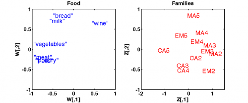

[](http://quantlet.de/)

## [](http://quantlet.de/) **SMSdecofood** [](http://quantlet.de/)

```yaml


Name of Quantlet: SMSdecofood

Published in: Multivariate Statistics: Exercises and Solutions

Description: 'Standardizes the data first and performs a singular value decomposition on the transformed French food data. Resulting coordinates are plotted for the first two largest eigenvalues and corresponding eigenvectors in a two dimensional space.'

Keywords: analysis, dimension reduction, eigenvalues, eigenvectors, empirical, factorial, factorial decomposition, graphical representation, plot, scale, scaling, singular value, spectral decomposition, standardization, standardize, svd, transformation, visualization

See also: 'SMSdecotime, SMSdecobank, SMSdecofood'

Author[r]: Zdenek Hlavka
Author[m]: Norman Duckwitz

Datafile[r]: food.rda
Datafile[m]: food.csv

Example: 'Visualization of food and family types after dimension reduction.'
```



### R Code
```r


rm(list=ls(all=TRUE))
graphics.off()

# setwd("C:/...") # set working directory
# load data
load("food.rda")

x = data.matrix(food[,1:7])
n = nrow(x)
p = ncol(x)


one = matrix(1,n,n)
h   = diag(rep(1,n))-one/n # centering matrix
d   = diag(1/sqrt((apply((x-matrix(apply(x,2,mean),n,p,byrow=T))^2,2,sum)/n)))
xs  = h%*%as.matrix(x)%*%d    # standardized data

xs  = xs/sqrt(n)

# singular value decomposition
deco = svd(xs)
w = (-1)*deco$v[,1:2]%*%diag(deco$d[1:2])
z = (-1)*deco$u[,1:2]%*%diag(deco$d[1:2])

# plot
opar=par(mfrow=c(2,1))

plot(w,type="n",xlim=c(-1,1),ylim=c(-1,1),xlab=expression(w[1]),ylab=expression(w[2]))
title("food")
text(w,colnames(food),xpd=NA)
abline(h=c(0,0),lwd=2)
abline(v=c(0,0),lwd=2)

plot(z,type="n",xlim=c(-1.5,1.5),ylim=c(-1,1),xlab=expression(z[1]),ylab=expression(z[2]))
title("families")
text(z,row.names(food),xpd=NA)
abline(h=c(0,0),lwd=2)
abline(v=c(0,0),lwd=2)
par(opar)
```

automatically created on 2018-05-28

### MATLAB Code
```matlab


clear all
close all
clc

% load data
fooddata = importdata('food.csv');
x        = fooddata.data;
[m,n]    = size(x);
textz    = fooddata.textdata(2:(m+1),1);
textw    = transpose(fooddata.textdata(1,2:(n+1)));
xmeanm   = repmat((mean(x))',1,m);
stdvec   = sqrt((m-1)/m)*repmat(std(x)',1,m);

% transformation
x        = (x'-xmeanm)./stdvec;
x        = x'/sqrt(m);

% singular value decomposition
[U,S,V]  = svd(x);

w        = V(:,1:2)*S(1:2,1:2)*(-1);
z        = U(:,1:2)*S(1:2,1:2)*(-1);

%plot
subplot(1,2,1);
plot(w(:,1),w(:,2),'d', 'Color', 'white')
axis([-1 1  -1 1]);
xlabel('W[,1]','FontSize',16,'FontWeight','bold')
ylabel('W[,2]','FontSize',16,'FontWeight','bold')
title('Food','FontSize',16,'FontWeight','Bold')
for i=1:n
text(w(i,1),w(i,2),textw(i),'FontSize',18, 'Color', 'blue')
end
set(gca,'FontSize',16,'LineWidth',2,'FontWeight','bold')

subplot(1,2,2);
plot(z(:,1),z(:,2),'d', 'Color', 'white')
axis([-2 1.5 -1 1]);
xlabel('Z[,1]','FontWeight','bold','FontSize',16)
ylabel('Z[,2]','FontWeight','bold','FontSize',16)
title('Families','FontSize',16,'FontWeight','Bold')
for i=1:m
text(z(i,1),z(i,2),textz(i),'FontSize',18, 'Color', 'red')
end
set(gca,'FontSize',16,'LineWidth',2,'FontWeight','bold')

  % print -painters -dpdf -r600 SMSdecofood.pdf
  % print -painters -dpng -r600 SMSecofood.png
```

automatically created on 2018-05-28