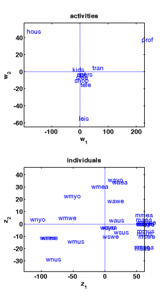

[](http://quantlet.de/)

## [](http://quantlet.de/) **SMSdecotime** [](http://quantlet.de/)

```yaml


Name of Quantlet: SMSdecotime

Published in: Multivariate Statistics: Exercises and Solutions

Description: 'Performs the factorial analysis for timebudget data set by first, standardizing the data and then employing singular value decomposition.'

Keywords: analysis, dimension reduction, eigenvalues, eigenvectors, empirical, factorial, factorial decomposition, graphical representation, plot, scale, scaling, singular value, spectral decomposition, standardization, standardize, svd, transformation, visualization

See also: 'SMSdecotime, SMSdecobank, SMSdecofood'

Author[r]: Zdenek Hlavka
Author[m]: Awdesch Melzer

Datafile[r]: timebudget.rda
Datafile[m]: timebudget.dat

Example: 'Visualization of activities and individuals after dimension reduction.'
```




### R Code
```r


# clear history, close windows
rm(list=ls(all=TRUE))
graphics.off()

# setwd("C:/...") # set working directory

load("timebudget.rda")

timebudget = as.matrix(timebudget)

n = nrow(timebudget) # rows of data matrix 
p = ncol(timebudget) # columns of data matrix 

 one = matrix(1,n,n)
 h = diag(n)-one/n       # centering matrix 
 xs = h%*%timebudget              # centered data

 xs = xs/sqrt(n)                
 xs2 = t(xs)%*%xs 
 ei = eigen(xs2)          # spectral decomposition 
 lambda = ei$values
 gamma = ei$vectors

 w = -t(t(gamma)*sqrt(lambda))       # coordinates of food 
 w = w[,1:2]                       
 z = -xs%*%gamma                     # coordinates of families 
 z = z[,1:2]                       

tau = cumsum(lambda)/sum(lambda)
tau

########## 
# different code: output differs from original Xplore
# transformation
# x = t((t(as.matrix(timebudget))-mean(timebudget)))/sqrt(nrow(timebudget))
# singular value decomposition                   
# deco = svd(x)
# w=deco$v[,1:2]%*%diag(sqrt(deco$d[1:2]))
# z=deco$u[,1:2]%*%diag(sqrt(deco$d[1:2]))
##########

# plot
opar=par(mfrow=c(1,2))
plot(w,type="n",xlab=expression(w[1]),ylab=expression(w[2]))
title("activities")
text(w,colnames(timebudget))
lines(c(0,0),c(-500,500),lwd=2)
lines(c(-500,500),c(0,0),lwd=2)
plot(z,type="n",xlab=expression(z[1]),ylab=expression(z[2]))
title("individuals")
text(z,row.names(timebudget))
lines(c(0,0),c(-500,500),lwd=2)
lines(c(-500,500),c(0,0),lwd=2)
par(opar)
```

automatically created on 2018-05-28

### MATLAB Code
```matlab


% delete history
clear all
close all
clc

% load data
time   = load('timebudget.dat');

% labels
cols   = cellstr(strvcat('prof','tran','hous','kids','shop','pers','eat','slee','tele','leis'));
rows   = cellstr(strvcat('maus','waus','wnus','mmus','wmus','msus','wsus','mawe','wawe','wnwe','mmwe','wmwe','mswe','wswe','mayo','wayo','wnyo','mmyo','wmyo','msyo','wsyo','maea','waea','wnea','mmea','wmea','msea','wsea'));

% retrieve dimensions
[n p]  = size(time);               % rows and columns of data matrix 

one    = ones(n,n);
h      = diag(ones(n,1))-one/n;    % centering matrix 
xs     = h*time;                   % centered data
xs     = xs/sqrt(n);               % correct for sample size
xs2    = xs'*xs; 
[xvec xval] = eig(xs2);            % spectral decomposition 
xval        = diag(xval);
[xval, ind] = sort(xval,'descend');% index eigenvalues by size
xvec        = xvec(:,ind);         % reorder eigenvectors according to eigenvalues
lambda = xval;                     % eigenvalues 
gamma  = xvec;                     % eigenvectors

w      = -(gamma'.*repmat(sqrt(abs(lambda)),1,p))'; % coordinates of activities 
w      = w(:,1:2);                       
z      = -xs*gamma;                % coordinates of individuals
z      = z(:,1:2);                       

tau    = cumsum(lambda)/sum(lambda)% percentage of explained variation

% visualization
subplot(2,1,1)
plot(w(:,1),w(:,2),'wo')
xlabel('w_1','FontSize',16,'FontWeight','Bold')
ylabel('w_2','FontSize',16,'FontWeight','Bold')
title('activities','FontSize',16,'FontWeight','Bold')
for i=1:p
text(w(i,1),w(i,2),cols(i),'FontSize',16, 'Color', 'blue')
end
line([0,0]',[-300,300]')
line([-300,300]',[0,0]')
axis([min(w(:,1))-10 max(w(:,1))+10  min(w(:,2))-10 max(w(:,2))+10]);
set(gca,'FontSize',16,'LineWidth',2,'FontWeight','bold')

subplot(2,1,2)
plot(z(:,1),z(:,2),'wo')
xlabel('z_1','FontSize',16,'FontWeight','Bold')
ylabel('z_2','FontSize',16,'FontWeight','Bold')
title('individuals','FontSize',16,'FontWeight','Bold')
for i=1:n
text(z(i,1),z(i,2),rows(i),'FontSize',16, 'Color', 'blue')
end
line([0,0]',[-300,300]')
line([-300,300]',[0,0]')
axis([min(z(:,1))-10 max(z(:,1))+10  min(z(:,2))-10 max(z(:,2))+10]);
set(gca,'FontSize',16,'LineWidth',2,'FontWeight','bold')

```

automatically created on 2018-05-28