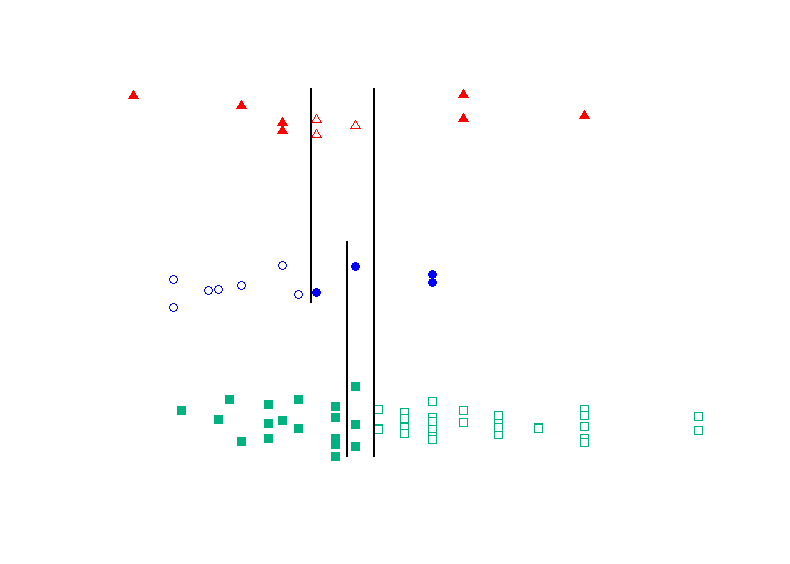

[](http://quantlet.de/)

## [](http://quantlet.de/) **SMSdisccar** [](http://quantlet.de/)

```yaml

Name of Quantlet: SMSdisccar

Published in: Multivariate Statistics: Exercises and Solutions

Description: 'Demonstrates the ML discrimination rule for 
               car data set which encloses different variables for the
               three regions, the US, Europe and Japan. The apparent error
               rate (APER), defined as the percentage of misclassified
               observations is (11 + 8 + 2 + 2 + 3 + 5)/79 = 41.89 per cent.
               It seems that the rule is not particularly good since we 
               have less than 60 chance of correct classification. 
               Moreover, this estimate is based on the observations which 
               were used to construct the discriminant rule and it might
               be way too optimistic.'

Keywords: 'ML rule, discriminant analysis, aper, discrimination'

See also: 'SMSdiscbaycar, SMSdisccar, SMSdisfbank, SMSdisfwais'

Author[r]: Michaela Marsalkova, Zdenek Hlavka
Author[m]: Awdesch Melzer

Datafile[r]: carc.rda
Datafile[m]: carc.txt

Example: 'Plot of ML dicrimination rule for car data.'
```




### R Code
```r

graphics.off()
rm(list=ls(all=TRUE))

# setwd("C:/...") # please change the working directory
load("carc.rda")

reg    = as.numeric(carc[,13])
x      = carc[,2]
x      = 2.352*100/x   #litres per 100 km instead miles per gallon
n      = length(x)

 #separating data by region
x1     = x[reg==1]
x2     = x[reg==2]
x3     = x[reg==3]

 #means of groups by region
m1     = mean(x1)            
m2     = mean(x2)   
m3     = mean(x3) 
 #common means
m12    = (m1+m2)/2 
m23    = (m2+m3)/2    
m13    = (m1+m3)/2  

 #common variance matrix
s      =((length(x1)-1)*var(x1)+(length(x2)-1)*var(x2)+(length(x3)-1)*var(x3))/(length(x)-3)    
   
  #allocating regions (1,2,3) to data with the MLE rule 
alloc1 = 1*((x-m12)*solve(s)*(m1-m2)>0)*((x-m13)*solve(s)*(m1-m3)>0)
alloc2 = 2*((x-m12)*solve(s)*(m2-m1)>0)*((x-m23)*solve(s)*(m2-m3)>0)
alloc3 = 3*((x-m13)*solve(s)*(m3-m1)>0)*((x-m23)*solve(s)*(m3-m2)>0)

rule12 = m12
rule23 = m23
rule13 = m13

alloc  = alloc1+alloc2+alloc3   #vector with elements (1,2,3) 

aper   = 1-sum(reg==alloc)/n     #percent of incorrectly sorted data

mist   = (alloc!=reg)          #position of sorting mistakes


 #plot of sorted data; full symbols - data sorted into the wrong category
par(mar=c(0,0,0,0))
plot(x,(reg+0.1*rnorm(n,0,1)),col=(reg+2),pch=(reg-1+mist*15),axes=FALSE,ann=FALSE)
 #lines showing the sorting rules
lines(c(rule12,rule12),c(0.8,2.2),lwd=2)
lines(c(rule23,rule23),c(1.8,3.2),lwd=2)
lines(c(rule13,rule13),c(0.8,3.2),lwd=2)

print("aper")
print(aper)

```

automatically created on 2018-05-28

### MATLAB Code
```matlab

clear all
close all
clc

% Read data
load('carc.txt')
reg   = carc(:,13);     % region: 1=US, 3=EU, 2=Japan
x     = carc(:,2);      % miles per gallon
x     = 2.352*100./x;   % litres per 100 km  instead miles per gallon
n     = length(x);      % number of observations


% separating data by region
x1    = x(find(reg==1));
x2    = x(find(reg==2));
x3    = x(find(reg==3));

% means of groups by region
m1    = mean(x1);
m2    = mean(x2);
m3    = mean(x3);

% common means
m12   = (m1+m2)/2;
m23   = (m2+m3)/2;   
m13   = (m1+m3)/2; 

 %common variance matrix
s = ((length(x1)-1)*var(x1)+(length(x2)-1)*var(x2)+(length(x3)-1)*var(x3))/(length(x)-3);   
   
  %allocating regions (1,2,3) to data with the MLE rule 
alloc1 = 1*((x-m12).*inv(s).*(m1-m2)>0).*((x-m13).*inv(s).*(m1-m3)>0);
alloc2 = 2*((x-m12).*inv(s).*(m2-m1)>0).*((x-m23).*inv(s).*(m2-m3)>0);
alloc3 = 3*((x-m13).*inv(s).*(m3-m1)>0).*((x-m23).*inv(s).*(m3-m2)>0);

rule12 = m12;
rule23 = m23;
rule13 = m13;

alloc = alloc1+alloc2+alloc3;   %vector with elements (1,2,3) 

aper = 1-sum(reg==alloc)/n;     %percent of incorrectly sorted data

mist = (alloc~=reg);          %position of sorting mistakes
y     = (reg+0.1*normrnd(0,1,n,1));
pch   = reg;
pch1  = num2str(ones(n,1));
colour = ones(3,n);
fill = ones(3,n);
for i=1:n
   if(mist(i)==1)
      if(pch(i) ==1)
         colour(:,i) = [0, 0.7, 0.5]';
         fill(:,i)   = [0, 0.7, 0.5]';
      end
      if(pch(i) ==2)
         colour(:,i) = [0, 0, 1]';
         fill(:,i)   = [0, 0, 1]';
      end
      if(pch(i) ==3)
         colour(:,i) = [1, 0, 0]';
         fill(:,i)   = [1, 0, 0]';
      end
   end
   if(mist(i)==0)
      if(pch(i) ==1)
         colour(:,i) = [0, 0.7, 0.5]';
      end
      if(pch(i) ==2)
         colour(:,i) = [0, 0, 1]';
      end
      if(pch(i) ==3)
         colour(:,i) = [1, 0, 0]';
      end
   end
end
for i = 1:n
    if(pch(i)==1)
        pch1(i) = 's';
    end
    if(pch(i)==2)
        pch1(i) = 'o';
    end
    if(pch(i)==3)
        pch1(i) = '^';
    end
end
        
% plot of sorted data; full symbols - data sorted into the wrong category
figure(1)
axis off 
hold on
for i=1:n
plot(x(i),y(i),pch1(i),'Color',colour(:,i),'MarkerFaceColor',fill(:,i))
end
% lines showing the sorting rules
line([rule12;rule12],[0.8;2.2],'Color','k','LineWidth',2)
line([rule23;rule23],[1.8;3.2],'Color','k','LineWidth',2)
line([rule13;rule13],[0.8,3.2],'Color','k','LineWidth',2)

disp('aper')
disp(aper)


```

automatically created on 2018-05-28