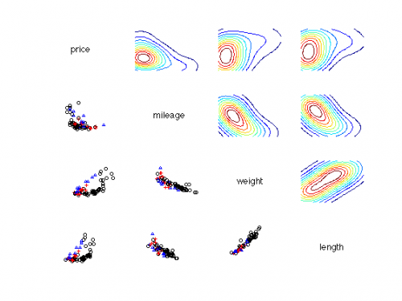

[](http://quantlet.de/)

## [](http://quantlet.de/) **SMSdrafcar** [](http://quantlet.de/)

```yaml


Name of Quantlet: SMSdrafcar

Published in: Multivariate Statistics: Exercises and Solutions

Description: 'Produces draftsman''s plots and density contour plots for the car data. Within the scatterplots, the squares mark US cars, the triangles mark Japanese cars and the circles mark European cars. The bandwidths for the kernel density estimation of the countours are selected via Scott''s rule of thumb.'

Keywords: contour, data visualization, density, graphical representation, kde, kernel, multi-dimensional, multivariate, plot, scatterplot, visualization

Keywords[new]: draftsman

See also: 'SMSandcurpopu, SMSboxbank6, SMSboxunemp, SMSboxunemp, SMSdenbank, SMSdenbank, SMSdrafcar, SMSdrafcar, SMSfacenorm, SMSfacenorm, SMShiscar, SMShiscar, SMShisheights, SMShisheights, SMSpcpcar, SMSpcpcar, SMSscanorm2, SMSscanorm3, SMSscanorm3, SMSscapopu, SMSscapopu'

Author[r]: Kristyna Ivankova, Dedy D. Prastyo
Author[m]: Awdesch Melzer

Submitted:  Fri, August 07 2015 by Awdesch Melzer

Datafile[r]: carc.rda
Datafile[m]: carc.txt

Example: 'Draftsman''s plots and density contour plots for the car data. In scatterplots, the squares mark US cars, the triangles mark Japanese cars and the circles mark European cars.'

```




### R Code
```r


# clear variables and close windows
rm(list=ls(all=TRUE))
graphics.off()

# setwd(Sys.glob("~/downloads/")) # set your working directory

# install and load packages
libraries = c("KernSmooth")
lapply(libraries, function(x) if (!(x %in% installed.packages())) {
  install.packages(x)
})
lapply(libraries, library, quietly = TRUE, character.only = TRUE)

load("carc.rda")

x = cbind(carc[,1], carc[,2], carc[,8], carc[,9])
y = c("price", "mileage", "weight", "length")
p = dim(x)[2]
n = dim(x)[1]

par(mfrow=c(p,p), mar = 0.2 + c(0,0,0,0))        # creates display pxp with margins=0.2

for (k in 0:15) {
  i = (k %/% 4) + 1                              # div, ith raw
  j = (k %% 4) + 1                               # mod, jth column
  if (i>j) {
    plot(x[,i]~x[,j], xlab = "", ylab = "", axes=FALSE, frame.plot=TRUE,pch=as.numeric(carc$C)-1-(carc$C=="Europe")+(carc$C=="Japan"),cex=1.5)
  }
  if (i<j) {
    xx      = cbind(x[,i],x[,j])
    nd      = 15                                 # number of grid points in each dimension
    nd      = matrix(1,1,nrow = dim(xx)[2])*nd   # matrix 2x1 with numbers of grid points in each dimension
    d       = c(apply(t(xx), 1, max) - apply(t(xx), 1, min))/(nd-1)
    h       = c(3.5*sqrt(var(x[,i]))*n^(-1/3),3.5*sqrt(var(x[,j]))*n^(-1/3)); # bandwidth a la Scott's rule of thumb
    minmaxx = c(min(x[,i]), max(x[,i]))
    minmaxy = c(min(x[,j]), max(x[,j]))
    est     = bkde2D(xx, bandwidth=h/2, gridsize=nd, truncate=TRUE, range.x=list(minmaxx, minmaxy))   # estimates 2dimensional density
    contour(est$x1, est$x2, est$fhat,  col="blue", axes=FALSE, frame.plot=TRUE)
  }
  if (i == j) {
    plot(0~0,xlab = "", ylab = "", axes=FALSE, xlim=c(1,5), ylim=c(1,5), frame.plot=TRUE)
    text(2,4.5, y[i], cex=1.5)                   # print text on diagonal graphs
  }
}
```

automatically created on 2018-05-28

### MATLAB Code
```matlab

% clear history
clear all
close all
clc

% load data
load carc.txt

x     = [carc(:,1) carc(:,2) carc(:,8) carc(:,9)];

[n p] = size(x);

% bandwidth a la Scott's rule of thumb
for i = 1:p
   h(i) = 3.5.*sqrt(var(x(:,i)))*n.^(-1/3); % Scott's rule of thumb
end

pch   = carc(:,13)-1;

daspect([1,1,1])

figure(1)
 
for k = 0:15 
    i = fix(4k) + 1;  % div, ith raw
    j = rem(k,4) + 1;  % mod, jth column
subplot(4,4,(i-1)*4+j)


hold on
box on
axis off


  if (i>j) 
    for l=1:n
      if(pch(l)==0)
         
      plot(x(l,i),x(l,j),'ko','MarkerSize',4)
      elseif (pch(l)==1)
      plot(x(l,i),x(l,j),'r+','MarkerSize',4)
      elseif (pch(l)==2)
      plot(x(l,i),x(l,j),'b^','MarkerSize',4)
      set(gca,'YTickLabel',{})
      set(gca,'XTickLabel',{})
      end
    end
          
  end

   if (i<j) 


xrange = min(x(:,j)):(max(x(:,j))-min(x(:,j)))./size(x(:,j),1):max(x(:,j));
yrange = min(x(:,i)):(max(x(:,i))-min(x(:,i)))./size(x(:,i),1):max(x(:,i));

% steps
endx = length(xrange);
endy = length(yrange);
ndata = length(x(:,4));
% manual multivariate kernel density estimation
for xxxi=1:endx
    for yyyi=1:endy
        u1 =(xrange(xxxi)-x(:,j))/h(j);
        u2 =(yrange(yyyi)-x(:,i))/h(i);
        u=[u1,u2]';
        for is=1:ndata
            KD(is)=1/(2*pi)^(2/2)*exp(-1/2*u(:,is)'*u(:,is));
        end
        fhat(xxxi,yyyi)=mean(KD)/prod(h);
    end
end
contour(fhat,10,'LineWidth',1) 
     axis off

    end
end


figure(1)
subplot(4,4,1)
axis off
text(0.3,0.5,'price  ','FontSize',12,'FontWeight','Bold')
subplot(4,4,6)
axis off
text(0.3,0.5,'mileage','FontSize',12,'FontWeight','Bold')
subplot(4,4,11)
axis off
text(0.3,0.5,'weight ','FontSize',12,'FontWeight','Bold')
subplot(4,4,16)
axis off
text(0.3,0.5,'length ','FontSize',12,'FontWeight','Bold')
hold off
```

automatically created on 2018-05-28