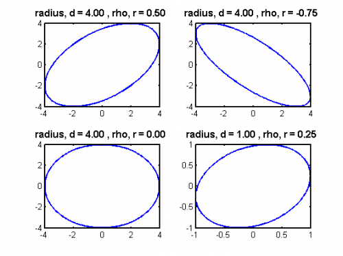

[](http://quantlet.de/)

## [](http://quantlet.de/) **SMSellipse** [](http://quantlet.de/)

```yaml


Name of Quantlet: SMSellipse

Published in: Multivariate Statistics: Exercises and Solutions

Description: 'computes ellipsoids for varying rho and d. rho
is the direction and correlation parameter lying between -1 and 1. d
is the radius of the ellipsoids. Given a covariance 
structure Sigma, depending on rho, the ellipse function
calculates the cholesky decomposition of Sigma = Q''*Q,
resulting in a upper triangular matrix Q, which in turn
is used for the transformation of the unit circle with
respect to the direction. The shape of the ellipsoids
is in accordance with the correlation parameter rho.'

Keywords: ellipse, correlation, plot, covariance matrix, Cholesky decomposition

See also: 'SMSellipse, SMSjordandec'

Author[r]: Monika Jakubcova
Author[m]: Awdesch Melzer, Dedy Dwi Prastyo

Example: 'Ellipsoids for rho = (0.5, -0.75, 0, 0.25) and radius = (4, 4, 4, 1) are plotted.'

```




### MATLAB Code
```matlab

% ---------------------------------------------------------------------
% Book:         SMS
% ---------------------------------------------------------------------
% Quantlet:     SMSellipse
% ---------------------------------------------------------------------
%               SMSellipse computes ellipsoids for varying rho and d. rho
%               is the direction and correlation parameter lying between -1 and 1. d
%               is the radius of the ellipsoids. Given a covariance 
%               structure Sigma, depending on rho, the ellipse function
%               calculates the cholesky decomposition of Sigma = Q'*Q,
%               resulting in a upper triangular matrix Q, which in turn
%               is used for the transformation of the unit circle with
%               respect to the direction. The shape of the ellipsoids
%               is in accordance with the correlation parameter rho.
% ---------------------------------------------------------------------
% See also:     SMSellipse, SMSjordandec
% ---------------------------------------------------------------------
% Keywords:     ellipse, correlation, plot, covariance matrix,
%               Cholesky decomposition
% ---------------------------------------------------------------------
% Usage:        -
% ---------------------------------------------------------------------
% Inputs:       None
% ---------------------------------------------------------------------
% Output:       Plots of four ellipsoids.
% ---------------------------------------------------------------------
% Example:      Ellipsoids for rho = [0.5, -0.75, 0, 0.25]' and 
%               radius = [4, 4, 4, 1]' are plotted.
% ---------------------------------------------------------------------
% Autor:        Awdesch Melzer, Dedy Dwi Prastyo 20121128
%----------------------------------------------------------------------

% clear variables and close windows
clear all
close all
clc


ucircle = [cos((0:360)/180*pi);sin((0:360)/180*pi)]'; % unit cirle


% rho and d
rhovec  = [0.5,-0.75,0,0.25]';          % directions
dvec    = [4,4,4,1]';                   % radius


for i = 1:4
    r       = rhovec(i);
    d       = dvec(i);
    c       = [0,0]';
    n       = 101;
    c1      = [1,r]';
    c2      = [r,1]';
    sha     = [c1,c2];
    Q       = chol(sha);                 % cholesky decomposition for reshape the unit circle
    radius  = d; 
    D       = radius .* (ucircle * Q)';  % change directions via cholesky decomposition
    Center  = repmat(c,1,size(D,2));     % center matrix
    ellipse = (Center + D)'; % reconstruct ellipse
    
    subplot(2,2,i)
    plot(ellipse(:,1),ellipse(:,2),'LineWidth',2)
    str = sprintf('radius, d = %3.2f , rho, r = %3.2f ', d , r);
    title(str,'FontSize',12,'FontWeight','Bold')
    box on
    set(gca,'LineWidth',1.6)
end


```

automatically created on 2018-05-28

### R Code
```r

# ---------------------------------------------------------------------
# Book:         SMS
# ---------------------------------------------------------------------
# Quantlet:     SMSellipse
# ---------------------------------------------------------------------
# Description:  SMSellipse computes ellipsoids for varying rho and d. rho
#               is the direction and correlation parameter lying between -1 and 1. d
#               is the radius of the ellipsoids. Given a covariance 
#               structure Sigma, depending on rho, the ellipse function
#               calculates the cholesky decomposition of Sigma = Q'*Q,
#               resulting in a upper triangular matrix Q, which in turn
#               is used for the transformation of the unit circle with
#               respect to the direction. The shape of the ellipsoids
#               is in accordance with the correlation parameter rho.
# ---------------------------------------------------------------------
# See also:     SMSellipse, SMSjordandec
# ---------------------------------------------------------------------
# Keywords:     ellipse, correlation, plot, covariance matrix,
#               Cholesky decomposition
# ---------------------------------------------------------------------
# Usage:        -
# ---------------------------------------------------------------------
# Inputs:       None
# ---------------------------------------------------------------------
# Output:       Plots of four ellipsoids.
# ---------------------------------------------------------------------
# Example:      Ellipsoids for rho = c(0.5, -0.75, 0, 0.25) and 
#               radius = c(4, 4, 4, 1) are plotted.
# ---------------------------------------------------------------------
# Autor:        Monika Jakubcova
#----------------------------------------------------------------------

# clear variables and close windows
rm(list=ls(all=TRUE))
graphics.off()

# setwd(Sys.glob("~/downloads/")) # set your working directory

# install and load packages
libraries = c("car")
lapply(libraries, function(x) if (!(x %in% installed.packages())) {
  install.packages(x)
})
lapply(libraries, library, quietly = TRUE, character.only = TRUE)

#help.search("ellipse", "input")

rhovec  = c(0.5,-0.75,0,0.25)  # direction
dvec    = c(4,4,4,1)           # radius
par(mfrow=c(2,2))
for (i in 1:4) {
    r   = rhovec[i]
    d   = dvec[i]
    c   = c(0,0)
    c1  = c(1,r)
    c2  = c(r,1)
    sha = cbind(c1,c2)         # covariance matrix used for the cholesky decomposition within the ellipse function
    plot(cbind(c(d,-d),c(d,-d)),type="n",xlab="", ylab="", main=substitute(list(d==d1,  rho==r1), list(d1=d,r1=sprintf("%0.2f",r))))
    ellipse(c,sha,d, center.pch=20, center.cex=1, segments=51, add=TRUE, col="black", lwd=1, lty=1)
}

```

automatically created on 2018-05-28