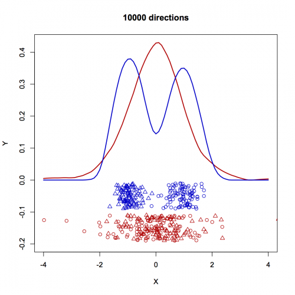

[](http://quantlet.de/)

## [](http://quantlet.de/) **SMSeppbank** [](http://quantlet.de/)

```yaml

Name of Quantlet: SMSeppbank

Published in: Multivariate Statistics: Exercises and Solutions

Description: 'We read the Swiss banknote data and sphere them to run  EPP on them. We select n randomly choosen one  dimensional projections in the six dimensional space of the data. For each set of projected data the Friedman-Tukex-Index is applied to judge the "interestingness" of the projection.
In the graphics we see the estimated densities for  the best (blue) and the worst (red) projections found. Additionally we see a dotplot of the projections.'

Keywords: 'Friedman Tukey index, kernel density estimation, sphere, Epanechnikov, projection pursuit, projection, dimension reduction'

See also: 'SMScartdiag, SMScartsq, SMSdisfbank2, SMSeppbank, SMSsimpdbank, SMSsimpdsimu, SMSsir2cars, SMSsir2simu, SMSsircars, SMSsirsimu, SMSsircars, SMSsirsimu, SMSsiruscomp, SMSsvmbankrupt, SMSsvmorange, SMSsvmspiral'

Author[r]: Awdesch Melzer, Zdenek Hlavka, Sigbert Klinke
Author[m]: Awdesch Melzer

Datafile[r]: bank2.rda
Datafile[m]: bank2.dat

Example: 'Projection pursuit for Swiss bank notes data'

Subfunctions[m]: ppf, ppexample, sphere
```




### R Code
```r

rm(list=ls(all=TRUE))
graphics.off()

# install and load packages
libraries = c("locpol")
lapply(libraries, function(x) if (!(x %in% installed.packages())) {
    install.packages(x)})
lapply(libraries, library, quietly = TRUE, character.only = TRUE)

# ppf computes the Friedman Tukey index (integral about the squared density of the projected data) via kernel density estimation
ppf = function(px,h){
    dens = PRDenEstC(sort(px),xeval=seq(min(px),max(px),length=length(px)),bw=h,kernel=EpaK)$den
    ind  = mean(dens)
       return(ind)
    }

ppexample = function (x, h , n){
  xg     = seq(-4,by=0.1,length=81)
  id     = rbind(matrix(3,100,1),matrix(4,100,1))
# select a starting vector
  p      = rnorm(ncol(x))
  p      = p/sqrt(sum(p^2))
# compute index for starting vector
  xp     = x%*%p
  imin   = ppf(xp,h)
  imax   = imin  
  xi     = cbind(xp,runif(length(xp),0,1))
  xi[,2] = -0.01-0.08*xi[,2]
  fi     = PRDenEstC(xp,xeval=xg,bw=h,kernel=EpaK)
  xa     = cbind(xp,runif(length(xp),0,1))
  xa[,2] = -0.11-0.08*xa[,2]
  fa     = PRDenEstC(xp,xeval=xg,bw=h,kernel=EpaK)
  inds   = c(1/sqrt(4*pi),imax)
  pind   = cbind((1:length(inds)),inds)
#  search for better projection vector
  i    = 0
  pmin = 1
  pmax = 1
  while (i<n){
    i    = i+1
    tit  = toString(paste(i, "directions"))
    p    = rnorm(ncol(x))
    p    = p/sqrt(sum(p^2))

    xp   = x%*%p
    
    ind  = ppf(xp, h)
    inds = c(inds,ind)
    pind = cbind(1:length(inds),inds)
    cind = rbind(2,1)
    cind[which.max(inds)] = 4
    cind[which.min(inds)] = 1
    cind[1] = 2
    if (ind>imax){
      imax = ind
      xa   = cbind(xp,runif(xp,0,1))
      xa[,2] = -0.11-0.08*xa[,2]
      pa=p
      fa   = PRDenEstC(xp,xeval=xg,bw=h,kernel=EpaK) # line red dashed
       pmin = i
    }
    if (ind<imin){
      imin  = ind
      xi    = cbind(xp,runif(xp,0,1))
      xi[,2]= -0.01-0.08*xi[,2]
      pi    = p
      fi    = PRDenEstC(xp,xeval=xg,bw=h,kernel=EpaK) # blue line
      pmax  = i
      mini  = p
    }
  }
  return(list(xa=xa,xi=xi,fa=fa,fi=fi,pa=pa,pi=pi,tit=tit,pind=pind,cind=cind))

}

# sphere data transform
sphere = function(x){
    x = x - matrix(colMeans(x),nrow=nrow(x),ncol=ncol(x),byrow=T)
    s = svd(var(x))
    s = s$u/matrix(sqrt(s$d),nrow(s$u),ncol(s$u),byrow=T)
    x = as.matrix(x)%*%as.matrix(s)
return(x)
}

data(bank2)
x = bank2

#sphere the data
x = sphere(as.matrix(x))

set.seed(0)
# choose bandwidth related to Scott's rule
h    = 2.62*nrow(x)^(-1/5)
# choose number of projections
n    =  10000
inde = ppexample(as.matrix(x), h, n)

plot(inde$xa,type="n",ylab="",xlab="",ylim=c(-0.2,max(inde$fi[,2],inde$fa[,2])),xlim=c(-4.4,4.4))
points(inde$xi,col="red3",pch=c(rep(1,100),rep(2,100)))
points(inde$xa,col="blue3",pch=c(rep(1,100),rep(2,100)))
lines(inde$fi,col="red3",lwd=2,lty=3)
lines(inde$fa,col="blue3",lwd=2)
title(inde$tit)

# most interesting
print(round(inde$pa,4))

# least interesting
print(round(inde$pi,4))

```

automatically created on 2018-05-28

### MATLAB Code
```matlab

% clear variables and close windows
clear all;
close all;
clc;

RandStream.setDefaultStream(RandStream('mt19937ar','seed',100));

% load data
x = load('bank2.dat');

% sphere the data
x = sphere(x);

% choose bandwidth according to Silverman s rule of thumb
h = 1.06*length(x)^(-1/5).*max(std(x));

% choose number of projections
n = 10000;

[xa xi fa fi tit pind cind] = ppexample(x, h, n);

    plot(fi(:,1),fi(:,2),'r-','LineWidth',2)
    hold on;
    plot(xa(1:100,1),xa(1:100,2),'bo')
    ylim([-0.2,0.5]);
    xlim([-4,4]);
    plot(xa(101:200,1),xa(101:200,2),'b^')
    plot(xi(1:100,1),xi(1:100,2),'ro')
    plot(xi(101:200,1),xi(101:200,2),'r^')
    ylabel('Y','FontWeight','bold','FontSize',16);
    xlabel('X','FontWeight','bold','FontSize',16);
    line(fa(:,1),fa(:,2),'color','b','LineWidth',2)
    set(gca,'FontSize',16,'LineWidth',2,'FontWeight','bold');
    hold off;
    title(tit,'FontWeight','bold','FontSize',16);
```

automatically created on 2018-05-28