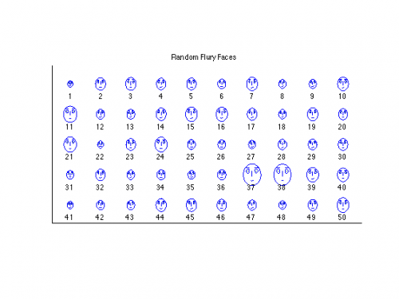
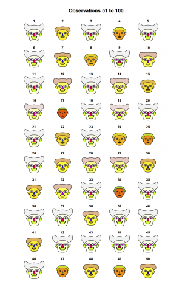

[](http://quantlet.de/)

## [](http://quantlet.de/) **SMSfacenorm** [](http://quantlet.de/)

```yaml


Name of Quantlet: SMSfacenorm

Published in: Multivariate Statistics: Exercises and Solutions

Description: 'Computes Flury faces for two normal samples: x~N1(0,1) and y~N2(2,1) permutating over the right and left face line, and over the right and left darkness of hair. Up to 36 dimensional data can be represented using this technique. The difference in the mean between both samples is illustrated in different face size. Matlab allows a specification of only one parameter per coloumn of variable.'

Keywords: Flury faces, data visualization, graphical representation, multivariate, normal, plot, random-number-generation, visualization

See also: 'SMSandcurpopu, SMSboxbank6, SMSboxunemp, SMSboxunemp, SMSdenbank, SMSdenbank, SMSdrafcar, SMSdrafcar, SMSfacenorm, SMSfacenorm, SMShiscar, SMShiscar, SMShisheights, SMShisheights, SMSpcpcar, SMSpcpcar, SMSscanorm2, SMSscanorm3, SMSscanorm3, SMSscapopu, SMSscapopu'

Author[r]: Tomas Marada, Zdenek Hlávka
Author[m]: Awdesch Melzer

Submitted:  Fri, August 07 2015 by Awdesch Melzer

Example: 
- x~N1(0,1)
- y~N2(2,1)
```






### R Code
```r

# clear variables and close windows
rm(list=ls(all=TRUE))
graphics.off()

# install and load packages
libraries = c("aplpack")
lapply(libraries, function(x) if (!(x %in% installed.packages())) {
  install.packages(x)
})
lapply(libraries, library, quietly = TRUE, character.only = TRUE)

set.seed(1)                      # set pseudo random numbers
q      = matrix(0, ncol = 36);   # define new variable
q[,13] = 1;                      # right face line
q[,14] = 1;                      # right darkness of hair
q[,31] = 1;                      # left face line
q[,32] = 1;                      # left darkness of hair
x      = rnorm(50);              # generates 50 standard normal distributed data
y      = rnorm(50) + 2;          # generates 50 normal distributed data with mean 2
z      = t(cbind(t(x),t(y)));    # puts the data together in matrix
z      = (z-1)/sqrt(2)           # rescale z
faces(as.matrix(z[1:50]),   q, main="Observations 1 to 50",   scale=FALSE, ncol.plot=5, nrow.plot=10);   # plots the Flury faces
dev.new()
faces(as.matrix(z[51:100]), q, main="Observations 51 to 100", scale=FALSE, ncol.plot=5, nrow.plot=10);   # plots the Flury faces
```

automatically created on 2018-05-28

### MATLAB Code
```matlab

% remove variables and close windows
clear all
close all
clc

x = normrnd(0,1,50,1);       % generates 50 standard normal distributed data
y = normrnd(2,1,50,1);       % generates 50 normal distributed data with mean 2
z = [x y];
% change the following value to adjust other parts of the faces. Choose an integer between 1 and 17.
f = [1];                     % size of face 

% plot
figure(1)
glyphplot(x, 'Glyph','face','Features',f,'Grid',[5 10],'Page','all')
title('Random Flury Faces');
figure(2)
glyphplot(y, 'Glyph','face','Features',f,'Grid',[5 10],'Page','all')
title('Random Flury Faces');
```

automatically created on 2018-05-28