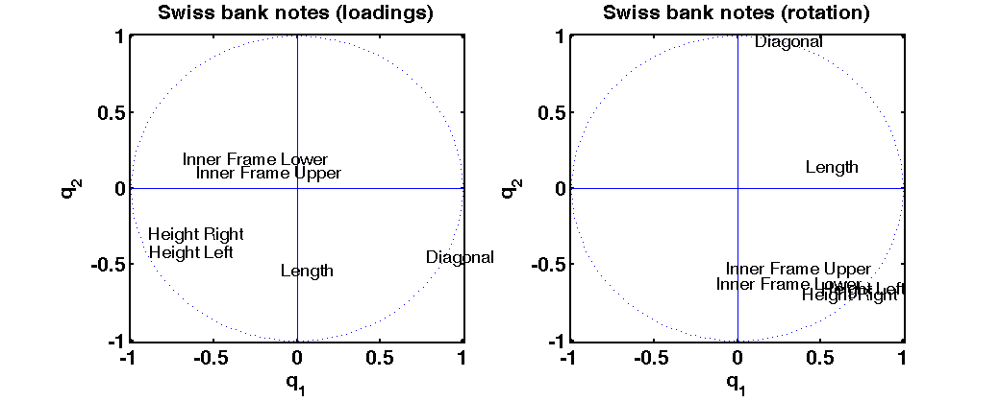
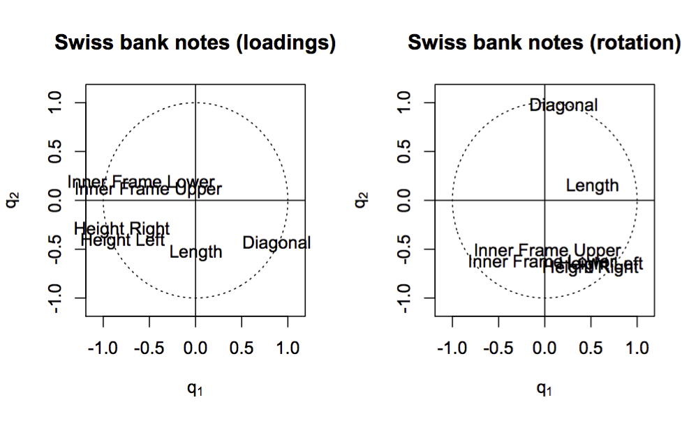

[](http://quantlet.de/)

## [](http://quantlet.de/) **SMSfactbank** [](http://quantlet.de/)

```yaml

Name of Quantlet: SMSfactbank

Published in: 'Multivariate Statistics: Exercises and Solutions'

Description: "Performs a factor analysis on the variables 'Length','Height Left','Height Right','Inner Frame Lower', 'Inner Frame Upper' and 'Diagonal' in the bank data set using iterated principal factors method (iPFM) with and without manual rotation by an angle of 7*pi/12 counterclockwise. Estimated factor loadings, communalities and specific variances are presented in a table, plots of original and rotated factor loadings are given"

Keywords: 'Factor Analysis, standardization, Principal Factors Method, Iterated Principal Factors Method, Rotation, Varimax, factor-loadings, iPFM, PFM, specific variance, factor analysis, factor scores'

See also: 'SMSfactbank, SMSfactfood, SMSfacthletic, SMSfactsigma, SMSfactuscrime, SMSfactushealth, SMSfactvocab'

Author[r]: Monika Jakubcova, Zdenek Hlavka
Author[m]: Awdesch Melzer

Datafile[r]: bank2.rda
Datafile[m]: bank2.dat

Example: 'Estimated factor loadings, communalities
and specific variances are presented in a table, plots of
original and rotated factor loadings are given'

Subfunctions[m]: 'factiter, factpf'
```





### R Code
```r

# clear workspace
rm(list=ls(all=TRUE))
graphics.off()

# setwd("C:/...")
load("bank2.rda")

x  = as.matrix(bank2)
y  = t((t(x)-mean(x))/sd(x))
r  = cor(y)
r

###########################
#performs factor analysis using principal factors method
#returns the un-rotated loadings

factpf = function(r){
  n         = ncol(r)
  redcormat = r
  diag(redcormat) = apply(abs(r-diag(1,nrow=n,ncol=n)),2,max)
  xeig      = eigen(redcormat)
  xval      = xeig$values
  xvec      = xeig$vectors
  for (i in 1:length(xval[xval>0])){
    xvec[,i]= xvec[,i]*sqrt(xval[i])}
  rownames(xvec) = colnames(r)
  return(xvec[,xval>0])
}

########################################

#performs factor analysis using iterated principal factors method
#returns the communalties after each iteration and the final un-rotated loadings.

factiter = function(r,niter=10,maxfactors=ncol(r)){
  n         = ncol(r)
  temp      = matrix(0,nrow=n,ncol=n)
  comm      = matrix(0,nrow=niter+1,ncol=n)
  y         = factpf(r)
  m         = ncol(y)
  temp[1:n,1:m] = y
  comm[1,]  = apply(temp^2,1,sum)                 
  for (i in 2:(niter+1)){
    redcormat = r
    diag(redcormat) = comm[i-1,]
    xeig    = eigen(redcormat)
    m = min(maxfactors,length(xeig$values[xeig$values>0]))
    for (j in 1:m){
      xeig$vectors[,j] = xeig$vectors[,j]*sqrt(xeig$values[j])} 
    temp[1:n,1:m] = xeig$vectors[1:n,1:m]
    comm[i,]= apply(temp[1:n,1:m]^2,1,sum)
  }
  f.loadings= temp[1:n,1:m]
  rownames(f.loadings) = colnames(r)
  return(list(comm=comm,f.loadings=f.loadings))
}

 
##############################################
PFA         = factiter(r,niter=10,maxfactor=2)
#factor analysis - iterated principal factors method (PFM)
#number of iterations: 10, maximal number of factors to be extracted: 2
loadings    = PFA$f.loadings
colnames(loadings) = c("Q1","Q2")
communality = PFA$comm[11,]
specific_variance = 1-PFA$comm[11,]
b           = cbind(loadings,communality,specific_variance)
round(b,4)  #iterating the PFM 10 times
# xtable(b,digits=4)
#varim = varimax(loadings) #rotating loadings using function varimax

#windows(width=8,height=8)
opar        = par(mfrow=c(1,2))
lab         = colnames(bank2) #adding labels

plot(c(-1.1,1.1),c(-1.1,1.1),type="n",main="Swiss bank notes (loadings)",xlab=expression(q[1]),ylab=expression(q[2])) #plotting... [KONECNE!]
ucircle     = cbind(cos((0:360)/180*3.14159),sin((0:360)/180*3.14159))
points(ucircle,type="l",lty="dotted")
abline(h = 0)
abline(v = 0)
text(loadings[,1:2],labels=lab,col="black",xpd=NA)

#manual rotation
theta       = 3.14159*7/12
rot         = rbind(c(cos(theta),sin(theta)),c(-sin(theta),cos(theta)))
qr          = loadings%*%rot

#windows(width=8,height=8)

plot(c(-1.1,1.1),c(-1.1,1.1),type="n",main="Swiss bank notes (rotation)",xlab=expression(q[1]),ylab=expression(q[2])) 
points(ucircle,type="l",lty="dotted")
abline(h = 0)
abline(v = 0)
text(qr[,1:2],labels=lab,col="black",xpd=NA)

par(opar)

```

automatically created on 2018-09-04

### MATLAB Code
```matlab

clear all
close all
clc

x           = load('bank2.dat'); % load data

% scale data
y           = (((x)-repmat(mean(x),size(x,1),1))./repmat(std(x),size(x,1),1));
r           = corr(y); % correlation matrix
r
niter       = 10;      % number of iterations
maxfactor   = 2;       % number of factors

[PFA.comm, PFA.floadings]  = factiter(r,niter,maxfactor);
%factor analysis - iterated principal factors method (PFM)
%number of iterations: 10, maximal number of factors to be extracted: 2
loadings     = PFA.floadings;
loadings(:,2)=loadings(:,2).*(-1); % correcion for publication
communality  = PFA.comm(11,:);
spec_var     = 1-PFA.comm(11,:);
% table of loadings, communalities and specific variance
b            = [loadings,communality',spec_var']

%% plot
subplot(1,2,1) % correlation of original loadings with variables
a            = strvcat('Length','Height Left','Height Right','Inner Frame Lower','Inner Frame Upper','Diagonal');
lab          = cellstr(a);
ucircle      = [cos((0:360)/180*3.14159)' , sin((0:360)/180*3.14159)'];
plot(ucircle(:,1),ucircle(:,2),'b:')
ylim([-1.01,1.01])
xlim([-1.01,1.01])
title('Swiss bank notes (loadings)','FontSize',16,'FontWeight','Bold')
xlabel('q_1','FontSize',16,'FontWeight','Bold')
ylabel('q_2','FontSize',16,'FontWeight','Bold')
line([0,0]',[-1.5,1.5]')
line([-1.5,1.5]',[0,0]')
text(loadings(:,1)-0.1,loadings(:,2),lab,'FontSize',14)
set(gca,'LineWidth',1.6,'FontSize',16,'FontWeight','Bold')


%% manual rotation
theta        = pi*7/12;
rot          = [[cos(theta);sin(theta)],[-sin(theta);cos(theta)]]';
qr           = loadings*rot;

subplot(1,2,2) % correlation of rotated loadings with variables
plot(ucircle(:,1),ucircle(:,2),'b:')
title('Swiss bank notes (rotation)','FontSize',16,'FontWeight','Bold')
xlabel('q_1','FontSize',16,'FontWeight','Bold')
ylabel('q_2','FontSize',16,'FontWeight','Bold')
set(gca,'LineWidth',1.6,'FontSize',16,'FontWeight','Bold')
line([0,0]',[-1.5,1.5]')
line([-1.5,1.5]',[0,0]')
text(qr(:,1)-0.1,qr(:,2),lab,'FontSize',14)
ylim([-1.01,1.01])
xlim([-1.01,1.01])


```

automatically created on 2018-09-04