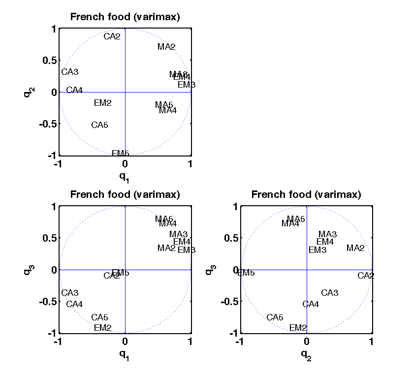

[](http://quantlet.de/)

## [](http://quantlet.de/) **SMSfactfood** [](http://quantlet.de/)

```yaml

Name of Quantlet: SMSfactfood

Published in: Multivariate Statistics: Exercises and Solutions

Description: 'performs a factor analysis on the French food data using Principal Factors Method (PFM), iterated PFM, with Varimax rotation algorithm and manual rotation'

Keywords: 'Factor Analysis, standardization, Principal Factors Method,
Iterated Principal Factors Method, Rotation, Varimax,
factor-loadings, iPFM, PFM, specific variance, factor analysis, factor scores'

See also: 'SMSfactbank, SMSfactfood, SMSfacthletic, SMSfactsigma, SMSfactuscrime, SMSfactushealth, SMSfactvocab'

Author[r]: Monika Jakubcova, Zdenek Hlavka
Author[m]: Awdesch Melzer

Datafile[r]: food.rda
Datafile[m]: food.dat

Example: 'Estimated factor loadings, communalities
and specific variances are presented in a table, plots of
varimax and manually rotated factor loadings are given'

Subfunctions[m]: 'factiter, factpf'
```




### R Code
```r

 graphics.off()
 rm(list=ls(all=TRUE))
# setwd("C:/...") #set your working directory, create there a subdirectory 'data' for the datasets

load("food.rda")

x=as.matrix(food)
#standardization of the columns of the data matrix x
y=(t(x)-colMeans(x))/sd(x)
r=cor(y)
r

###########################
#performs factor analysis using principal factors method
#returns the un-rotated loadings

factpf<-function(r){
n<-ncol(r)
redcormat<-r
diag(redcormat)<-apply(abs(r-diag(1,nrow=n,ncol=n)),2,max)
xeig<-eigen(redcormat)
xval<-xeig$values
xvec<-xeig$vectors
for (i in 1:length(xval[xval>0])){
 xvec[,i]<-xvec[,i]*sqrt(xval[i])}
rownames(xvec)<-colnames(r)
return(xvec[,xval>0])
}

########################################

#performs factor analysis using iterated principal factors method
#returns the communalties after each iteration and the final un-rotated loadings.

factiter<-function(r,niter=10,maxfactors=ncol(r)){
n<-ncol(r)
temp<-matrix(0,nrow=n,ncol=n)
comm<-matrix(0,nrow=niter+1,ncol=n)
y<-factpf(r)
m<-ncol(y)
temp[1:n,1:m]<-y
comm[1,]<-apply(temp^2,1,sum)                 
for (i in 2:(niter+1)){
  redcormat<-r
  diag(redcormat)<-comm[i-1,]
  xeig<-eigen(redcormat)
  m<-min(maxfactors,length(xeig$values[xeig$values>0]))
  for (j in 1:m){
     xeig$vectors[,j]<-xeig$vectors[,j]*sqrt(xeig$values[j])} 
  temp[1:n,1:m]<-xeig$vectors[1:n,1:m]
  comm[i,]<-apply(temp[1:n,1:m]^2,1,sum)
}
f.loadings<-temp[1:n,1:m]
rownames(f.loadings)<-colnames(r)
return(list(comm=comm,f.loadings=f.loadings))
}
 
 
##############################################
PFA<-factiter(r,niter=10,maxfactor=3)
#factor analysis - iterated principal factors method (PFM)
#number of iterations: 10, maximal number of factors to be extracted: 2
loadings<-PFA$f.loadings
colnames(loadings)<-c("Q1","Q2","Q3")
communality<-PFA$comm[11,]
specific_variance<-1-PFA$comm[11,]
b<-cbind(loadings,communality,specific_variance)
round(b,4)  #iterating the PFM 10 times
varim<-varimax(loadings) #rotating loadings using function varimax

#windows(width=8,height=8)
opar=par(mfrow=c(2,2))
lab<-c("MA2","EM2","CA2","MA3","EM3","CA3","MA4","EM4","CA4","MA5","EM5","CA5")  #adding labels


plot(c(-1.1,1.1),c(-1.1,1.1),type="n",main="French food (varimax)",xlab=expression(q[1]),ylab=expression(q[2])) #plotting... [KONECNE!]
ucircle<-cbind(cos((0:360)/180*3.14159),sin((0:360)/180*3.14159))
points(ucircle,type="l",lty="dotted")
abline(h = 0)
abline(v = 0)
text(varim$loadings[,1:2],labels=lab,col="black",cex=1.0)

frame()

plot(c(-1.1,1.1),c(-1.1,1.1),type="n",main="French food (varimax)",xlab=expression(q[1]),ylab=expression(q[3])) #plotting... [KONECNE!]
points(ucircle,type="l",lty="dotted")
abline(h = 0)
abline(v = 0)
text(varim$loadings[,c(1,3)],labels=lab,col="black",cex=1.0)

plot(c(-1.1,1.1),c(-1.1,1.1),type="n",main="French food (varimax)",xlab=expression(q[2]),ylab=expression(q[3])) #plotting... [KONECNE!]
points(ucircle,type="l",lty="dotted")
abline(h = 0)
abline(v = 0)
text(varim$loadings[,2:3],labels=lab,col="black",cex=1.0)


#manual rotation
theta1=pi
theta2=0.5
theta3=1.5
rot3=rbind(c(cos(theta3),sin(theta3),0),c(-sin(theta3),cos(theta3),0),c(0,0,1))
rot2=rbind(c(cos(theta2),0,sin(theta2)),c(0,1,0),c(-sin(theta2),0,cos(theta2)))
rot1=rbind(c(1,0,0),c(0,cos(theta1),sin(theta1)),c(0,(-sin(theta1)),cos(theta1)))
qr=loadings%*%diag(c(1,-1,-1))%*%rot1%*%rot2%*%rot3
dev.new()
#windows(width=8,height=8)
par(mfrow=c(2,2))

plot(c(-1.1,1.1),c(-1.1,1.1),type="n",main="French food",xlab=expression(q[1]),ylab=expression(q[2])) 
points(ucircle,type="l",lty="dotted")
abline(h = 0)
abline(v = 0)
text(qr[,1:2],labels=lab,col="black",cex=1.0)

frame()

plot(c(-1.1,1.1),c(-1.1,1.1),type="n",main="French food",xlab=expression(q[1]),ylab=expression(q[3])) 
points(ucircle,type="l",lty="dotted")
abline(h = 0)
abline(v = 0)
text(qr[,c(1,3)],labels=lab,col="black",cex=1.0)

plot(c(-1.1,1.1),c(-1.1,1.1),type="n",main="French food",xlab=expression(q[2]),ylab=expression(q[3])) 
points(ucircle,type="l",lty="dotted")
abline(h = 0)
abline(v = 0)
text(qr[,2:3],labels=lab,col="black",cex=1.0)

par(opar)


```

automatically created on 2018-05-28

### MATLAB Code
```matlab

clear all
close all
clc

%% load data and scaling
[type, A, B, C, D, E, F, G] = textread('food.dat','%s %f %f %f %f %f %f %f');
x                           = [A, B, C, D, E, F, G];
% scale data
y           = (((x')-repmat(mean(x),size(x,1),1)')./repmat(std(x),size(x,1),1)');

%% correlation matrix and interated principal factor method
r           = corr(y); % correlation matrix
r
niter       = 10;      % number of iterations
maxfactor   = 3;       % number of factors

[PFA.comm,PFA.floadings]    = factiter(r,niter,maxfactor);
%factor analysis - iterated principal factors method (PFM)
%number of iterations: 10, maximal number of factors to be extracted: 3

loadings                    = PFA.floadings;
loadings(:,3)               = loadings(:,3)*(-1); % correction for publication
communality                 = PFA.comm(11,:);
specific_variance           = 1-PFA.comm(11,:);
% table of final factor loadings, communalities and specific variance
b                           = [loadings,communality',specific_variance']
% rotating loadings using function varimax
varim                       = rotatefactors(loadings,'Method','varimax');

figure(1)
subplot(2,2,1)
a            = strvcat(type');
lab          = cellstr(a);
ucircle      = [cos((0:360)/180*3.14159)' , sin((0:360)/180*3.14159)'];
plot(ucircle(:,1),ucircle(:,2),'b:')
title('French food (varimax)','FontSize',16,'FontWeight','Bold')
ylim([-1.01,1.01])
xlim([-1.01,1.01])
xlabel('q_1','FontSize',16,'FontWeight','Bold')
ylabel('q_2','FontSize',16,'FontWeight','Bold')
line([0,0]',[-1.5,1.5]')
line([-1.5,1.5]',[0,0]')
text(varim(:,1)-0.1,varim(:,2),lab','FontSize',14)
set(gca,'LineWidth',1.6,'FontSize',16,'FontWeight','Bold')

subplot(2,2,3)
plot(ucircle(:,1),ucircle(:,2),'b:')
title('French food (varimax)','FontSize',16,'FontWeight','Bold')
ylim([-1.01,1.01])
xlim([-1.01,1.01])
xlabel('q_1','FontSize',16,'FontWeight','Bold')
ylabel('q_3','FontSize',16,'FontWeight','Bold')
line([0,0]',[-1.5,1.5]')
line([-1.5,1.5]',[0,0]')
text(varim(:,1)-0.1,varim(:,3),lab','FontSize',14)
set(gca,'LineWidth',1.6,'FontSize',16,'FontWeight','Bold')

subplot(2,2,4)
plot(ucircle(:,1),ucircle(:,2),'b:')
title('French food (varimax)','FontSize',16,'FontWeight','Bold')
ylim([-1.01,1.01])
xlim([-1.01,1.01])
xlabel('q_2','FontSize',16,'FontWeight','Bold')
ylabel('q_3','FontSize',16,'FontWeight','Bold')
line([0,0]',[-1.5,1.5]')
line([-1.5,1.5]',[0,0]')
text(varim(:,2)-0.1,varim(:,3),lab','FontSize',14)
set(gca,'LineWidth',1.6,'FontSize',16,'FontWeight','Bold')


%manual rotation
theta1 = pi;
theta2 = 0.5;
theta3 = 1.5;
rot3   = [cos(theta3),sin(theta3),0;-sin(theta3),cos(theta3),0;0,0,1];
rot2   = [cos(theta2),0,sin(theta2);0,1,0;-sin(theta2),0,cos(theta2)];
rot1   = [1,0,0;0,cos(theta1),sin(theta1);0,(-sin(theta1)),cos(theta1)];
qr     = loadings*diag([1,-1,-1])*rot1*rot2*rot3

figure(2)
subplot(2,2,1)
plot(ucircle(:,1),ucircle(:,2),'b:')
title('French food','FontSize',16,'FontWeight','Bold')
ylim([-1.01,1.01])
xlim([-1.01,1.01])
xlabel('q_1','FontSize',16,'FontWeight','Bold')
ylabel('q_2','FontSize',16,'FontWeight','Bold')
line([0,0]',[-1.5,1.5]')
line([-1.5,1.5]',[0,0]')
text(qr(:,1)-0.1,qr(:,2),lab','FontSize',14)
set(gca,'LineWidth',1.6,'FontSize',16,'FontWeight','Bold')

subplot(2,2,3)
plot(ucircle(:,1),ucircle(:,2),'b:')
title('French food','FontSize',16,'FontWeight','Bold')
ylim([-1.01,1.01])
xlim([-1.01,1.01])
xlabel('q_1','FontSize',16,'FontWeight','Bold')
ylabel('q_3','FontSize',16,'FontWeight','Bold')
line([0,0]',[-1.5,1.5]')
line([-1.5,1.5]',[0,0]')
text(qr(:,1)-0.1,qr(:,3),lab','FontSize',14)
set(gca,'LineWidth',1.6,'FontSize',16,'FontWeight','Bold')

subplot(2,2,4)
plot(ucircle(:,1),ucircle(:,2),'b:')
title('French food','FontSize',16,'FontWeight','Bold')
ylim([-1.01,1.01])
xlim([-1.01,1.01])
xlabel('q_2','FontSize',16,'FontWeight','Bold')
ylabel('q_3','FontSize',16,'FontWeight','Bold')
line([0,0]',[-1.5,1.5]')
line([-1.5,1.5]',[0,0]')
text(qr(:,2)-0.1,qr(:,3),lab','FontSize',14)
set(gca,'LineWidth',1.6,'FontSize',16,'FontWeight','Bold')
```

automatically created on 2018-05-28