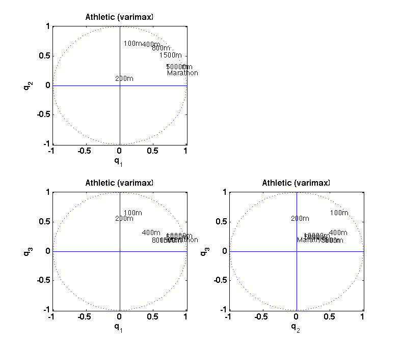
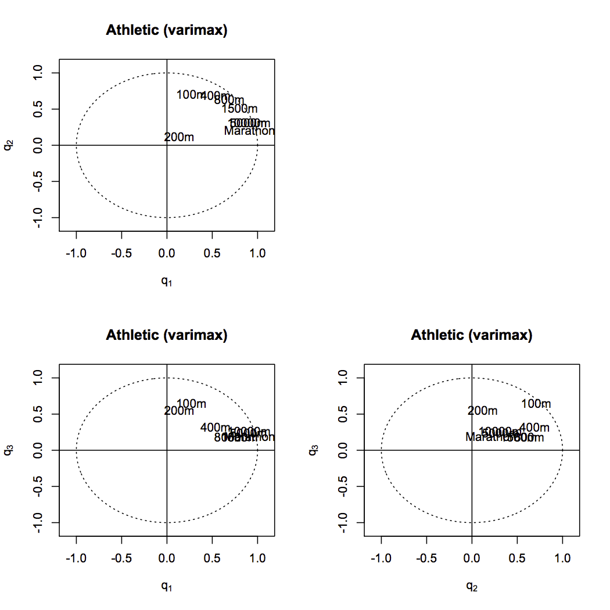
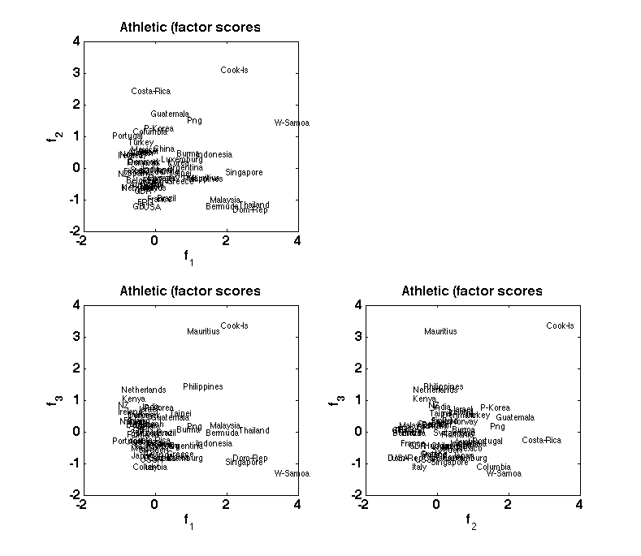

[](http://quantlet.de/)

## [](http://quantlet.de/) **SMSfacthletic** [](http://quantlet.de/)

```yaml

Name of Quantlet: SMSfacthletic

Published in: Multivariate Statistics: Exercises and Solutions

Description: 'performs a factor analysis of athletic records
               data set (athletic.mat)  which
               contains national athletic records of 55 countries in eight
               disciplines (100m, 200m, 400m, 800m, 1500m, 5km, 10km and
               marathon) and estimates factor scores.
               A table of estimated factor loadings, communalities and 
               specific variances as well as plots of factors and
               factor scores are presented.
               With p-value 0.363 for the LR test on k=3 factors we
               cannot reject the null hypothesis of 3 factors to be
               included.
               The communalities and specific variances show that three 
               factors explain very well all of the original variables 
               up to the record in 200m.
               The first factor is most strongly related to times achieved
               in longer distances, the second factor is positively related
               mainly to the records in middle distances and 100m, and the
               third factor has positive relationship to the records in
               100m and 200m.
               The best times on long distances are on average achieved 
               by Portugal, New Zealand, Ireland, Norway, and Kenya. 
               On 100m and 400m, 1500m, the best countries are Dominican 
               Republic, USA, Bermuda, Great Britain, and Thailand.
               The estimated factor scores f3 suggest that West Samoa,
               Italy, Columbia, Singapore, and USSR possess the best sprinters.
               It is also interesting to notice that some of the countries 
               which have some very good factor scores, may have, at the
               same time, very bad some other factor scores. See, for 
               example, Dominican Republic, West Samoa, Netherlands, 
               Thailand, or Kenya.'

Keywords: 'Factor Analysis, standardization, Principal Factors Method,
Iterated Principal Factors Method, Rotation, Varimax,
factor-loadings, iPFM, PFM, specific variance, factor analysis, factor scores'

See also: 'SMSfactbank, SMSfactfood, SMSfacthletic, SMSfactsigma, SMSfactuscrime, SMSfactushealth, SMSfactvocab'

Author[r]: Zdenek Hlavka
Author[m]: Awdesch Melzer

Datafile[r]: athletic.rda
Datafile[m]: athletic.mat

Example: 'Plots of the first couple of factors against each other'
```








### R Code
```r

# clear history
rm(list=ls(all=TRUE))
graphics.off()

# setwd("C:/...") # please change your working directory
# load data
load("athletic.rda")

# main calculation
facthle = factanal(athletic,factors=3,rotation="varimax",scores="regression")
print(facthle)
facttable = cbind(facthle$loadings, (1 - facthle$uniquenesses),facthle$uniqueness)
colnames(facttable) = c("q1", "q2", "q3", "Communalities", "Specific variances")
print(round(facttable,4))
# xtable(facttable,digits=4)

lab = colnames(athletic)


par(mfrow=c(2,2))
plot(c(-1.1,1.1),c(-1.1,1.1),type="n",main="Athletic (varimax)",xlab=expression(q[1]),ylab=expression(q[2])) 
ucircle = cbind(cos((0:360)/180*3.14159),sin((0:360)/180*3.14159))
points(ucircle,type="l",lty="dotted")
abline(h = 0)
abline(v = 0)
text(facthle$loadings[,1:2],labels=lab,col="black",xpd=NA)

frame()

plot(c(-1.1,1.1),c(-1.1,1.1),type="n",main="Athletic (varimax)",xlab=expression(q[1]),ylab=expression(q[3])) 
points(ucircle,type="l",lty="dotted")
abline(h = 0)
abline(v = 0)
text(facthle$loadings[,c(1,3)],labels=lab,col="black",xpd=NA)

plot(c(-1.1,1.1),c(-1.1,1.1),type="n",main="Athletic (varimax)",xlab=expression(q[2]),ylab=expression(q[3])) 
points(ucircle,type="l",lty="dotted")
abline(h = 0)
abline(v = 0)
text(facthle$loadings[,c(2,3)],labels=lab,col="black",xpd=NA)

dev.new()
par(mfrow=c(2,2)) 

plot(facthle$scores[,1:2],type="n",xlab=expression(f[1]),ylab=expression(f[2]),main="Athletic (factor scores)")
text(facthle$scores[,1:2],row.names(athletic),cex=0.7,xpd=NA)
frame()
plot(facthle$scores[,c(1,3)],type="n",xlab=expression(f[1]),ylab=expression(f[3]),main="Athletic (factor scores)")
text(facthle$scores[,c(1,3)],row.names(athletic),cex=0.7,xpd=NA)
plot(facthle$scores[,c(2,3)],type="n",xlab=expression(f[2]),ylab=expression(f[3]),main="Athletic (factor scores)")
text(facthle$scores[,c(2,3)],row.names(athletic),cex=0.7,xpd=NA)

o1=order(facthle$scores[,1])
o2=order(facthle$scores[,2])
o3=order(facthle$scores[,3])
row.names(athletic)[o1]
row.names(athletic)[o2]
row.names(athletic)[o3]

```

automatically created on 2018-05-28

### MATLAB Code
```matlab

clear all
close all
clc


load('athletic.mat')

% main calculation
[lambda,psi,T,stats,F] = factoran(athletic.data,3,'rotate','varimax','scores','regression')

facttable = [lambda, (1 - psi), psi];
format bank
disp('          q1            q2            q3            Communalities  Specific variances')
disp(facttable)

format short
lab = athletic.textdata(1,2:end);
ucircle      = [cos((0:360)/180*3.14159)' , sin((0:360)/180*3.14159)'];

%% correlation plots of factor loadings with variables
figure(1)
subplot(2,2,1)
plot(ucircle(:,1),ucircle(:,2),'b:')
title('Athletic (varimax)','FontSize',16,'FontWeight','Bold')
ylim([-1.01,1.01])
xlim([-1.01,1.01])
xlabel('q_1','FontSize',16,'FontWeight','Bold')
ylabel('q_2','FontSize',16,'FontWeight','Bold')
line([0,0]',[-1.5,1.5]')
line([-1.5,1.5]',[0,0]')
text(lambda(:,1)-0.2,lambda(:,2),lab','FontSize',14)
set(gca,'LineWidth',1.6,'FontSize',16,'FontWeight','Bold')

subplot(2,2,3)
plot(ucircle(:,1),ucircle(:,2),'b:')
title('Athletic (varimax)','FontSize',16,'FontWeight','Bold')
ylim([-1.01,1.01])
xlim([-1.01,1.01])
xlabel('q_1','FontSize',16,'FontWeight','Bold')
ylabel('q_3','FontSize',16,'FontWeight','Bold')
line([0,0]',[-1.5,1.5]')
line([-1.5,1.5]',[0,0]')
text(lambda(:,1)-0.2,lambda(:,3),lab','FontSize',14)
set(gca,'LineWidth',1.6,'FontSize',16,'FontWeight','Bold')

subplot(2,2,4)
plot(ucircle(:,1),ucircle(:,2),'b:')
title('Athletic (varimax)','FontSize',16,'FontWeight','Bold')
ylim([-1.01,1.01])
xlim([-1.01,1.01])
xlabel('q_2','FontSize',16,'FontWeight','Bold')
ylabel('q_3','FontSize',16,'FontWeight','Bold')
line([0,0]',[-1.5,1.5]')
line([-1.5,1.5]',[0,0]')
text(lambda(:,2)-0.2,lambda(:,3),lab','FontSize',14)
set(gca,'LineWidth',1.6,'FontSize',16,'FontWeight','Bold')

%% plots of factor scores
names = athletic.textdata(2:end,1);
figure(2)
subplot(2,2,1)
plot(F(:,1),F(:,2),'w')
xlabel('f_1','FontSize',16,'FontWeight','Bold')
ylabel('f_2','FontSize',16,'FontWeight','Bold')
title('Athletic (factor scores)','FontSize',16,'FontWeight','Bold')
set(gca,'LineWidth',1.6,'FontSize',16,'FontWeight','Bold')
text(F(:,1),F(:,2),names)
subplot(2,2,3)
plot(F(:,1),F(:,3),'w')
xlabel('f_1','FontSize',16,'FontWeight','Bold')
ylabel('f_3','FontSize',16,'FontWeight','Bold')
title('Athletic (factor scores)','FontSize',16,'FontWeight','Bold')
set(gca,'LineWidth',1.6,'FontSize',16,'FontWeight','Bold')
text(F(:,1),F(:,3),names)
subplot(2,2,4)
plot(F(:,2),F(:,3),'w')
xlabel('f_2','FontSize',16,'FontWeight','Bold')
ylabel('f_3','FontSize',16,'FontWeight','Bold')
title('Athletic (factor scores)','FontSize',16,'FontWeight','Bold')
set(gca,'LineWidth',1.6,'FontSize',16,'FontWeight','Bold')
text(F(:,2),F(:,3),names)

FL = [(1:length(F(:,1)))',F];
[B1,index1] = sortrows(FL,2);
[B2,index2] = sortrows(FL,3);
[B3,index3] = sortrows(FL,4); 
names(index1)
names(index2)
names(index3)
```

automatically created on 2018-05-28