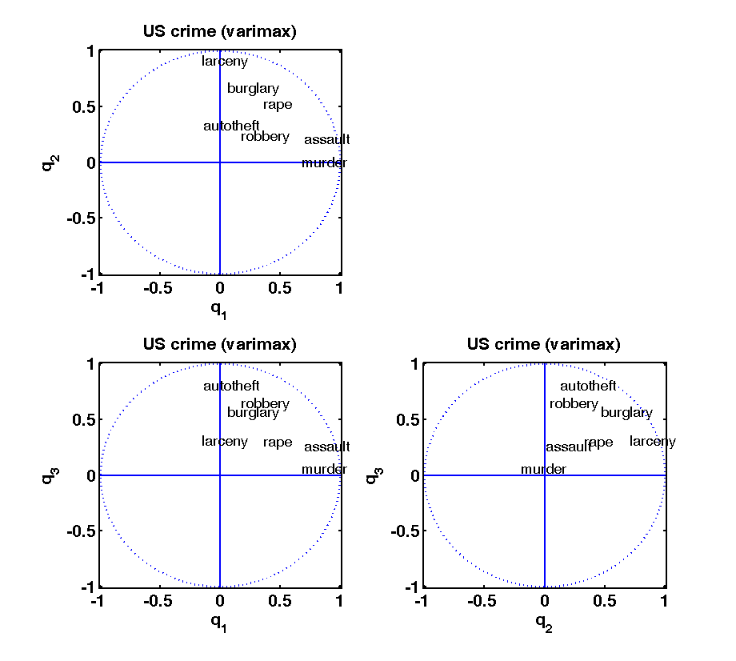
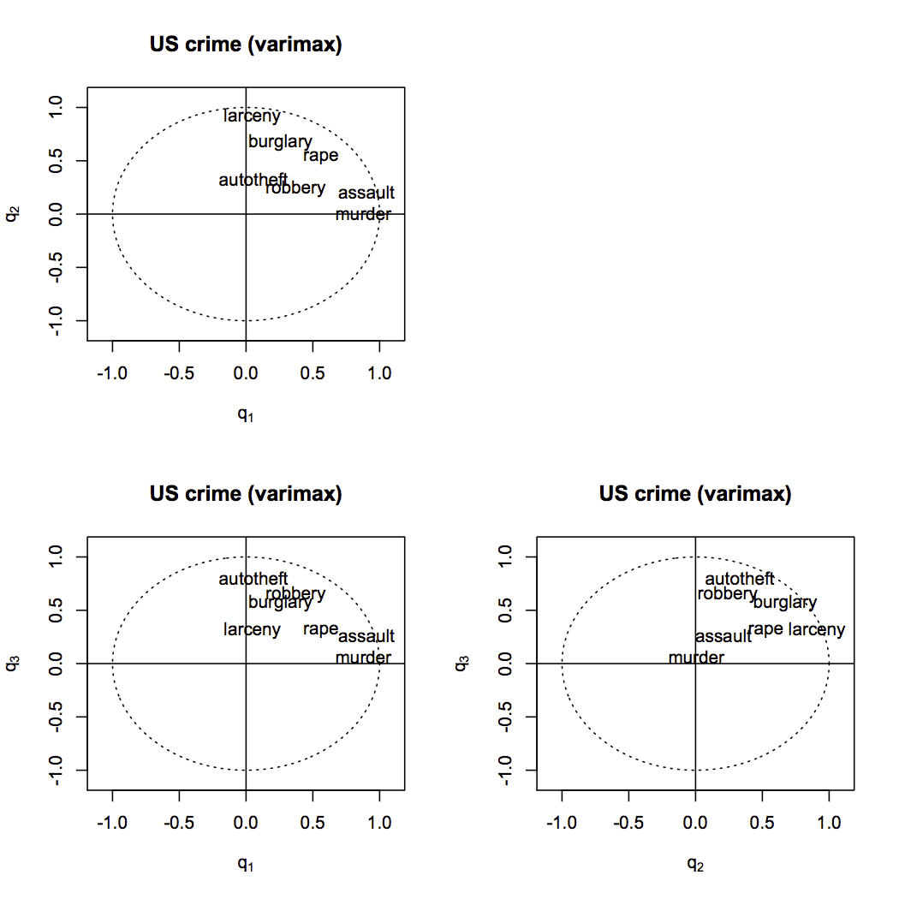
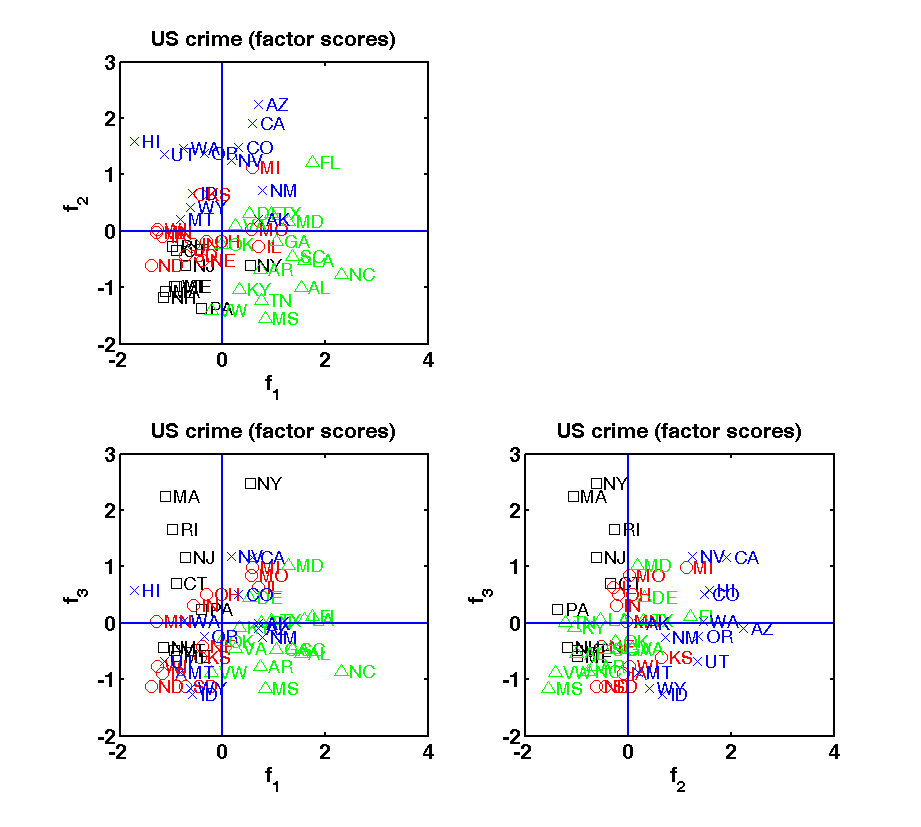
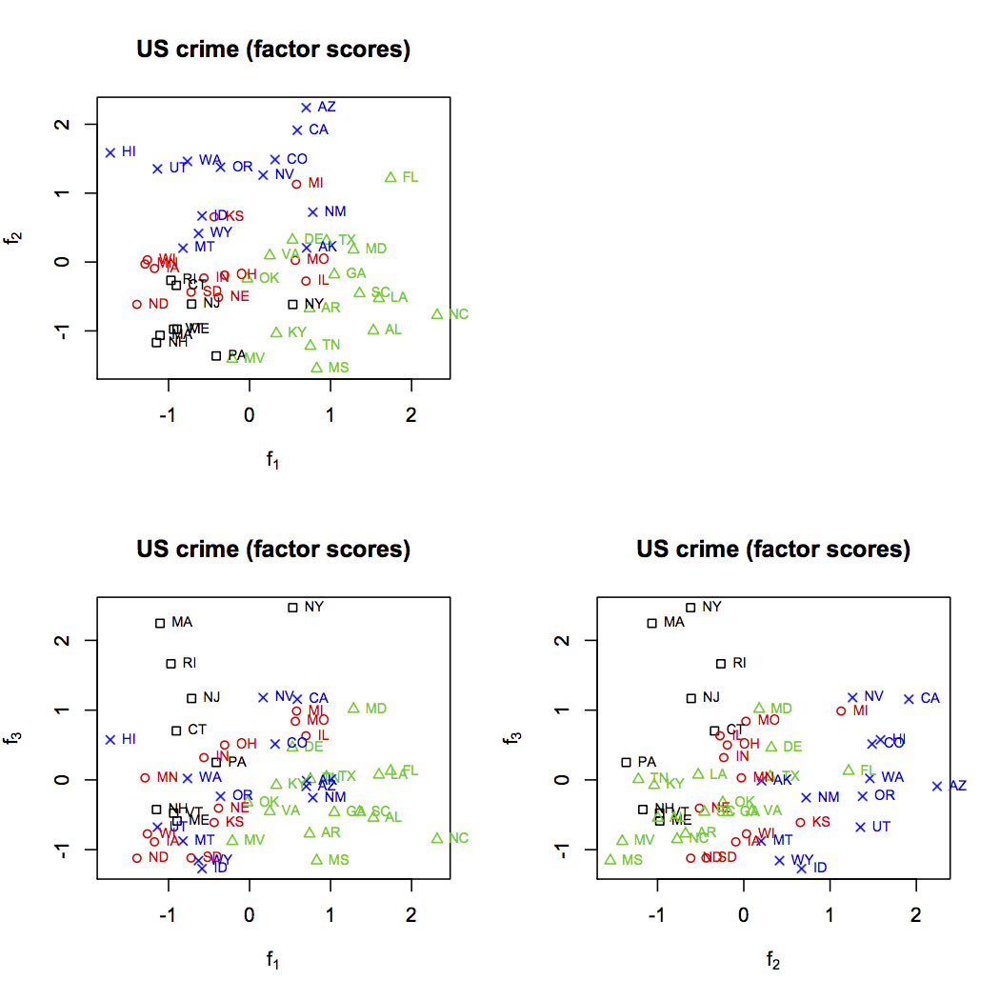

[](http://quantlet.de/)

## [](http://quantlet.de/) **SMSfactuscrime** [](http://quantlet.de/)

```yaml

Name of Quantlet: SMSfactuscrime

Published in: Multivariate Statistics: Exercises and Solutions

Description: 'performs a factor analysis on the US crime 
               data set and estimates factor scores. The data set contains
               the reported number of crimes in he 50 states of the USA
               classified according to 7 cateories.
               A table of estimated factor loadings, communalities and 
               specific variances as well as plots of factors and
               factor scores are presented.
               With p-value 0.8257 for the LR test on k=3 factors we
               cannot reject the null hypothesis of 3 factors to be
               included. First factor could
               be as violent assault and murder criminality factor. The
               second factor is strongly related to larceny, burglary and
               rape. The third factor is related to auto theft, robbery
               and burglary.
               The estimated factor scores for the first factor, murder
               and assault, seem to be largest in North Carolina. The 
               second factor suggests that larceny is common mainly in 
               Arizona and California. The third factor, auto theft and 
               robbery, reaches the highest estimated factor scores in New
               York and Massachusetts.'

Keywords: 'varimax, rotation, factor analysis, factor scores, factor loadings, communalities, specific variances, factor model'

See also: 'SMSfactbank, SMSfactfood, SMSfacthletic, SMSfactsigma, SMSfactuscrime, SMSfactushealth, SMSfactvocab'

Author[r]: Zdenek Hlavka
Author[m]: Awdesch Melzer

Datafile[r]: uscrime.rda
Datafile[m]: uscrime.dat

Example: 'Plots of the first couple of factors against each other and the corresponding factor scores'
```









### R Code
```r

graphics.off()
rm(list=ls(all=TRUE))

# setwd("C:/...") #set your working directory
load("uscrime.rda")

factcrime = factanal(~murder+rape+robbery+assault+burglary+larceny+autotheft,factors=3,rotation="varimax",scores="regression",data=uscrime)
print(factcrime)
facttable = cbind(factcrime$loadings, (1 - factcrime$uniquenesses),factcrime$uniqueness)
colnames(facttable) = c("q1", "q2", "q3", "Communalities", "Specific variances")
print(round(facttable,4))
# xtable(facttable,digits=4)

lab=colnames(uscrime)[3:9]

opar=par(mfrow=c(2,2))
plot(c(-1.1,1.1),c(-1.1,1.1),type="n",main="US crime (varimax)",xlab=expression(q[1]),ylab=expression(q[2])) 
ucircle<-cbind(cos((0:360)/180*3.14159),sin((0:360)/180*3.14159))
points(ucircle,type="l",lty="dotted")
abline(h = 0)
abline(v = 0)
text(factcrime$loadings[,1:2],labels=lab,col="black")

frame()

plot(c(-1.1,1.1),c(-1.1,1.1),type="n",main="US crime (varimax)",xlab=expression(q[1]),ylab=expression(q[3])) 
points(ucircle,type="l",lty="dotted")
abline(h = 0)
abline(v = 0)
text(factcrime$loadings[,c(1,3)],labels=lab,col="black")

plot(c(-1.1,1.1),c(-1.1,1.1),type="n",main="US crime (varimax)",xlab=expression(q[2]),ylab=expression(q[3])) 
points(ucircle,type="l",lty="dotted")
abline(h = 0)
abline(v = 0)
text(factcrime$loadings[,c(2,3)],labels=lab,col="black")


type = as.numeric(uscrime$reg)
type2 = type-1
type2[which(type2==3)]=4

dev.new()
par(mfrow=c(2,2))

plot(factcrime$scores[,1:2],type="n",xlab=expression(f[1]),ylab=expression(f[2]),main="US crime (factor scores)")
points(factcrime$scores[,1:2],cex=0.9,col=type,pch=type2)
text(factcrime$scores[,1:2],row.names(uscrime),cex=0.7,xpd=NA,col=type,pos=4)
frame()

plot(factcrime$scores[,c(1,3)],type="n",xlab=expression(f[1]),ylab=expression(f[3]),main="US crime (factor scores)")
points(factcrime$scores[,c(1,3)],cex=0.9,col=type,pch=type2)
text(factcrime$scores[,c(1,3)],row.names(uscrime),cex=0.7,xpd=NA,col=type,pos=4)

plot(factcrime$scores[,c(2,3)],type="n",xlab=expression(f[2]),ylab=expression(f[3]),main="US crime (factor scores)")
points(factcrime$scores[,c(2,3)],cex=0.9,col=type,pch=type2)
text(factcrime$scores[,c(2,3)],row.names(uscrime),cex=0.7,xpd=NA,col=type,pos=4)


par(opar)


```

automatically created on 2018-05-28

### MATLAB Code
```matlab

% clear memory and close windows
clear all
close all
clc

x         = load('uscrime.dat'); % load data
% labels for crimes
crime     = strvcat('murder', 'rape', 'robbery', 'assault', 'burglary', 'larceny', 'autotheft');
crime     = cellstr(crime);
% labels for regions
state     = strvcat('ME','NH','VT','MA','RI','CT','NY','NJ','PA','OH','IN','IL','MI','WI','MN','IA','MO','ND','SD','NE','KS','DE','MD','VA','VW','NC','SC','GA','FL','KY','TN','AL','MS','AR','LA','OK','TX','MT','ID','WY','CO','NM','AZ','UT','NV','WA','OR','CA','AK','HI');
state     = cellstr(state);
% factor analysis
[lambda,psi,T,stats,F] = factoran(x(:,3:9),3,'rotate','varimax','scores','regression')
facttable = [lambda, (1 - psi), psi];
format bank
disp('          q1            q2            q3            Communalities  Specific variances')
disp(facttable)
format short

% unit circle
ucircle      = [cos((0:360)/180*3.14159)' , sin((0:360)/180*3.14159)'];
% correlation plots of factor loadings with variables
figure(1)
subplot(2,2,1)
plot(ucircle(:,1),ucircle(:,2),'b:','LineWidth',1.6)
title('US crime (varimax)','FontSize',16,'FontWeight','Bold')
ylim([-1.01,1.01])
xlim([-1.01,1.01])
xlabel('q_1','FontSize',16,'FontWeight','Bold')
ylabel('q_2','FontSize',16,'FontWeight','Bold')
line([0,0]',[-1.5,1.5]','LineWidth',1.6)
line([-1.5,1.5]',[0,0]','LineWidth',1.6)
text(lambda(:,1)-0.2,lambda(:,2),crime,'FontSize',14)
set(gca,'LineWidth',1.6,'FontSize',16,'FontWeight','Bold')

subplot(2,2,3)
plot(ucircle(:,1),ucircle(:,2),'b:','LineWidth',1.6)
title('US crime (varimax)','FontSize',16,'FontWeight','Bold')
ylim([-1.01,1.01])
xlim([-1.01,1.01])
xlabel('q_1','FontSize',16,'FontWeight','Bold')
ylabel('q_3','FontSize',16,'FontWeight','Bold')
line([0,0]',[-1.5,1.5]','LineWidth',1.6)
line([-1.5,1.5]',[0,0]','LineWidth',1.6)
text(lambda(:,1)-0.2,lambda(:,3),crime,'FontSize',14)
set(gca,'LineWidth',1.6,'FontSize',16,'FontWeight','Bold')

subplot(2,2,4)
plot(ucircle(:,1),ucircle(:,2),'b:','LineWidth',1.6)
title('US crime (varimax)','FontSize',16,'FontWeight','Bold')
ylim([-1.01,1.01])
xlim([-1.01,1.01])
xlabel('q_2','FontSize',16,'FontWeight','Bold')
ylabel('q_3','FontSize',16,'FontWeight','Bold')
line([0,0]',[-1.5,1.5]','LineWidth',1.6)
line([-1.5,1.5]',[0,0]','LineWidth',1.6)
text(lambda(:,2)-0.2,lambda(:,3),crime,'FontSize',14)
set(gca,'LineWidth',1.6,'FontSize',16,'FontWeight','Bold')


% markers for factor scores plot
Markers= ['s','s','s','s','s','s','s','s','s',...
 'o','o','o','o','o','o','o','o','o','o','o','o',...
 '^','^','^','^','^','^','^','^','^','^','^','^','^','^','^','^',...
 'x','x','x','x','x','x','x','x','x','x','x','x','x'];
%  color of markers for factor scores plot
Colors = ['k','k','k','k','k','k','k','k','k',...
 'r','r','r','r','r','r','r','r','r','r','r','r',...
 'g','g','g','g','g','g','g','g','g','g','g','g','g','g','g','g',...
 'b','b','b','b','b','b','b','b','b','b','b','b','b'];

% factor scores plot
figure(2)
subplot(2,2,1)
for i=1:size(F,1)
plot(F(i,1),F(i,2),Markers(i),'Color',Colors(i),'MarkerSize',10)
hold on
text(F(i,1)+0.15,F(i,2),state(i),'Color',Colors(i),'FontSize',14)
end
title('US crime (factor scores)','FontSize',16,'FontWeight','Bold')
xlabel('f_1','FontSize',16,'FontWeight','Bold')
ylabel('f_2','FontSize',16,'FontWeight','Bold')
line([0,0]',[-2,3]','LineWidth',1.6)
line([-2,4]',[0,0]','LineWidth',1.6)
set(gca,'LineWidth',1.6,'FontSize',16,'FontWeight','Bold')
hold off

subplot(2,2,3)
for i=1:size(F,1)
plot(F(i,1),F(i,3),Markers(i),'Color',Colors(i),'MarkerSize',10)
hold on
text(F(i,1)+0.15,F(i,3),state(i),'Color',Colors(i),'FontSize',14)
end
title('US crime (factor scores)','FontSize',16,'FontWeight','Bold')
xlabel('f_1','FontSize',16,'FontWeight','Bold')
ylabel('f_3','FontSize',16,'FontWeight','Bold')
line([0,0]',[-2,3]','LineWidth',1.6)
line([-2,4]',[0,0]','LineWidth',1.6)
set(gca,'LineWidth',1.6,'FontSize',16,'FontWeight','Bold')

subplot(2,2,4)
for i=1:size(F,1)
plot(F(i,2),F(i,3),Markers(i),'Color',Colors(i),'MarkerSize',10)
hold on
text(F(i,2)+0.15,F(i,3),state(i),'Color',Colors(i),'FontSize',14)
end
title('US crime (factor scores)','FontSize',16,'FontWeight','Bold')
xlabel('f_2','FontSize',16,'FontWeight','Bold')
ylabel('f_3','FontSize',16,'FontWeight','Bold')
line([0,0]',[-2,3]','LineWidth',1.6)
line([-2,4]',[0,0]','LineWidth',1.6)
set(gca,'LineWidth',1.6,'FontSize',16,'FontWeight','Bold')

```

automatically created on 2018-05-28