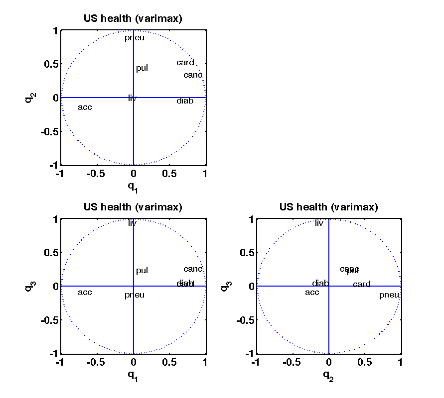
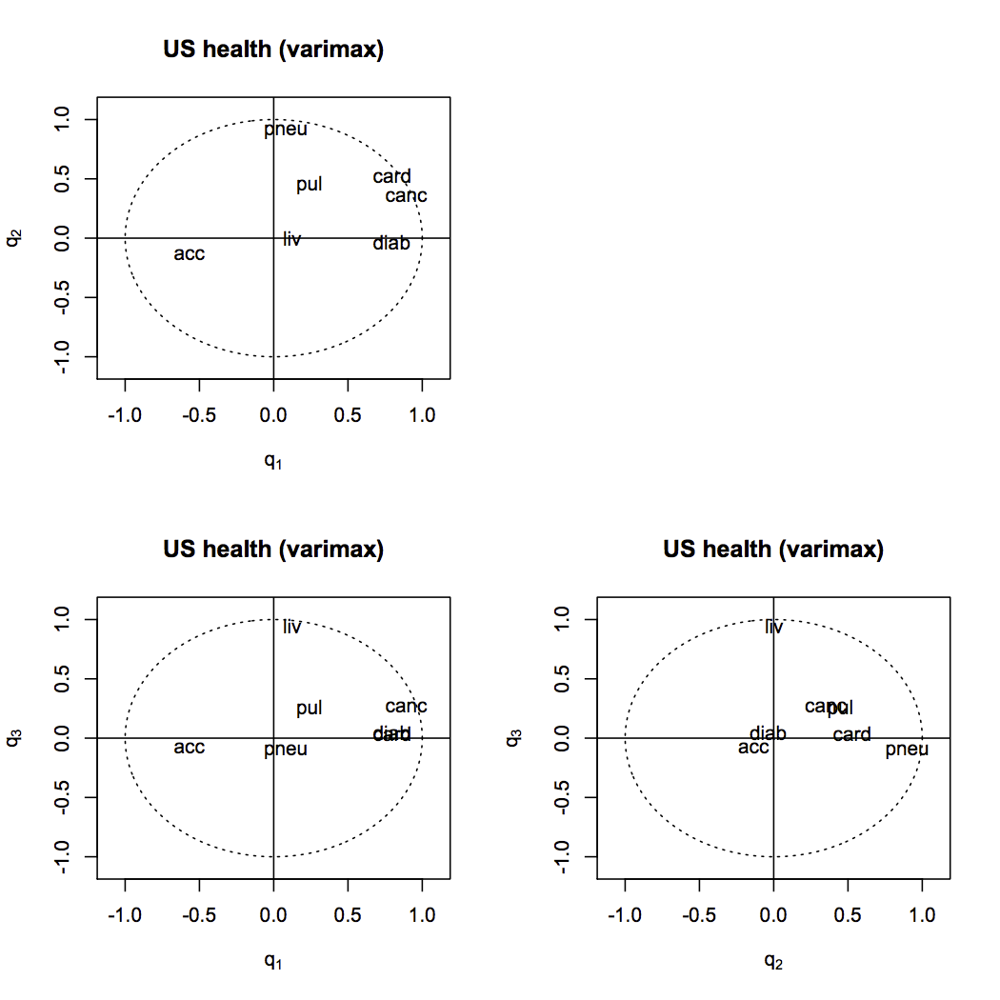
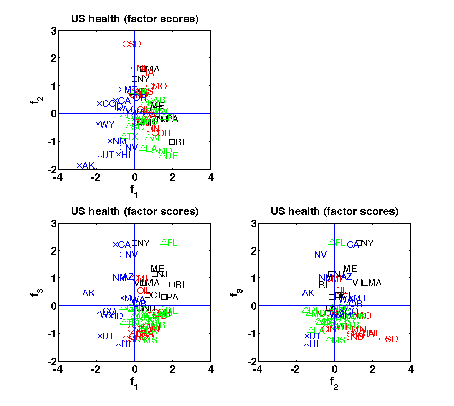
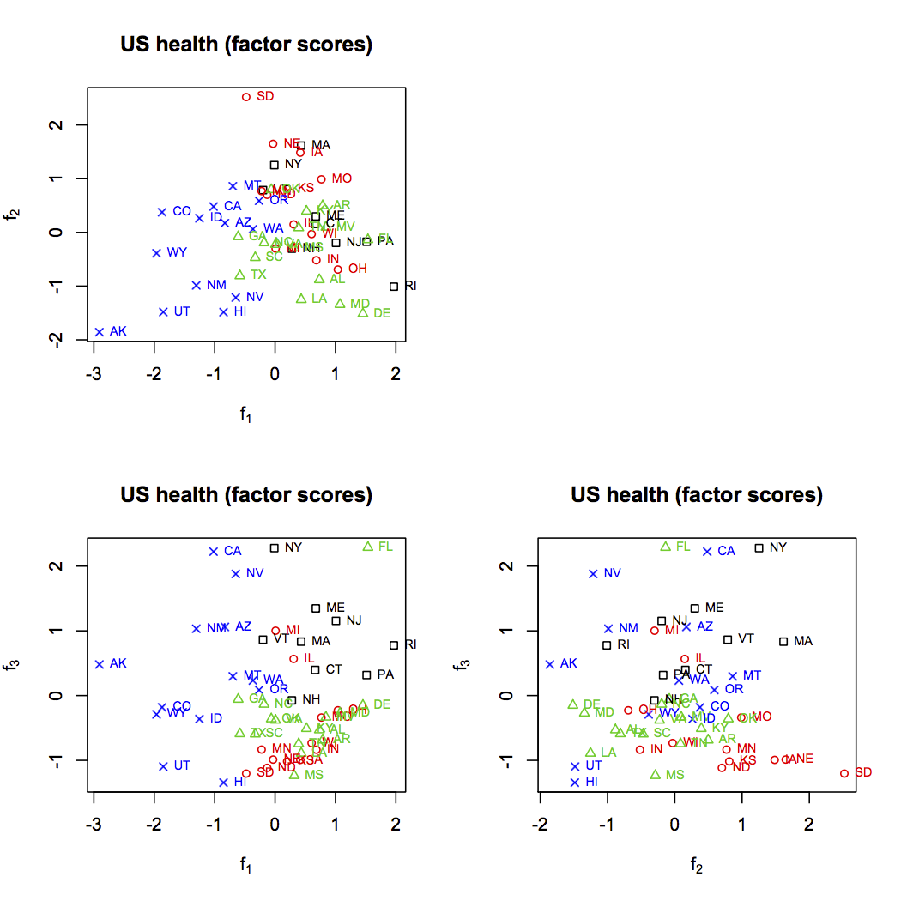

[](http://quantlet.de/)

## [](http://quantlet.de/) **SMSfactushealth** [](http://quantlet.de/)

```yaml

Name of Quantlet: SMSfactushealth

Published in: Multivariate Statistics: Exercises and Solutions

Description: 'performs a factor analysis on the US health
               data set. The first factor, corresponding to diabetes, 
               cancer, and cardiovascular problems, leads to higher factor
               scores in Rhode Island. On the other side, these causes of
               death are less common mainly in Alaska, Wyoming, Colorado,
               and Utah. The second health factor, positively related to  
               pneumonia flu, has highest estimated values in South Dakota
               and smallest values in Alaska. The third health factor, 
               strongly positively related to liver, has high values in Florida,
               California, and New York and small values in Hawaii and 
               Mississippi. Looking at the the geographical codes, 
               it is interesting to note that Florida seems to be a 
               regional outlier from the point of view of the third factor.
               The most healthy U.S. states are Alaska, Hawaii, and Utah.
               A table of estimated factor loadings, communalities and 
               specific variances as well as plots of factors and
               factor scores are presented.'

Keywords: 'varimax, rotation, factor analysis, factor scores, factor loadings, communalities, specific variances, factor model'

See also: 'SMSfactbank, SMSfactfood, SMSfacthletic, SMSfactsigma, SMSfactuscrime, SMSfactushealth, SMSfactvocab'

Author[r]: Zdenek Hlavka
Author[m]: Awdesch Melzer

Datafile[r]: ushealth.rda
Datafile[m]: ushealth.dat

Example: 'Plots of the first couple of factors against each other and the corresponding factor scores'
```









### R Code
```r

# clear workspace
 graphics.off()
 rm(list=ls(all=TRUE))
# setwd("C:/...") #set your working directory
load("ushealth.rda")

facthealth=factanal(~acc+card+canc+pul+pneu+diab+liv,factors=3,rotation="varimax",scores="regression",data=ushealth)
print(facthealth,cutoff=0.001)
communalities = (1 - facthealth$uniquenesses)
facttable = cbind(facthealth$loadings,communalities,facthealth$uniqueness)
colnames(facttable) = c("q1", "q2", "q3", "Communalities", "Specific variances")
print(round(facttable,4))
# xtable(facttable,digits=4)

lab=colnames(ushealth)[3:9]


opar=par(mfrow=c(2,2))
plot(c(-1.1,1.1),c(-1.1,1.1),type="n",main="US health (varimax)",xlab=expression(q[1]),ylab=expression(q[2])) 
ucircle<-cbind(cos((0:360)/180*3.14159),sin((0:360)/180*3.14159))
points(ucircle,type="l",lty="dotted")
abline(h = 0)
abline(v = 0)
text(facthealth$loadings[,1:2],labels=lab,col="black")

frame()

plot(c(-1.1,1.1),c(-1.1,1.1),type="n",main="US health (varimax)",xlab=expression(q[1]),ylab=expression(q[3])) 
points(ucircle,type="l",lty="dotted")
abline(h = 0)
abline(v = 0)
text(facthealth$loadings[,c(1,3)],labels=lab,col="black")


plot(c(-1.1,1.1),c(-1.1,1.1),type="n",main="US health (varimax)",xlab=expression(q[2]),ylab=expression(q[3])) 
points(ucircle,type="l",lty="dotted")
abline(h = 0)
abline(v = 0)
text(facthealth$loadings[,c(2,3)],labels=lab,col="black")

type = as.numeric(ushealth$reg)
type2 = type-1
type2[which(type2==3)]=4
dev.new()
par(mfrow=c(2,2))

plot(facthealth$scores[,1:2],type="n",xlab=expression(f[1]),ylab=expression(f[2]),main="US health (factor scores)")
points(facthealth$scores[,1:2],cex=0.9,col=type,pch=type2)
text(facthealth$scores[,1:2],row.names(ushealth),xpd=NA,cex=0.7,col=type,pos=4)
frame()
plot(facthealth$scores[,c(1,3)],type="n",xlab=expression(f[1]),ylab=expression(f[3]),main="US health (factor scores)")
points(facthealth$scores[,c(1,3)],cex=0.9,col=type,pch=type2)
text(facthealth$scores[,c(1,3)],row.names(ushealth),xpd=NA ,cex=0.7,col=type,pos=4)
plot(facthealth$scores[,c(2,3)],type="n",xlab=expression(f[2]),ylab=expression(f[3]),main="US health (factor scores)")
points(facthealth$scores[,c(2,3)],cex=0.9,col=type,pch=type2)
text(facthealth$scores[,c(2,3)],row.names(ushealth),xpd=NA,cex=0.7,col=type,pos=4)


par(opar)


```

automatically created on 2018-05-28

### MATLAB Code
```matlab

clear all
close all
clc

% load data
[rows,land_area,popu_1985,acc,card,canc,pul, pneu,diab,liv,doc,shop, reg, div] = ...
    textread('ushealth.dat','%s %f %f %f %f %f %f %f %f %f %f %f %f %f');
health  = horzcat(land_area,popu_1985,acc,card,canc,pul, pneu,diab,liv,doc,shop, reg, div); % Horizontal concatenation, creates data matrix
x       = health(:,3:9);

% perform factor analysis employing varimax rotation method
[lambda,psi,T,stats,F] = factoran(x,3,'rotate','varimax','scores','regression')
facttable = [lambda, (1 - psi), psi];
format bank
disp('          q1            q2            q3            Communalities  Specific variances')
disp(facttable)
format short

% labels
lab = strvcat('acc', 'card', 'canc', 'pul', 'pneu', 'diab', 'liv');
lab = cellstr(lab);

% unit circle
ucircle      = [cos((0:360)/180*3.14159)' , sin((0:360)/180*3.14159)'];

% correlation plots of factor loadings with original variables
figure(1)
subplot(2,2,1)
plot(ucircle(:,1),ucircle(:,2),'b:','LineWidth',1.6)
title('US health (varimax)','FontSize',16,'FontWeight','Bold')
ylim([-1.01,1.01])
xlim([-1.01,1.01])
xlabel('q_1','FontSize',16,'FontWeight','Bold')
ylabel('q_2','FontSize',16,'FontWeight','Bold')
line([0,0]',[-1.5,1.5]','LineWidth',1.6)
line([-1.5,1.5]',[0,0]','LineWidth',1.6)
text(lambda(:,1)-0.2,lambda(:,2),lab,'FontSize',14)
set(gca,'LineWidth',1.6,'FontSize',16,'FontWeight','Bold')

subplot(2,2,3)
plot(ucircle(:,1),ucircle(:,2),'b:','LineWidth',1.6)
title('US health (varimax)','FontSize',16,'FontWeight','Bold')
ylim([-1.01,1.01])
xlim([-1.01,1.01])
xlabel('q_1','FontSize',16,'FontWeight','Bold')
ylabel('q_3','FontSize',16,'FontWeight','Bold')
line([0,0]',[-1.5,1.5]','LineWidth',1.6)
line([-1.5,1.5]',[0,0]','LineWidth',1.6)
text(lambda(:,1)-0.2,lambda(:,3),lab,'FontSize',14)
set(gca,'LineWidth',1.6,'FontSize',16,'FontWeight','Bold')

subplot(2,2,4)
plot(ucircle(:,1),ucircle(:,2),'b:','LineWidth',1.6)
title('US health (varimax)','FontSize',16,'FontWeight','Bold')
ylim([-1.01,1.01])
xlim([-1.01,1.01])
xlabel('q_2','FontSize',16,'FontWeight','Bold')
ylabel('q_3','FontSize',16,'FontWeight','Bold')
line([0,0]',[-1.5,1.5]','LineWidth',1.6)
line([-1.5,1.5]',[0,0]','LineWidth',1.6)
text(lambda(:,2)-0.2,lambda(:,3),lab,'FontSize',14)
set(gca,'LineWidth',1.6,'FontSize',16,'FontWeight','Bold')

% factor scores
% labels for regions
state     = strvcat('ME','NH','VT','MA','RI','CT','NY','NJ','PA','OH','IN','IL','MI','WI','MN','IA','MO','ND','SD','NE','KS','DE','MD','VA','VW','NC','SC','GA','FL','KY','TN','AL','MS','AR','LA','OK','TX','MT','ID','WY','CO','NM','AZ','UT','NV','WA','OR','CA','AK','HI');
state     = cellstr(state);

% markers for factor scores plot
Markers= ['s','s','s','s','s','s','s','s','s',...
 'o','o','o','o','o','o','o','o','o','o','o','o',...
 '^','^','^','^','^','^','^','^','^','^','^','^','^','^','^','^',...
 'x','x','x','x','x','x','x','x','x','x','x','x','x'];
%  color of markers for factor scores plot
Colors = ['k','k','k','k','k','k','k','k','k',...
 'r','r','r','r','r','r','r','r','r','r','r','r',...
 'g','g','g','g','g','g','g','g','g','g','g','g','g','g','g','g',...
 'b','b','b','b','b','b','b','b','b','b','b','b','b'];

% factor scores plot
figure(2)
subplot(2,2,1)
for i=1:size(F,1)
plot(F(i,1),F(i,2),Markers(i),'Color',Colors(i),'MarkerSize',10)
hold on
text(F(i,1)+0.15,F(i,2),state(i),'Color',Colors(i),'FontSize',14)
end
title('US health (factor scores)','FontSize',16,'FontWeight','Bold')
xlabel('f_1','FontSize',16,'FontWeight','Bold')
ylabel('f_2','FontSize',16,'FontWeight','Bold')
line([0,0]',[-2,3]','LineWidth',1.6)
line([-4,4]',[0,0]','LineWidth',1.6)
set(gca,'LineWidth',1.6,'FontSize',16,'FontWeight','Bold')
hold off

subplot(2,2,3)
for i=1:size(F,1)
plot(F(i,1),F(i,3),Markers(i),'Color',Colors(i),'MarkerSize',10)
hold on
text(F(i,1)+0.15,F(i,3),state(i),'Color',Colors(i),'FontSize',14)
end
title('US health (factor scores)','FontSize',16,'FontWeight','Bold')
xlabel('f_1','FontSize',16,'FontWeight','Bold')
ylabel('f_3','FontSize',16,'FontWeight','Bold')
line([0,0]',[-2,3]','LineWidth',1.6)
line([-4,4]',[0,0]','LineWidth',1.6)
set(gca,'LineWidth',1.6,'FontSize',16,'FontWeight','Bold')

subplot(2,2,4)
for i=1:size(F,1)
plot(F(i,2),F(i,3),Markers(i),'Color',Colors(i),'MarkerSize',10)
hold on
text(F(i,2)+0.15,F(i,3),state(i),'Color',Colors(i),'FontSize',14)
end
title('US health (factor scores)','FontSize',16,'FontWeight','Bold')
xlabel('f_2','FontSize',16,'FontWeight','Bold')
ylabel('f_3','FontSize',16,'FontWeight','Bold')
line([0,0]',[-2,3]','LineWidth',1.6)
line([-4,4]',[0,0]','LineWidth',1.6)
set(gca,'LineWidth',1.6,'FontSize',16,'FontWeight','Bold')

```

automatically created on 2018-05-28