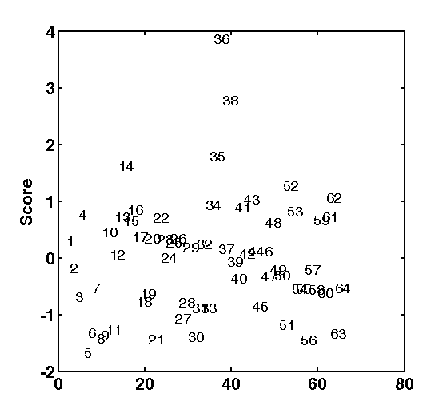
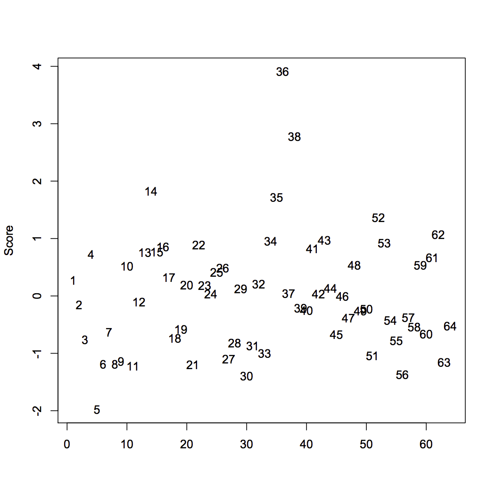

[](http://quantlet.de/)

## [](http://quantlet.de/) **SMSfactvocab** [](http://quantlet.de/)

```yaml

Name of Quantlet: SMSfactvocab

Published in: Multivariate Statistics: Exercises and Solutions

Description: 'calculates factor scores for the vocabulary 
               data set, which contains the test scores of 64 pupils from
               the eigth through eleventh grade levels. For each pupil we
               have one test score per grade which leads to a
               4-dimensional data set. However, after perfoming LR test,
               we observe, that H0 k=1 factor cannot be rejected at a
               p-value of 0.457. Estimated factor loadings, communalities
               and specific variances are presented in a table. A plot of
               factor scores for the pupils is shown. The values on the 
               vertical axis are randomly chosen so that the plotted
               numbers are readable. The best values were achieved in
               observations 36 and 38 whereas the 5th observation seems
               to be extremely bad.'

Keywords: 'varimax, rotation, factor analysis, factor scores, factor loadings, communalities, specific variances, factor model'

See also: 'SMSfactbank, SMSfactfood, SMSfacthletic, SMSfactsigma, SMSfactuscrime, SMSfactushealth, SMSfactvocab'

Author[r]: Petra Cernayova, Zdenek Hlavka
Author[m]: Awdesch Melzer

Datafile[r]: vocabulary.rda
Datafile[m]: vocabulary.dat

Example: 'Plots the factor scores for the vocabulary data set.'
```





### R Code
```r

# clear workspace
 graphics.off()
 rm(list=ls(all=TRUE))

# setwd("C:/...") #set your working directory
load("vocabulary.rda")

voc       = vocabulary[,1:4] 
factvocab = factanal(voc, factors=1,scores="Bartlett")
facttable = cbind(factvocab$loadings, (1 - factvocab$uniquenesses),factvocab$uniqueness)
colnames(facttable) = c("q1", "Communalities", "Specific variances")
print(round(facttable,4))
# xtable(facttable,digits=4)
plot(factanal(voc, factors=1,scores="Bartlett")$scores,type="n",xlab="",ylab="Score")
text(factanal(voc, factors=1,scores="Bartlett")$scores,rownames(voc))
```

automatically created on 2018-05-28

### MATLAB Code
```matlab

clear all
close all
clc

x         = load('vocabulary.dat');
voc       = x(:,1:4); 
[lambda,psi,T,stats,F] = factoran(voc, 1, 'scores', 'Bartlett')
facttable = [lambda, (1 - psi), psi];
format bank
disp('          q1            Communalities Specific variances')
disp(facttable)
format short
lab = strvcat(num2str((1:64)'));
plot((1:64)',F,'w')
text((1:64)',F(:),lab,'FontSize',14)
ylabel('Score','FontSize',16,'FontWeight','Bold')
set(gca,'LineWidth',1.6,'FontSize',16,'FontWeight','Bold')
```

automatically created on 2018-05-28