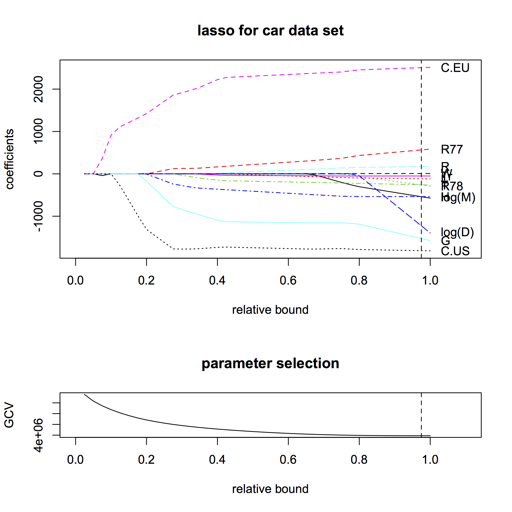

[](http://quantlet.de/index.php?p=info)

## [](http://quantlet.de/) **SMSlassocar** [](http://quantlet.de/d3/ia)


```yaml
Name of Quantlet: SMSlassocar

Published in: Multivariate Statistics: Exercises and Solutions Series 

Description: 'Performs a lasso regression on the car data'

Keywords: 'lasso, cross validation, cv, Least Angle Regression, variance-inflation factors, vif, L1-constraint'

See also: 'SMSlassocar, SMSlassologit, SMSlassoridge, SMSlinregcar, SMSlinregcar2, SMSlogitbankrupt'

Author:   Zdenek Hlavka

Datafile: carc.rda

Example: 'log(M)       R77       R78         H         R        Tr         W   
 4.706813  3.415431  3.596420  2.110418  2.506423  4.163597 27.630889 
       L         T    log(D)         G      C.EU      C.US 
 18.040191  8.811997 15.585687  4.669373  3.422943    4.407940 
                    Value   Std. Error    Z score     Pr(>|Z|)


 (Intercept) 26211.288803 12841.709749  2.0411058 4.124031e-02
 log(M)       -539.530856  1786.785229 -0.3019562 7.626855e-01
 R77           565.120251   415.360651  1.3605532 1.736549e-01
 R78          -261.006248   406.749748 -0.6416875 5.210761e-01
 H            -538.271391   377.236913 -1.4268789 1.536148e-01
 R             173.625653   113.789595  1.5258482 1.270477e-01
 Tr            -50.499150   101.391289 -0.4980620 6.184403e-01
 W               7.461142     1.414427  5.2750289 1.327351e-07
 L            -116.773868    40.564076 -2.8787509 3.992536e-03
 T            -259.231117   148.650273 -1.7438994 8.117664e-02
 log(D)      -1226.375991  1761.388982 -0.6962551 4.862691e-01
 G           -1526.552234  1013.301941 -1.5065127 1.319356e-01
 C.EU         2506.674417  1162.323559  2.1566064 3.103635e-02
 C.US        -1813.521626   984.970647 -1.8411936 6.559320e-02'

```





```R
# clear variables, close windows
rm(list=ls(all=TRUE))
graphics.off()

# install and load packages
libraries = c("car","lasso2","glmnet")
lapply(libraries, function(x) if (!(x %in% installed.packages())) {
  install.packages(x)
})
lapply(libraries, library, quietly = TRUE, character.only = TRUE)
 
# setwd("C:/...") # set working directory
 
# load data set
load('carc.rda')

# convert factors to numeric
carc$R78  = as.numeric(as.character(carc$R78))
carc$R77  = as.numeric(as.character(carc$R77))
carc$C.EU = as.numeric(carc$C=="Europe")
carc$C    = as.numeric(carc$C=="US")
names(carc)[13] = "C.US"

# Variance-Inflation Factors
vif(lm(P~log(M)+R77+R78++H+R+Tr+W+L+T+log(D)+G+C.EU+C.US,data=carc))
 #   log(M)       R77       R78         H         R        Tr         W         L 
 # 4.706813  3.415431  3.596420  2.110418  2.506423  4.163597 27.630889 18.040191 
 #        T    log(D)         G      C.EU      C.US 
 # 8.811997 15.585687  4.669373  3.422943  4.407940 
 #

 # lasso on a grid | Regression Fitting with L1-Norm Regularization
res     = l1ce(P~log(M)+R77+R78++H+R+Tr+W+L+T+log(D)+G+C.EU+C.US,data=carc,bound=(1:40)/40)

 # generalized cross-validation - simplification of usual leave-one-out CV
gcv.car = gcv(res)
opt.t   = gcv.car[which.min(gcv.car[,"gcv"]),1]
plres   = plot(res)

 # split graph.window
 dev.new()
layout(matrix(c(1,2), 2, 1),heights=c(0.65,0.35))

 # plot LASSO
matplot(plres$bound[,"rel.bound"],plres$mat[,-1],type="l",xlim=c(0,1.1),xlab="relative bound",ylab="coefficients",main="lasso for car data set")
text(cbind(1.03,coef(res[40])[-1]),labels(res),adj=0)
abline(v=opt.t,lty=2)

 # plot GCV
plot(gcv.car[,"gcv"]~gcv.car[,1],xlim=c(0,1.1),type="l",ylab="GCV",xlab="relative bound",main="parameter selection")
abline(v=opt.t,lty=2)

 # coefficients
summary(l1ce(P~log(M)+R77+R78++H+R+Tr+W+L+T+log(D)+G+C.EU+C.US,data=carc,bound=opt.t))$coefficients

 #                    Value   Std. Error    Z score     Pr(>|Z|)
 # (Intercept) 26211.288803 12841.709749  2.0411058 4.124031e-02
 # log(M)       -539.530856  1786.785229 -0.3019562 7.626855e-01
 # R77           565.120251   415.360651  1.3605532 1.736549e-01
 # R78          -261.006248   406.749748 -0.6416875 5.210761e-01
 # H            -538.271391   377.236913 -1.4268789 1.536148e-01
 # R             173.625653   113.789595  1.5258482 1.270477e-01
 # Tr            -50.499150   101.391289 -0.4980620 6.184403e-01
 # W               7.461142     1.414427  5.2750289 1.327351e-07
 # L            -116.773868    40.564076 -2.8787509 3.992536e-03
 # T            -259.231117   148.650273 -1.7438994 8.117664e-02
 # log(D)      -1226.375991  1761.388982 -0.6962551 4.862691e-01
 # G           -1526.552234  1013.301941 -1.5065127 1.319356e-01
 # C.EU         2506.674417  1162.323559  2.1566064 3.103635e-02
 # C.US        -1813.521626   984.970647 -1.8411936 6.559320e-02
                                        

 ##   Efron, Hastie, Johnstone and Tibshirani (2003) "Least Angle
 ##     Regression" (with discussion) _Annals of Statistics_
 ## - navrhuji vybrat model podle (Mallows) C_p
 ##   las.car$Cp

 
 # create matrix of explanatory variables (dummy variables for factor)
 # x = model.matrix(lm(P~.,data=carc))
 # remove missing values
 # y = carc$P[is.element(row.names(carc),row.names(x))]
 # cv.glmnet(x,y,nfolds=66,type.measure="mse")

```
