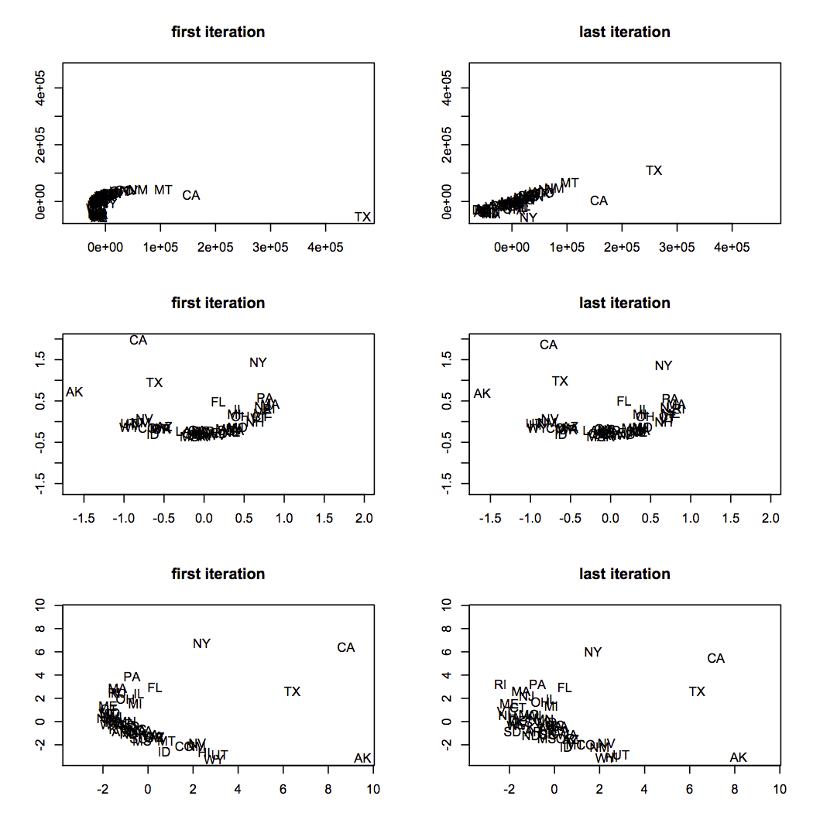

[](http://quantlet.de/index.php?p=info)

## [](http://quantlet.de/) **SMSnmdsushealth** [](http://quantlet.de/d3/ia)


```yaml
Name of Quantlet: SMSnmdsushealth

Published in: Multivariate Statistics: Exercises and Solutions

Description: 'computes the nonmetric MDS for the original, 0-1 scaled and standardized U.S. health data set. It employs the Shepard-Kruskal algorithm and isotonic regression.'

Keywords: 'multidimensional scaling, mds, nonmetric, distance, Euclidean, correlation, Shepard-Kruskal algorithm, isotonic regression'

See also: 'SMSmdsbank, SMSnmdsathlesub, SMSnmdsathletic, SMSnmdscarm, SMSnmdsuscrime, SMSnmdsushealth'

Author: Awdesch Melzer

Datafile: uscrime.rda

Example: 'Plots of first and last iterations of nonmetric MDS for the  original, 0-1 scaled and standardized U.S. health data set'
```





```R
rm(list=ls(all=TRUE))
graphics.off()

nonMDS = function(Dist){
     alpha = 0.2
 # calculate configuration of points in two dimensions

# define matrix A
    A  = (as.matrix(Dist)^2)*(-0.5) 
    n  = nrow(as.matrix(Dist))
# size of distance matrix
    nn = n^2
 
    I  = diag(rep(1,n))
    u  = matrix(1,n,1)
# define the centering matrix 
    H  = I-(1/6*(u%*%t(u)))
# compute inner product matrix
    B  = H%*%A%*%H
# compute eigenvalues and vectors, sorted by values 
    G  = eigen(B)
    G1 = cbind(G$vectors[,1],G$vectors[,2])
    G2 = diag(G$values[1:2])
# compute point configuration in R^p
    X  = G1%*%(G2^0.5)
 
 # X=normal(rows(Dist),2)
    pic0 = X
    X1   = X

 # iterate Shepard-Kruskal until convergence
    change  = 1
    STRESS1 = 1
    iter    = 0
    n       = nrow(as.matrix(Dist))
    nn      = n^2
    while ((change>1e-8)&&(iter<10000)){
# while (iter<0)
        iter  = iter+1

  # isotonic regression
        Dist1 = cbind(matrix(as.matrix(dist(X,"euclidean",diag=T,upper=T)),nn,1),floor((0:(nn-1))/n+1))
        Dist1 = cbind(Dist1,((1:(nn))-(Dist1[,2]-1)*n))
        Dist1 = cbind(matrix(as.matrix(Dist),nn,1),Dist1)
        Dist1 = Dist1[order(Dist1[,1]),]
        DIST1 = cbind(Dist1[,1],Dist1[,2],Dist1[,4],Dist1[,3])
        Dist1 = DIST1
        Dist2 = isoreg(Dist1[,2])$yf

        STRESS0 = STRESS1
        STRESS1 = t(Dist2-Dist1[,1])%*%(Dist2-Dist1[,1])/(2*sum(Dist1[,1]^2))

        change  = STRESS0 - STRESS1

  # update X
        Xnew = X
        Dist1 = cbind(Dist1, Dist2)

        Dist1 = Dist1[order(Dist1[,4],Dist1[,3]),]#,Dist1[,3])
        D = matrix(Dist1[,2],n,n)+I
        DH = matrix(Dist1[,5],n,n)+I
        shift = alpha*(1-(DH/D))/(n-1)
        i=0
        while (i<n){
               i=i+1 
               Xnew[i,] = X[i,] + apply(shift[,i]*(X-matrix(X[i,],nrow=50,2,byrow=T)),2,sum)
        }
       X  = Xnew 


    }
 
    picl  = X
    comsc = c(min(X[,1],X[,2],X1[,1],X1[,2]),max(X[,1],X[,2],X1[,1],X1[,2]))
    comra = (comsc[2]-comsc[1])/5
    comsc = comsc+c(-comra,comra)
    ym    = floor(comra*2)

	return(list(X=X, pic0=pic0, picl=picl))

}

load("ushealth.rda")                # read the data set
x = matrix(0, nrow=nrow(ushealth),ncol=ncol(ushealth))
for(i in 1:ncol(ushealth)){
	x[,i] = as.numeric(ushealth[,i])
}

for (i in 1:ncol(x)){
x[,i] = as.numeric(x[,i]) 
}
#x = ushealth[,3:9]

#x = x[,1:13]
x01 = matrix(0,nrow(x),ncol(x))
for (i in 1:ncol(x)){
x01[,i] = (cbind(x[,i])-matrix(min(x[,i]),nrow(x),1))/(max(x[,i])-min(x[,i]))             # 0-1 scaling
}
#x01 = (x-min(x))/(max(x)-min(x))             # 0-1 scaling
xSD = scale(x)                               # standardizing

# distance matrix original data
Dist  = dist(x)
text1 = c("ME","NH","VT","MA","RI","CT","NY","NJ","PA","OH","IN","IL","MI","WI","MN","IA","MO","ND","SD","NE","KS","DE","MD","VA","WV","NC","SC","GA","FL","KY","TN","AL","MS","AR","LA","OK","TX","MT","ID","WY","CO","NM","AZ","UT","NV","WA","OR","CA","AK","HI")
pc    = proc.time()
Y     = nonMDS(Dist)
proc.time() - pc
par(mfrow=c(3,2),mar=c(3, 4, 4, 2) +  0.1)
plot(Y$pic0,type="n",ylab="",xlab="",ylim=c(min(Y$pic0,Y$picl),max(Y$pic0,Y$picl)),xlim=c(min(Y$pic0,Y$picl),max(Y$pic0,Y$picl)))
title("first iteration")
text(Y$pic0,text1,xpd=NA)

plot(Y$picl,type="n",ylab="",xlab="",ylim=c(min(Y$pic0,Y$picl),max(Y$pic0,Y$picl)),xlim=c(min(Y$pic0,Y$picl),max(Y$pic0,Y$picl)))
text(Y$picl,text1,xpd=NA)
title("last iteration")

# distance matrix 0-1 scaled data
Dist      = dist(x01)
Y01       = nonMDS(Dist)
Y01$pic0  = t(t(Y01$pic0[,1:2])*sign(Y01$pic0[1,1:2]))
Y01$picl  = t(t(Y01$picl[,1:2])*sign(Y01$picl[1,1:2]))

plot(Y01$pic0,type="n",ylab="",xlab="",ylim=c(min(Y01$pic0,Y01$picl),max(Y01$pic0,Y01$picl)),xlim=c(min(Y01$pic0,Y01$picl),max(Y01$pic0,Y01$picl)))
title("first iteration")
text(Y01$pic0,text1,xpd=NA)

plot(Y01$picl,type="n",ylab="",xlab="",ylim=c(min(Y01$pic0,Y01$picl),max(Y01$pic0,Y01$picl)),xlim=c(min(Y01$pic0,Y01$picl),max(Y01$pic0,Y01$picl)))
text(Y01$picl,text1,xpd=NA)
title("last iteration")

# distance matrix standardized data
Dist          = dist(xSD)
YSD           = nonMDS(Dist)
YSD$pic0[,2]  = t(t(YSD$pic0[,2])*sign(YSD$pic0[1,2]))
YSD$picl[,2]  = t(t(YSD$picl[,2])*sign(YSD$picl[1,2]))

plot(YSD$pic0,type="n",ylab="",xlab="",ylim=c(min(YSD$pic0,YSD$picl),max(YSD$pic0,YSD$picl)),xlim=c(min(YSD$pic0,YSD$picl),max(YSD$pic0,YSD$picl)))
title("first iteration")
text(YSD$pic0,text1,xpd=NA)

plot(YSD$picl,type="n",ylab="",xlab="",ylim=c(min(YSD$pic0,YSD$picl),max(YSD$pic0,YSD$picl)),xlim=c(min(YSD$pic0,YSD$picl),max(YSD$pic0,YSD$picl)))
text(YSD$picl,text1,xpd=NA)
title("last iteration")

```
