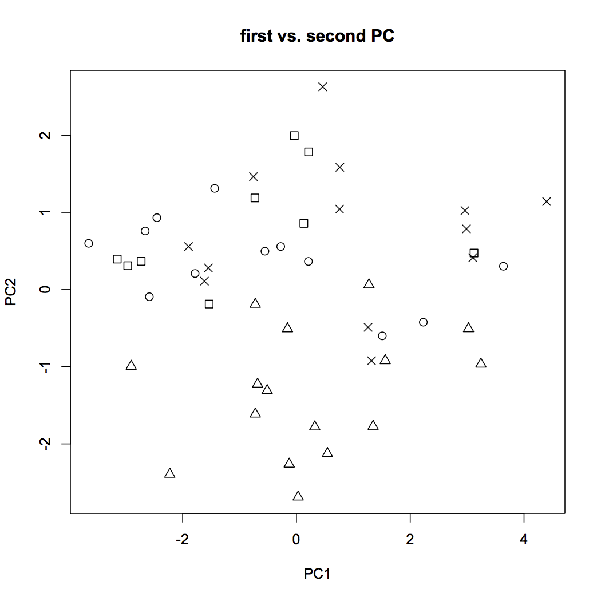
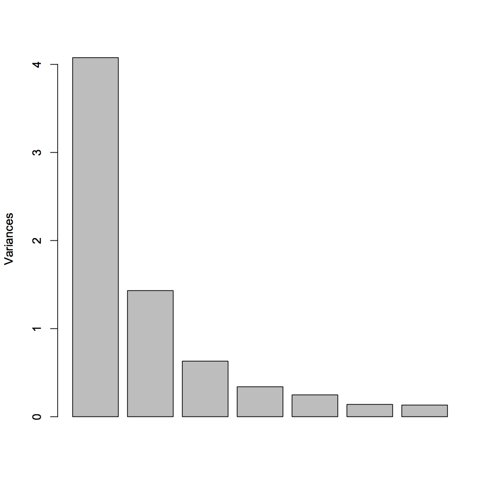

[](http://quantlet.de/index.php?p=info)

## [](http://quantlet.de/) **SMSnpcacrime** [](http://quantlet.de/d3/ia)


```yaml
Name of Quantlet: SMSnpcacrime

Published in: Multivariate Statistics: Exercises and Solutions

Description: 'Computes normalized principal components for US crime data set which consists of the reported number of crimes in the 50 US states in 1985. The crimes were classified according to 7 categories: murder, rape, robbery, assault, burglary, larceny, and auto theft. The data set also contains identification of the resion: Northeast, Midwest, South, West. After scaling the variables, a NPCA is perfomed the reported felonies. A scatterplot of the first two principal components, a screeplot and a plot of the correlations of the first two PCs with the original variables.'

Keywords: 'NPCA, dimension reduction, eigenvalues, eigenvectors, multi-dimensional, multivariate, normalization, pca, principal-components, scaling, screeplot, transformation'

See also: 'SMSnpcacrime, SMSnpcageopol, SMSnpcasimu, SMSnpcathletic, SMSpcacarm, SMSpcahealth'

Author[r]: Zdenek Hlavka
Author[m]: Janek Berger, Awdesch Melzer

Datafile[r]: uscrime.rda
Datafile[m]: uscrime.dat

Output: 'Table of principal components and plots of normalized principal components for US crime data'

Example: 'Visualization of variables and individuals after dimension reduction. Screeplot'
```






```R
# Clear workspace
rm(list=ls(all=TRUE))
graphics.off()

# setwd("C:/...") # set working directory

load("uscrime.rda") # load data

pccrime = prcomp(~murder+rape+robbery+assault+burglary+larceny+autotheft,scale.=TRUE,data=uscrime)

# the sign does not matter (this is just to get the same picture as in 1st edition)
pccrime$rotation[,"PC2"] = -pccrime$rotation[,"PC2"]
pccrime$x[,"PC2"]        = -pccrime$x[,"PC2"]

print(pccrime)

## eigenvalues of the variance matrix
pccrime$sdev^2

opar = par(mfrow=c(1,1))
#biplot(pccrime)

plot(pccrime$x,type="n",main="first vs. second PC")
tmp  = as.numeric(uscrime$reg)
#char=1+21*(tmp==2)+(tmp==3)+3*(tmp==4)
char = 0 + 1*(tmp==2) + 2*(tmp==3) + 4*(tmp==4)
points(pccrime$x[,1:2],cex=1.2,pch=char)
#text(pccrime$x[,1:2],uscrime$reg)
#text(pccrime$x[,1:2],row.names(uscrime),cex=0.7,col=1+as.numeric(uscrime$reg),pos=4)
dev.new()
plot(pccrime,main="")
dev.new()
plot(c(-1.1,1.1),c(-1.1,1.1),type="n",main="US crime",xlab="first PC",ylab="second PC") #plotting... [KONECNE!]
ucircle<-cbind(cos((0:360)/180*3.14159),sin((0:360)/180*3.14159))
points(ucircle,type="l",lty="dotted")
abline(h = 0)
abline(v = 0)
cors=pccrime$rotation%*%diag(pccrime$sdev)
lab=colnames(uscrime)[3:9]
text(cors,labels=lab,col="black")

par(opar)

```
