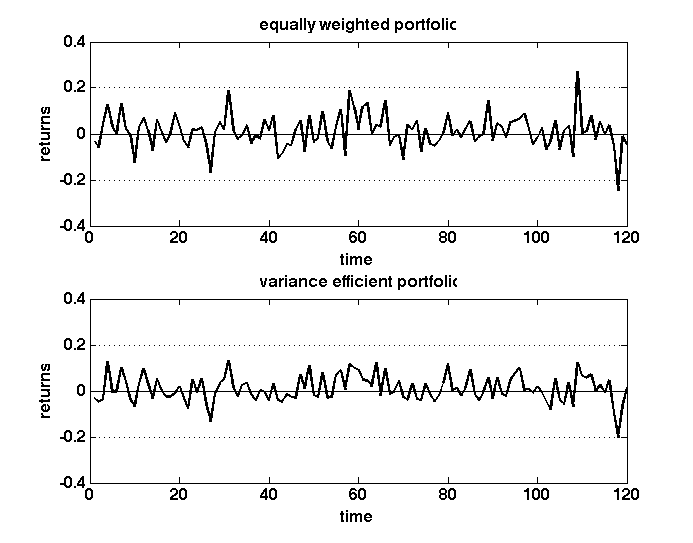

[](http://quantlet.de/)

## [](http://quantlet.de/) **SMSportfol** [](http://quantlet.de/)

```yaml

Name of Quantlet: SMSportfol

Published in: Multivariate Statistics: Exercises and Solutions

Description: 'computes the optimal portfolio weights with monthly returns and the equally weighted portfolio'

Keywords: 'CAPM, portfolio, optimization, variance'

Keywords[new]: 'variance efficient portfolio, equally weighted portfolio'

See also: 'SMScapmnyse, SMSportfol'

Author[r]: Zdenek Hlavka
Author[m]: Awdesch Melzer

Datafile[r]: nyse.rda
Datafile[m]: nyse.dat

Example: 'the optimal portfolio weights with monthly returns'
```




### R Code
```r

# clear variables and close windows
rm(list=ls(all=TRUE))
graphics.off()

# load data
load("nyse.rda")

# select portfolio
portfolio = nyse[,c(1,2,7)]

returns1 = as.matrix(portfolio)%*%c(1,1,1)/3
par(mfrow=c(2,1),mar=c(5, 4, 3, 2) +  0.1)
setscale = rbind(c(0,-0.28),c(121,0.28))

plot(setscale,type="n",main="equally weighted portfolio",xlab="time",ylab="returns")
abline(h=0)
abline(h=c(-0.2,0.2),lty=2,col="gray50")
lines(returns1)

# optimal portfolio weights
opti = solve(cov(portfolio))%*%c(1,1,1)
opti = opti/sum(opti)

returns2 = as.matrix(portfolio)%*%opti
plot(setscale,type="n",main="variance efficient portfolio",xlab="time",ylab="returns")
abline(h=0)
abline(h=c(-0.2,0.2),lty=2,col="gray50")
lines(returns2)
```

automatically created on 2018-05-28

### MATLAB Code
```matlab

%clear variables and close windows
clear all
close all
clc

% load data
load('nyse.dat')

% select portfolio
portfolio = nyse(:,[1,2,7]);

returns1 = portfolio*ones(1,3,1)'./3

subplot(2,1,1)
plot(returns1,'k-','LineWidth',2)
title('equally weighted portfolio','FontSize',16,'FontWeight','Bold')
box on
set(gca,'LineWidth',1.6,'FontSize',16,'FontWeight','Bold')
xlabel('time','FontSize',16,'FontWeight','Bold')
ylabel('returns','FontSize',16,'FontWeight','Bold')
line([1,size(returns1,1)]',[0,0]','Color','k','LineWidth',1.6)
line([1,size(returns1,1)]',[-0.2,-0.2]','Color','k','LineWidth',1.6,'LineStyle',':')
line([1,size(returns1,1)]',[0.2,0.2]','Color','k','LineWidth',1.6,'LineStyle',':')


% optimal portfolio weights
opti = inv(cov(portfolio))*ones(1,3,1)';
opti = opti/sum(opti);

returns2 = portfolio*opti;
subplot(2,1,2)
plot(returns2,'k-','LineWidth',2)
title('variance efficient portfolio','FontSize',16,'FontWeight','Bold')
box on
set(gca,'LineWidth',1.6,'FontSize',16,'FontWeight','Bold')
xlabel('time','FontSize',16,'FontWeight','Bold')
ylabel('returns','FontSize',16,'FontWeight','Bold')
line([1,size(returns2,1)]',[0,0]','Color','k','LineWidth',1.6)
line([1,size(returns2,1)]',[-0.2,-0.2]','Color','k','LineWidth',1.6,'LineStyle',':')
line([1,size(returns2,1)]',[0.2,0.2]','Color','k','LineWidth',1.6,'LineStyle',':')
```

automatically created on 2018-05-28