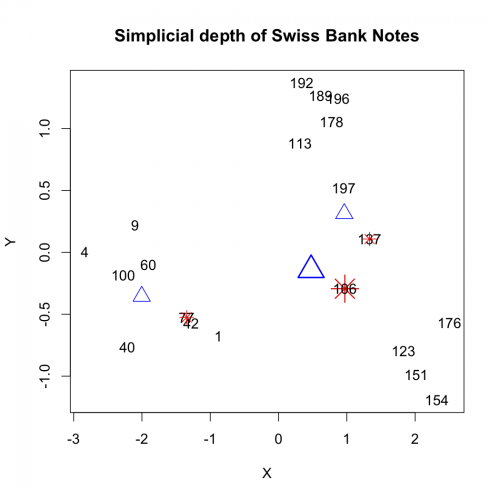

[](http://quantlet.de/)

## [](http://quantlet.de/) **SMSsimpdbank** [](http://quantlet.de/)

```yaml

Name of Quantlet: SMSsimpdbank

Published in: Multivariate Statistics: Exercises and Solutions

Description: 'Calculates simplicial depth of a sample of the Swiss bank notes data, n=20. The star represents the deepest point and the big blue triangle the coordinatewise median. The numbers are labels of the selected 20 bank notes.'

Keywords: 'simplicial depth, convex hull, median'

See also: 'SMScartdiag, SMScartsq, SMSdisfbank2, SMSeppbank, SMSsimpdbank, SMSsimpdsimu, SMSsir2cars, SMSsir2simu, SMSsircars, SMSsirsimu, SMSsircars, SMSsirsimu, SMSsiruscomp, SMSsvmbankrupt, SMSsvmorange, SMSsvmspiral'

Author: Awdesch Melzer, Zdenek Hlavka

Datafile: bank2.rda

Example: 'Simplicial depth for a sample of the Swiss bank notes data'
```



### R Code
```r

rm(list=ls(all=TRUE))
graphics.off()

# install and load packages
libraries = c("depth","MASS")
lapply(libraries, function(x) if (!(x %in% installed.packages())) {
    install.packages(x)})
lapply(libraries, library, quietly = TRUE, character.only = TRUE)

# setwd("C:/...") # set working directory
load("bank2.rda")

# simulate data
set.seed(2012)            # sets random seed

x     = as.matrix(bank2)
n     = 20
xxi   = cbind(sort(sample(1:200,n,replace=F)))
y     = prcomp(x[xxi,],scale.=TRUE)$x[,1:2]

m     = med(y,method="Liu")
mm    = m$median
 
med12 = apply(y,2,median)

par(c(1,1),cex=1)
      
plot(y,type="n",xlab="PC1",ylab="PC2",main="simplicial depth of 20 Swiss bank notes")
#median is the big red star
points(mm[1],mm[2],col="red",pch=8,cex=4,lwd=1.5)
points(med12[1],med12[2],col="blue",pch=2,cex=3,lwd=2)

tc    = (xxi<101)
ng    = sum(tc)
nf    = n-ng

# "GENUINE"
 
m     = med(y[1:ng,],method="Liu")
mmg   = m$median # "Deepest point"

#  "coordinatewise median"
medg12= apply(y[1:ng,],2,median)

points(mmg[1],mmg[2],col="red",pch=8,cex=1.5)
points(medg12[1],medg12[2],col="blue",pch=2,cex=1.5)
 
 
# "COUNTERFEIT"

 m    = med(y[(ng+1):n,],method="Liu")
 mmf  = m$median # "Deepest point"

#  "coordinatewise median"
medf12= apply(y[(ng+1):n,],2,median)

points(mmf[1],mmf[2],col="red",pch=8,cex=1.5)
points(medf12[1],medf12[2],col="blue",pch=2,cex=1.5)

text(y,labels=xxi,cex=1.2,xpd=NA)

```

automatically created on 2018-05-28