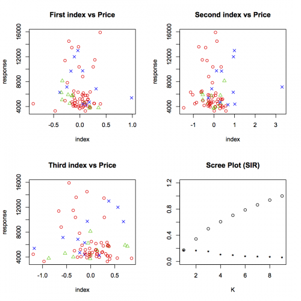
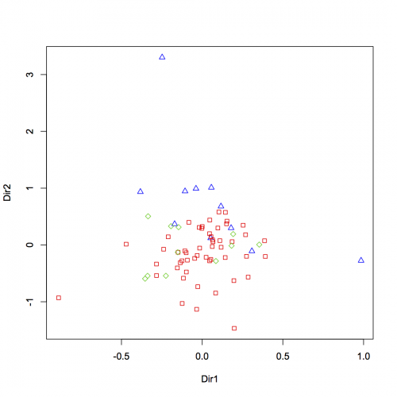

[](http://quantlet.de/)

## [](http://quantlet.de/) **SMSsir2cars** [](http://quantlet.de/)

```yaml

Name of Quantlet: SMSsir2cars

Published in: Multivariate Statistics: Exercises and Solutions

Description: 'Applies the sliced inverse regression algorithm (SIR II) on car data set (carc.rda) for dimension reduction.'

Keywords: 'sliced inverse regression, sir, EDR-directions, effective dimension reduction directions, eigenvalue'

See also: 'SMScartdiag, SMScartsq, SMSdisfbank2, SMSeppbank, SMSsimpdbank, SMSsimpdsimu, SMSsir2cars, SMSsir2simu, SMSsircars, SMSsirsimu, SMSsircars, SMSsirsimu, SMSsiruscomp, SMSsvmbankrupt, SMSsvmorange, SMSsvmspiral'

Author: Alena Babiakova, Awdesch Melzer

Datafile: carc.rda

Example: 'Effective dimension reduction directions (EDR-directions) for the car data and plots for the response versus the estimated EDR-directions, a three-dimensional plot for the first two directions and the response and plot for the eigenvalues and the cumulative sum.'
```





### R Code
```r

rm(list=ls(all=TRUE))
graphics.off()

# install and load packages
libraries = c("dr")
lapply(libraries, function(x) if (!(x %in% installed.packages())) {
    install.packages(x)})
lapply(libraries, library, quietly = TRUE, character.only = TRUE)

# setwd("C:/...") # set working directory
load("carc.rda")
m.text = row.names(carc)
n      = nrow(carc)
# get rid of the outliers
keep   = 1:n;
x      = carc[keep,c(2,(5:12))];
type   = as.numeric(carc[keep,13]);
y      = carc[keep,1];
t      = m.text[keep];
n      = nrow(x);
# x=log(x-min(x)+(max(x)-min(x))/200)

x      = scale(x);

temp   = dr(y~x, method="save", nslices = 10);
print(temp);

f      = temp$evectors;
g      = temp$evalues;

sg     = sum(g);
g      = as.vector(g/sg);
psi    = cumsum(g);
i      = 1:length(g);
ig     = cbind(i,g);
p11    = cbind(x %*% f[,1],y);
p12    = cbind(x %*% f[,2],y);
p21    = cbind(x %*% f[,3],y);
p123   = cbind(x %*% f[,1:2], y);

print("eigenvectors");
print(f);
print("eigenvalues and proportions");
print(cbind(g,cumsum(g)));
print(cbind(i,psi));

op     = par(mfrow = c(2,2));
type2  = type
type2[which(type==3)]=4

plot(p11, pch = type2, col = type+1, main = "", xlab = "1st projection", ylab = "price");
plot(p12, pch = type2, col = type+1, main = "", xlab = "2nd projection", ylab = "price");
plot(p21, pch = type2, col = type+1, main = "", xlab = "3rd projection", ylab = "price");
plot(ig, pch = "*", main = "SIR II scree plot", xlab = "k", ylab = " ", ylim = c(0,1));
points(cbind(i,psi));

# dev.new()
par(mfrow = c(1,1))
plot(p123, pch = type+21, col = type+1)
par(op)
```

automatically created on 2018-05-28