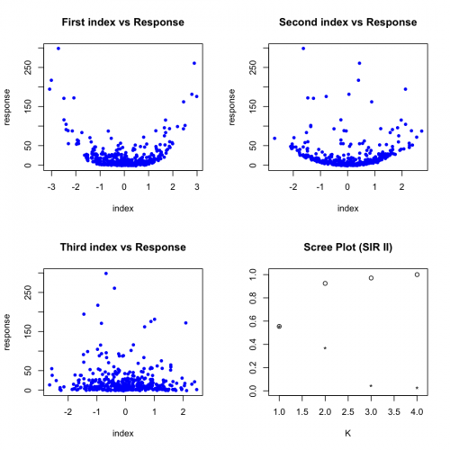

[](http://quantlet.de/)

## [](http://quantlet.de/) **SMSsir2simu** [](http://quantlet.de/)

```yaml

Name of Quantlet: SMSsir2simu

Published in: Multivariate Statistics: Exercises and Solutions

Description: 'generates a data set and applies the sliced inverse regression algorithm (SIR II) for dimension reduction.'

Keywords: 'sliced inverse regression, sir, EDR-directions, effective dimension reduction directions, eigenvalue'

See also: 'SMScartdiag, SMScartsq, SMSdisfbank2, SMSeppbank, SMSsimpdbank, SMSsimpdsimu, SMSsir2cars, SMSsir2simu, SMSsircars, SMSsirsimu, SMSsircars, SMSsirsimu, SMSsiruscomp, SMSsvmbankrupt, SMSsvmorange, SMSsvmspiral'

Author: Tomas Hovorka

Example: 'Effective dimension reduction directions (EDR-directions) for a simulated data set and plots for the response versus the estimated EDR-directions, a three-dimensional plot for the first two directions and the response and plot for the eigenvalues and the cumulative sum.'
```



### R Code
```r

# clear variables and close windows
rm(list=ls(all=TRUE))
graphics.off()

# install and load packages
libraries = c("dr")
lapply(libraries, function(x) if (!(x %in% installed.packages())) {
    install.packages(x)})
lapply(libraries, library, quietly = TRUE, character.only = TRUE)

set.seed(0)
n   = 400
x1  = rnorm(n)
x2  = rnorm(n)
x3  = rnorm(n)
x4  = rnorm(n)
x   = cbind(x1,x2,x3,x4)
e   = rnorm(n)
b1  = c(1,3,0,0)
b2  = c(0,0,-1,1)
i   = c(1:4)
y   = ((x%*%b1)^2)+((x%*%b2)^4)+e

m1  =  dr(y~x, method="save")

f   = m1$evectors
g   = m1$evalues
g
sg  = sum(g)
g   = g/sg
psi = cumsum(g)
ig  = cbind(i,g)
p11 = cbind(x%*%f[,1],y)
p12 = cbind(x%*%f[,2],y)
p21 = cbind(x%*%f[,3],y)

op=par(mfrow=c(2,2))
plot(p11,xlab="1st projection",ylab="response",col="blue",type="p",pch=20)
plot(p12,xlab="2nd projection",ylab="response",col="blue",type="p",pch=20)
plot(p21,xlab="3rd projection",ylab="response",col="blue",type="p",pch=20)
plot(ig,xlim=c(0.9,4.1),ylim=c(0,1.01),xlab="k",ylab="",main="SIR II scree plot",col="black",type="p",pch="*")
points(i,psi)
par(op)
```

automatically created on 2018-05-28