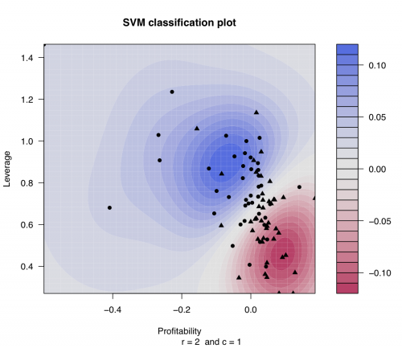
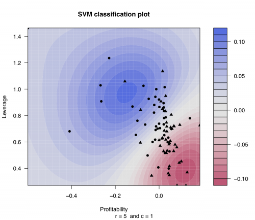
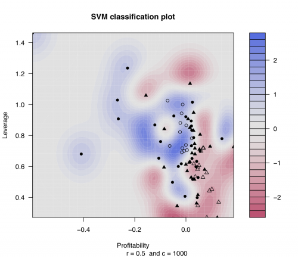
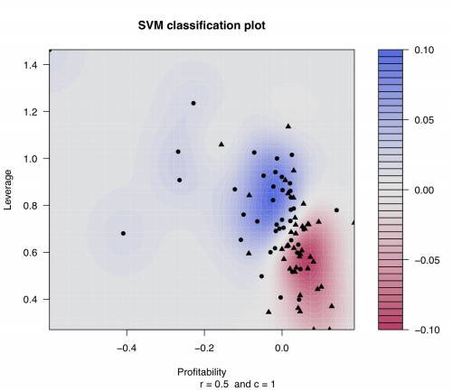

[](http://quantlet.de/)

## [](http://quantlet.de/) **SMSsvmbankrupt** [](http://quantlet.de/)

```yaml

Name of Quantlet: SMSsvmbankrupt

Published in: Multivariate Statistics: Exercises and Solutions

Description: 'Performs SVM to classify bankrupt companies. Plots are produced for various values of the cost and scale parameters c and sigma, respectively.'

Keywords: 'support vector machines, svm, classification, kde, kernel density estimation, anisotropic kernel, kernel'

See also: 'SMScartdiag, SMScartsq, SMSdisfbank2, SMSeppbank, SMSsimpdbank, SMSsimpdsimu, SMSsir2cars, SMSsir2simu, SMSsircars, SMSsirsimu, SMSsircars, SMSsirsimu, SMSsiruscomp, SMSsvmbankrupt, SMSsvmorange, SMSsvmspiral'

Author: Awdesch Melzer

Datafile: bankruptcy.rda

Example: 'SVM classification on bankrupt companies'
```











### MATLAB Code
```matlab

% SVMbankruptcy MATLAB Code
%
% translated from R by: Bey, Patrik (beypatri@gmail.com)
%
clear all

cd('./')    %adjust working directory

%load bankruptcy data
data = readtable('bankruptcy.csv', 'Delimiter', ';','ReadVariableNames',true);

%define kernel parameter for SVM
sgm = [0.2,0.2,1,1,2,2]'; %radial basis function kernel parameter sigma
C = [1,8,1,8,1,8]; %SVM cost function parameter C


group = data.Bankruptcy;   %group labels 
train_data = [data.Profitability,data.Leverage]%,data.Bankruptcy];    %training data

for i = 1:length(sgm)
    figure(i)
    svmStruct = svmtrain(train_data,group,'ShowPlot',true,'kernel_function','rbf','rbf_sigma',sgm(i),'boxconstraint',C(i));
     title( ['SVM with sigma ' num2str(sgm(i)) ' and C ' num2str(C(i))])
end

```

automatically created on 2018-05-28

### R Code
```r

rm(list=ls(all=TRUE))
graphics.off()

# install and load packages
libraries = c("kernlab")
lapply(libraries, function(x) if (!(x %in% installed.packages())) {
    install.packages(x)})
lapply(libraries, library, quietly = TRUE, character.only = TRUE)

# setwd("C:/...") # set working directory
load("bankruptcy.rda")

d = data.frame(Profitability=bankruptcy[,1], Leverage=bankruptcy[,2], Bankruptcy=factor(bankruptcy[,3]))
sgm = c(0.2,0.2,1,1,2,2)    # parameter r in anisotropic gaussian kernel
C = c(1,8,1,8,1,8)
#r = c(2,2,0.5,0.5,5,5)	# parameter r in anisotropic gaussian kernel
#C = c(1,1000,1,1000,1,1000)

for (i in 1:6){
ksvm.model = ksvm(Bankruptcy~Leverage+Profitability,data=d, type="C-svc", kernel="rbfdot", kpar=list(sigma=sgm[i]), C=C[i], prob.model=TRUE, cross=4) 
plot(ksvm.model,data=d)
str = paste("s=",sprintf("%0.1f",sgm[i]),", c=",sprintf("%0.1f",C[i]),"                          ",sep="")
title(sub=str)
print(ksvm.model)
}
```

automatically created on 2018-05-28