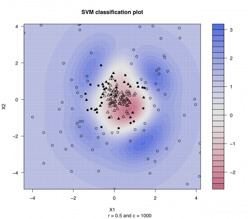
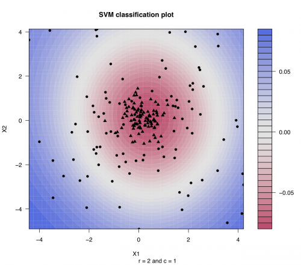
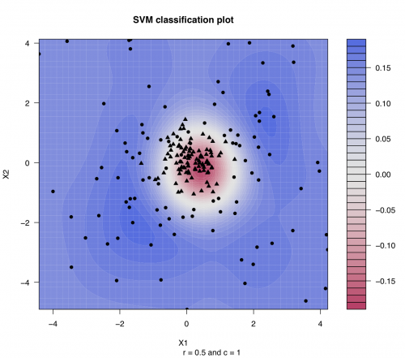

[](http://quantlet.de/)

## [](http://quantlet.de/) **SMSsvmorange** [](http://quantlet.de/)

```yaml

Name of Quantlet: SMSsvmorange

Published in: Multivariate Statistics: Exercises and Solutions

Description: 'plots the area of two different groups via svm classification using anipotropic Gaussian kernel for simulated data'

Keywords: 'support vector machines, svm, classification, kde, kernel density estimation, anisotropic kernel, kernel'

See also: 'SMScartdiag, SMScartsq, SMSdisfbank2, SMSeppbank, SMSsimpdbank, SMSsimpdsimu, SMSsir2cars, SMSsir2simu, SMSsircars, SMSsirsimu, SMSsircars, SMSsirsimu, SMSsiruscomp, SMSsvmbankrupt, SMSsvmorange, SMSsvmspiral'

Author: Wolfgang Härdle, Dedy Dwi Prastyo, Awdesch Melzer

Example: '2-dim plot of a svm classification for orangepeel data using anisotropic Gaussian kernel.'
```








### R Code
```r

rm(list=ls(all=TRUE))
graphics.off()
  
# install and load packages
libraries = c("kernlab","tseries","quadprog","zoo")
lapply(libraries, function(x) if (!(x %in% installed.packages())) {
    install.packages(x)})
lapply(libraries, library, quietly = TRUE, character.only = TRUE)  
  
  # generation of ideal data set: Xp with covariance (4,0,0,4) and Xn with covariance (0.25,0,0,0.25) for groups x(1) and x(-1)
p       = 4   # number of plots
n       = 200 # number of observations
set.seed(2)
# generating 2-variate data, member of group x(1)
  
sigma.p = matrix(c(4,0,0,4),2,2)
  
Mp      = t(chol(sigma.p))  				# Cholesky square root
Zp      = matrix(rnorm(n),2,100)  			# 2 row, 50 columns
Xp      = t(Mp %*% Zp)
Xp1     = Xp[,1]
Xp2     = Xp[,2]
  
  # generating 2-variate data, member of group x(-1)
  
sigma.n = matrix(c(0.25,0,0,0.25),2,2)
  
Mn      = t(chol(sigma.n))  				# Cholesky square root
Zn      = matrix(rnorm(n),2,100)  			# 2 row, 50 columns
Xn      = t(Mn %*% Zn)
Xn1     = Xn[,1]
Xn2     = Xn[,2]
  
  # Aggregating data
  
  X1      = c(Xp1,Xn1)
  X2      = c(Xp2,Xn2)
  
  # generating indicator variable
  
yp      = rep(1,n/2)
yn      = rep(-1,n/2)
  
Y       = c(yp,yn)
OP      = cbind(X2, X1)
  
## Main program of SVM classification plot
  
sgm = c(0.2,5,0.2,5)	# parameter r in anisotropic gaussian kernel
C = c(0.1,0.1,8,8)

for (i in 1:p){ 
  OrangePeelModel = ksvm(OP, Y, type="C-svc", kernel="rbfdot", kpar=list(sigma=sgm[i]), C=C[i], prob.model=TRUE, cross=4)
  str = paste("s=",sprintf("%0.1f",sgm[i]),", c=",sprintf("%0.1f",C[i]),"                          ",sep="")
  plot(OrangePeelModel, data=OP,cex=0.7,cex.main=1.5)
  title(sub=str)
  print(OrangePeelModel)
  }


```

automatically created on 2018-05-28

### MATLAB Code
```matlab

% SMSsvmorange MATLAB Code
%
% translated from R by: Bey, Patrik (beypatri@gmail.com)
%

clear all

cd('./')                              %adjust working directory

%%
% generation of ideal data set: Xp with covariance (4,0,0,4) and Xn with covariance (0.25,0,0,0.25) for groups x(1) and x(-1)
%%

n = 200;                              % number of observations

%%
% generating 2-variate data, member of group x(1)
%%  
sigma_p = [4 0;0 4];
  
Mp      = chol(sigma_p);               % Cholesky square root
Zp      = randn(2,n/2);                % 2 row, 100 columns /in orig R-code 50 columns
Xp      = (Mp*Zp)';
Xp1     = Xp(:,1);
Xp2     = Xp(:,2);

%%
% generating 2-variate data, member of group x(-1)
%%
  
sigma_n = [0.25 0; 0 0.25];
  
Mn      = chol(sigma_n);               % Cholesky square root
Zn      = randn(2,n/2);                % 2 row, 100 columns /in orig R-code 50 columns
Xn      = (Mn*Zn)';
Xn1     = Xn(:,1);
Xn2     = Xn(:,2);

%%  
% Aggregating data
%%  

X1      = [Xp1;Xn1];
X2      = [Xp2;Xn2];
  
%%
%generating indicator variable
%%

yp      = ones(n/2,1);
yn      = -ones(n/2,1);
  
Y       = [yp;yn];                     % group labels used in SVM
OP      = [X2, X1]                     % training data used in SVM

%%%%%%
%% Main program of SVM classification plot
%%%%%%

%%
%define kernel parameter for SVM
%%
sgm = [0.2,5,0.2,5]'; %radial basis function kernel parameter sigma
C = [0.1,0.1,8,8]; %SVM cost function parameter C
  
for i = 1:length(sgm)
    figure(i)
    svmStruct = svmtrain(OP,Y,'ShowPlot',true,'kernel_function','rbf','rbf_sigma',sgm(i),'boxconstraint',C(i));
    title( ['SVM with sigma ' num2str(sgm(i)) ' and C ' num2str(C(i))])
end


```

automatically created on 2018-05-28